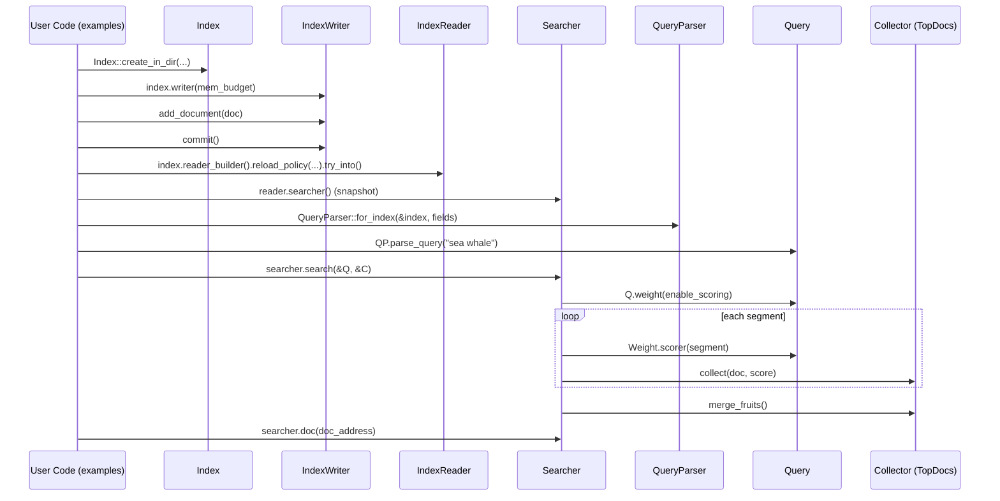

# P1-01 从示例理解 Tantivy 的最小闭环

> 版本基线：tantivy 0.24.0（本仓库）
>
> 本文主问题：一次“索引 + 搜索”的最小闭环里，关键对象各自负责什么？在源码里分别应该从哪里下手读？
>
> 读完你应该能做到：拿着 `examples/basic_search.rs`，顺着调用链一路找到 `IndexWriter::commit` 和 `Searcher::search`，并理解它们的职责边界。

## 本文目标

- 建立 Tantivy 用户视角主线：`Index → IndexWriter → commit → IndexReader/Searcher → Query → Collector`
- 把示例里的每一步，映射到源码模块入口（知道“下一跳在哪里”）
- 形成一套通用读法：**从 example 进入 → 找公开 API → 下钻到内部实现**

## 读前准备

- 会读 Rust 的 trait/泛型/Arc（不要求写得出来，但要看得懂）
- 了解倒排索引更好；不了解也没关系，本篇先建立“名词与边界”

## 关键概念（先给结论）

- `Schema`：索引的“强约束数据模型”，字段类型/索引方式都在这里声明。
- `Index`：顶层入口（偏“配置与资源”），持有 `Directory + Schema + Tokenizers + Executor` 等。
- `IndexWriter`：写入侧入口（偏“异步流水线”），负责接收文档、flush segment、commit、触发 merge。
- `IndexReader/Searcher`：读侧入口（偏“快照与复用”）。`Searcher` 是一致性快照：拿到以后，它看到的 segment 列表在生命周期内不变。
- `Query`：定义“匹配哪些文档 + 如何评分”。执行时会先变成 `Weight`，再针对每个 segment 变成 `Scorer`。
- `Collector`：定义“匹配到文档后做什么”（TopK、计数、聚合…）。Collector 决定是否需要 score。

> 注：Tantivy 默认相似度是 BM25（可在 `src/query/bm25.rs` 看到计算细节）。`basic_search` 里有一段注释提到 Tf-Idf，可以先把它当作“会打分”，本系列会以 BM25 为准。

## 源码入口（建议阅读顺序）

> 建议按“从外到内”的调用链阅读：先从可运行 example 进入，再去看公开 API，再下钻到内部实现。

1. `examples/basic_search.rs`：API 使用步骤（schema → writer → commit → reader → searcher → query → search）
2. `src/lib.rs`：crate 的公开导出与概念概览（Index/Segment/IndexWriter/Searcher/Query）
3. `src/index/index.rs`：`Index` 的创建/打开、`writer()`/`reader_builder()` 等入口
4. `src/indexer/index_writer.rs`：`pub struct IndexWriter`、`add_document`、`commit`
5. `src/reader/mod.rs`：`IndexReader`/`ReloadPolicy`（reload 与 searcher 快照）
6. `src/core/searcher.rs`：`pub struct Searcher`、`Searcher::search`
7. `src/query/query.rs`：`pub trait Query`（Query/Weight/Scorer 的分层原因）
8. `src/collector/top_collector.rs`：`TopDocs`（经典 Collector）

## 最小闭环：把 `basic_search` 分成 8 步

下面按 `examples/basic_search.rs` 的逻辑，把“最小闭环”拆成 8 步。你可以一边读，一边在自己的笔记里写出“入口 → 关键符号 → 下一跳”。

### 1) 定义 Schema：字段是什么、怎么索引、怎么存

示例核心动作：

- `Schema::builder()` / `add_text_field()` / `build()`
- 关注 `TEXT | STORED`：既做全文索引（倒排），又把原始字段存入 docstore（用于返回结果展示）

源码入口：

- `src/schema/schema.rs`：`Schema`、`SchemaBuilder`
- `src/schema/text_options.rs`：`TextOptions`/`TEXT` 等

### 2) 创建 Index：把 schema 落到目录里（meta.json）

示例：

- `Index::create_in_dir(&index_path, schema.clone())`

你现在只要记住：

- “创建 index”本质上是在 directory 里写入/更新元数据（以及后续 segment 文件）

源码入口：

- `src/index/index.rs`：`Index::create_in_dir`、`IndexBuilder`
- `src/index/index_meta.rs`：meta 的读写（下一篇 P1-02 会展开）

### 3) 获取 IndexWriter：写入侧“总控”

示例：

- `let mut index_writer: IndexWriter = index.writer(50_000_000)?;`

注意点：

- 参数是写入侧内存预算（影响吞吐与 flush/segment 形成）
- Tantivy 约束“同一 index 同时只能有一个 writer”，但 writer 内部会用多线程

源码入口：

- `src/index/index.rs`：`Index::writer(...)`
- `src/indexer/index_writer.rs`：`pub struct IndexWriter` 与 `IndexWriterOptions`

### 4) add_document：把文档丢给写入流水线

示例展示两种写法：

- 手动构造 `TantivyDocument` 并 `add_text(...)`
- 使用 `doc!(...)` 宏减少样板代码

此时文档**还不可搜索**。你可以先把它理解为“进入队列/进入 buffer”。

源码入口：

- `src/indexer/index_writer.rs`：`IndexWriter::add_document(...)`
- `src/schema/document/default_document.rs`：默认 `TantivyDocument`（CompactDoc）
- `src/macros.rs`：`doc!` 宏

### 5) commit：让 segment 落盘，并发布新版本

示例强调：不 commit 就不可搜索。

你现在只要记住一句话：

> commit 是“把一批写入变成可搜索快照”的边界。

源码入口：

- `src/indexer/index_writer.rs`：`IndexWriter::commit(...)`

### 6) 构建 Reader，获取 Searcher（快照）

示例：

- `index.reader_builder().reload_policy(...).try_into()?;`
- `let searcher = reader.searcher();`

你要形成的直觉：

- `IndexReader` 负责“什么时候 reload”
- `Searcher` 负责“拿着一组 SegmentReader 跑查询”，并保证这组 segment 在它生命周期内不变

源码入口：

- `src/reader/mod.rs`：`IndexReader`、`ReloadPolicy`
- `src/core/searcher.rs`：`pub struct Searcher`

### 7) 解析 Query：用户输入 → 可执行 Query

示例：

- `QueryParser::for_index(&index, vec![title, body])`
- `query_parser.parse_query("sea whale")?;`

本篇不深挖语法，只要知道：

- 最终会得到一个实现了 `Query` trait 的对象（通常是 `Box<dyn Query>`）
- Query 执行时会拆成 `Weight/Scorer`（后续 P3-10 会专门讲）

源码入口：

- `src/query/query_parser/query_parser.rs`：`QueryParser`
- `src/query/query.rs`：`pub trait Query`

### 8) searcher.search + TopDocs：执行并收集结果

示例：

- `searcher.search(&query, &TopDocs::with_limit(10))?;`
- 返回的是 `Vec<(Score, DocAddress)>`，因为 index 有多个 segment，`DocAddress` 需要同时携带 `(segment_ord, doc_id)`
- 之后用 `searcher.doc(doc_address)` 从 docstore 取回文档内容（只有标了 `STORED` 的字段能取回）
- `query.explain(&searcher, doc_address)` 可以获得打分解释（学习“为什么这个结果排第一”的神器）

源码入口：

- `src/core/searcher.rs`：`Searcher::search(...)`
- `src/collector/top_collector.rs`：`TopDocs`
- `src/store/reader.rs`：docstore 读取路径（通过 `Searcher::doc(...)` 间接调用）

## 最小闭环时序图（建议对照源码读）

下面这张图刻意只画“接口级别”的主线（不包含太多内部结构），目的是帮你在脑内建立路线图。



## 可运行实验

### 实验目标

- 跑通最小闭环（commit 后可搜索、TopDocs 有结果、docstore 可取回）
- 学会用 `rg` 快速从 example 跳到内部实现

### 操作步骤

```bash
# 1) 跑示例
cargo run --example basic_search

# 2) 从示例跳到关键入口（展示最常用的 4 个跳转）
rg -n "Index::create_in_dir|index\\.writer\\(|commit\\(|searcher\\.search" examples/basic_search.rs
rg -n "pub struct IndexWriter\\b" src/indexer/index_writer.rs
rg -n "pub struct Searcher\\b" src/core/searcher.rs
rg -n "pub trait Query\\b" src/query/query.rs
```

### 验证点

- 输出里至少包含几行 JSON（命中文档的 `title`）以及一段 explanation（pretty json）。
- 你能回答下面三个问题（不要求背 API，能定位到源码即可）：
  1. `IndexWriter::commit` 的实现入口在哪里？（文件 + 符号）
  2. `Searcher::search` 是如何“按 segment 执行并合并”的？（读到注释也算）
  3. `Query` 为什么要分成 `Weight/Scorer`？（看 `src/query/query.rs` 的 trait 文档）

## 常见坑 & FAQ（≤ 5）

1. **Q：为什么 add_document 之后立刻 search 查不到？**  
   A：因为文档还在写入流水线/内存结构里，只有 `commit` 后才会被序列化成 segment 并对新 searcher 可见。

2. **Q：commit 后，旧的 searcher 能看到新文档吗？**  
   A：通常不能。searcher 是快照；你需要让 reader reload 后再获取新的 searcher。示例用 `ReloadPolicy::OnCommitWithDelay` 会在 commit 后自动 reload（有延迟）。

3. **Q：为什么 search 返回的是 DocAddress，而不是直接给文档内容？**  
   A：搜索阶段追求“尽快筛选与排序”，返回 `DocAddress` 让你在需要展示时再去 docstore 拉取（store 解压相对慢）。这也是为什么 docstore 不适合对大量命中结果逐个读取。

4. **Q：TopDocs 一定需要 score 吗？**  
   A：是的（它要 TopK 排序）。但很多 Collector（比如 Count）可以不需要 score；这会让查询执行更快（`EnableScoring` 能被关闭）。

5. **Q：我应该从哪里开始读“倒排索引细节”？**  
   A：先别急。本篇只把主线跑通。倒排/termdict/postings 会在 Part 2 逐步展开。

## 延伸阅读（下一篇怎么接）

- `ARCHITECTURE.md`：先读 `core/`、`directory/`、`schema/` 三节，建立“模块地图”
- 下一篇 `P1-02`：会把“segment 与 meta.json”讲透，帮助你理解 commit/reload/merge 的本质

## TODO

- [ ] 读一遍 `Searcher::search`，把“按 segment 执行”的循环位置标出来
- [ ] 用自己的话写 10 行“最小闭环总结”，当作后续文章开篇复用材料
