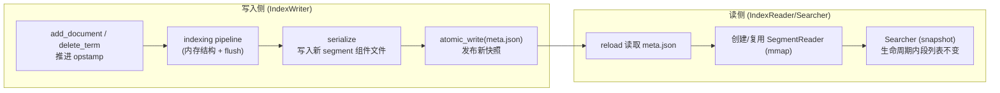

# P1-02 Index/Segment/Meta：不可变分段模型与 meta.json

> 版本基线：tantivy 0.24.0（本仓库）
>
> 本文主问题：为什么 Tantivy 选择“不可变 segment + meta.json”来组织索引？它如何同时支持并发读写、崩溃一致性与快速打开（mmap）？
>
> 本文产出：索引目录布局图 1 张 + `meta.json` 字段速查 + 可运行实验 1 个（连续 commit，观察 segment 与 meta 的变化）

## 本文目标

- 读懂：segment 是什么、为什么不可变、`meta.json` 记录了什么
- 理解 commit 做了什么（写新段 + 原子更新元数据）
- 为后续的 delete/merge/searcher 快照铺垫概念

## 读前准备

- 读过 P1-01 最好：你已经见过 `IndexWriter::commit` / `IndexReader::searcher`
- 有基本文件系统直觉：目录里一堆只读文件 + 1 个小的“清单文件”（manifest）
- 可选：先扫一眼 `ARCHITECTURE.md` 里 Index/Segments/Deletes/Merges 小节

## 关键概念（先给结论）

- `Segment`：一批文档的**不可变**索引产物。一次 commit 最核心的事情，就是“落盘一个或多个新 segment”。
- `SegmentId`：segment 的 UUID（在 `meta.json` 里通常是带 `-` 的字符串；在文件名里会用 32 位 hex 的“simple”形式当作前缀）。
- `SegmentComponent`：一个 segment 由多个组件文件构成（postings/terms/positions/fast field/docstore/fieldnorm/delete bitset…），每个组件一个文件。
- `meta.json`：索引的“目录索引 / manifest”。它告诉你：schema 是什么、当前有哪些可搜索 segments、索引级设置、最新 commit 的 `opstamp` 等。
- `IndexMeta / SegmentMeta`：`meta.json` 的内存表示（见 `src/index/index_meta.rs`）。
- `opstamp`：单调递增的操作序号（u64）。add/delete/commit 都会推进它；commit 的 `opstamp` 是“发布一个新快照”的版本号。
- （旁支但很重要）`.managed.json`：由 `ManagedDirectory` 维护的“曾经创建过的文件清单”，用于 GC 清理不再被任何 segment 引用的旧文件（见 `src/core/mod.rs`、`src/directory/managed_directory.rs`）。

## 先看结果：一个 index 目录长什么样？

先不写代码，我们直接看仓库里已有的一个小索引样本（兼容性测试数据）。

目录文件（节选）：

```text
tests/compat_tests_data/index_v6/
  meta.json
  00000000000000000000000000000000.idx
  00000000000000000000000000000000.term
  00000000000000000000000000000000.pos
  00000000000000000000000000000000.store
  00000000000000000000000000000000.fast
  00000000000000000000000000000000.fieldnorm
```

你可以先得到两个直觉：

1. 目录里有一个很小的 `meta.json`（manifest）——打开 index 时优先读它。
2. 大文件基本都是“只追加、只读”的 segment 组件文件——读的时候适合 mmap。

`meta.json` 里对 segment 的描述（节选）：

```json
{
  "segments": [
    {
      "segment_id": "00000000-0000-0000-0000-000000000000",
      "max_doc": 1,
      "deletes": null
    }
  ],
  "opstamp": 2
}
```

注意这里的 `segment_id` 带 `-`，但对应的文件前缀是去掉 `-` 的 32 位 hex：  
`00000000-0000-0000-0000-000000000000` → `00000000000000000000000000000000.*`

这不是“两套 id”，而是同一个 UUID 的两种展示形式：

- `meta.json` 走 serde → `Uuid` 的字符串表示（通常带 `-`）
- 段文件名用 `SegmentId::uuid_string()`（见 `src/index/segment_id.rs`）

### Segment 组件文件扩展名速查

segment 文件名规则基本是：

- `segment_uuid_simple + "." + 扩展名`
- delete bitset 的扩展名会额外带上 delete 的 `opstamp`：`segment_uuid_simple.<opstamp>.del`

在 `src/index/segment_component.rs` 和 `src/index/index_meta.rs`（`SegmentMeta::relative_path`）可以看到这些扩展名的来源：

| 扩展名 | 组件 | 大致是什么 | 你会在哪篇用到 |
|---|---|---|---|
| `.term` | Terms | term 字典（term → terminfo） | 倒排细节（P2-06） |
| `.idx` | Postings | postings（倒排列表） | 倒排细节（P2-06/P2-07） |
| `.pos` | Positions | 位置列表（短语/邻近） | 短语查询（P2-07） |
| `.fast` | FastFields | 列存 fast field | 列存/聚合（P2-08/P4-13） |
| `.fieldnorm` | FieldNorms | fieldnorm（BM25 需要） | BM25（P2-07） |
| `.store` | Store | 行存 docstore（返回原文） | docstore（P2-08） |
| `.store.temp` | TempStore | docstore 的临时文件（中间态） | merge/写入细节（P4-15） |
| `.<opstamp>.del` | Delete | **alive bitset**（标记哪些 doc 仍然活着） | deletes（P4-14） |

## 源码入口（建议阅读顺序）

> 建议按“目录清单（meta）→ 文件命名（segment 组件）→ commit 原子性（atomic_write）→ IndexWriter 调度”的顺序读。

1. `ARCHITECTURE.md`：Index/Segments、Deletes、Merges 小节（先建立大图景）
2. `src/core/mod.rs`：`META_FILEPATH`（`meta.json`）与 `MANAGED_FILEPATH`（`.managed.json`）
3. `src/index/index_meta.rs`：`IndexMeta` / `SegmentMeta` / `IndexSettings`（meta.json 的结构）
4. `src/index/segment_id.rs`：`SegmentId::uuid_string()`（文件名前缀为何是 32 位 hex）
5. `src/index/segment_component.rs`：`SegmentComponent`（有哪些组件）
6. `src/index/index_meta.rs`：`SegmentMeta::relative_path`（组件 → 扩展名，delete 文件名规则）
7. `src/directory/directory.rs`：`Directory::atomic_write` 的语义约束（“看不到半截 meta.json”）
8. `src/directory/mmap_directory.rs`：`atomic_write(...)` 的落地实现（tempfile + flush + sync + rename/persist）
9. `src/indexer/index_writer.rs`：`IndexWriter::commit`（commit 的外部入口）
10. `src/indexer/prepared_commit.rs`、`src/indexer/segment_updater.rs`：`PreparedCommit::commit_future` → `SegmentUpdater::schedule_commit` → `save_metas`

## 数据流/时序（建议画图）

下面这张图刻意只画与“不可变 segment + meta.json”相关的主线：写入侧永远只**新增文件**，最后用一次原子写把 `meta.json` 指向新的 segment 集合；读侧通过 reload 拿到新的快照。



你可以把 `meta.json` 理解成“指针切换”：

- commit 前：`meta.json` 指向旧的 segments
- commit 后：`meta.json` 原子替换为新内容（segments 列表增加/减少/更新 delete opstamp…）
- 老的 segment 文件不会被“就地修改”（immutable），因此旧 searcher 仍然安全可用

## 为什么 Tantivy 要坚持“不可变 segment + meta.json”？

这一套设计，本质上是把索引写入做成了一个“小型 LSM / log-structured”系统：写入永远产出新段，后台再做合并，元数据用一个小文件原子切换。

### 1) 并发读写变简单：读侧几乎不需要锁

- segment 不会被就地修改 → Searcher 可以放心 mmap + 随机读
- Writer 写新段时，不会影响正在读旧段的 Searcher
- “读到哪个版本”由 `meta.json` 决定：读侧 reload 后才会看到新 commit（快照一致性，P3-09 会展开）

### 2) 崩溃一致性更容易：commit 是 manifest 的原子更新

Tantivy 把“发布新版本”的边界放在 `meta.json`：

- 新 segment 的组件文件写完、flush/sync 完成后
- 用 `Directory::atomic_write` 原子替换 `meta.json`

`Directory::atomic_write` 的契约是：读操作永远不会观察到“写了一半的文件”（见 `src/directory/directory.rs`）。在 `MmapDirectory` 里，它通过“同目录临时文件 + flush + sync + rename/persist”来实现（见 `src/directory/mmap_directory.rs` 的 `atomic_write`）。

因此常见 crash 场景下，系统可以做到：

- 要么新 commit 没发布（仍读旧 `meta.json`）
- 要么新 commit 完整发布（读到新 `meta.json`）

而“写到一半的 meta.json 导致 index 打不开”这种情况会被尽量避免。

### 3) 打开 index 很快：小文件 + mmap

- `meta.json` 很小：它只包含 schema、segment 列表、少量设置与 opstamp
- 大文件都是 segment 组件：用 mmap 做到“几乎不拷贝地随机读”

### 4) 代价：你需要 merge（并且要理解 deletes）

- segment 不可变意味着：更新/删除不是“原地改”
  - delete 会生成/更新 `.del`（alive bitset），并在 `meta.json` 里记录 delete 的 `opstamp`
  - merge 会生成更大的新 segment，并把旧 segment 从 `meta.json` 移除（然后 GC 清文件）
- 如果你 commit 很频繁，segment 数会快速增长 → 查询会慢（每段都要跑一遍）→ 需要 merge policy（P4-15）

## 可运行实验

> 实验要求：至少跑 1 个 `cargo run --example ...` 或 `cargo test ...`。下面给两个：一个“看目录”，一个“造目录”。

### 实验 1：观察一个现成 index 目录（无需编译）

#### 实验目标

- 建立“meta.json + 一堆 segment 文件”的第一印象
- 对齐：`segment_id`（带 `-`）与文件名前缀（32 位 hex）之间的关系

#### 操作步骤

```bash
ls tests/compat_tests_data/index_v6
sed -n '1,80p' tests/compat_tests_data/index_v6/meta.json
```

#### 验证点

- `meta.json` 里存在 `segments[0].segment_id`（带 `-`）
- 目录里存在以“去掉 `-` 的 32 位 hex”开头的一组组件文件（`.idx/.term/.pos/...`）
- `deletes` 为 `null` 时，目录里通常不会出现 `.<opstamp>.del` 文件

### 实验 2：连续 commit 两次，观察 meta.json / segment 数变化（需要编译）

#### 实验目标

- 观察：每次 commit 都会“新增 segment 组件文件 + 原子更新 meta.json”
- 观察：`opstamp` 单调递增，且 `meta.json.opstamp` 会被更新到最新 commit 的值

#### 操作步骤

1) 把下面代码保存为 `examples/p1_02_commit_twice.rs`（你也可以换成任意文件名）：

```rust
use std::fs;
use std::path::Path;

use tantivy::indexer::NoMergePolicy;
use tantivy::schema::*;
use tantivy::{doc, Index, Term};
use tempfile::TempDir;

fn read_meta_json(dir: &Path) -> serde_json::Value {
    let meta_path = dir.join("meta.json");
    let meta_str = fs::read_to_string(&meta_path).expect("meta.json should exist");
    serde_json::from_str(&meta_str).expect("meta.json should be valid JSON")
}

fn print_summary(dir: &Path, label: &str) {
    let meta = read_meta_json(dir);
    let opstamp = meta["opstamp"].as_u64().unwrap_or(0);
    let segs = meta["segments"].as_array().map(|a| a.len()).unwrap_or(0);
    println!("\n=== {label} ===");
    println!("index_dir: {}", dir.display());
    println!("meta.json.opstamp = {opstamp}, segments = {segs}");
}

fn count_ext(dir: &Path, ext: &str) -> usize {
    fs::read_dir(dir)
        .expect("read_dir")
        .filter_map(|e| e.ok())
        .filter(|e| e.file_name().to_string_lossy().ends_with(ext))
        .count()
}

fn main() -> tantivy::Result<()> {
    let index_path = TempDir::new()?;
    let dir = index_path.path();

    let mut schema_builder = Schema::builder();
    let id = schema_builder.add_text_field("id", STRING);
    let title = schema_builder.add_text_field("title", TEXT);
    let schema = schema_builder.build();

    let index = Index::create_in_dir(dir, schema)?;
    print_summary(dir, "after create");

    // 让实验更“可控”：单线程写入 + 禁用 merge（否则后台 merge 可能改变段数量）
    let mut writer = index.writer_with_num_threads(1, 50_000_000)?;
    writer.set_merge_policy(Box::new(NoMergePolicy));

    writer.add_document(doc!(id => "doc-1", title => "The Old Man and the Sea"))?;
    writer.add_document(doc!(id => "doc-2", title => "Of Mice and Men"))?;
    let op1 = writer.commit()?;
    print_summary(dir, &format!("after commit #1 (opstamp={op1})"));

    writer.add_document(doc!(id => "doc-3", title => "Frankenstein"))?;
    let op2 = writer.commit()?;
    print_summary(dir, &format!("after commit #2 (opstamp={op2})"));

    // 可选：做一次 delete，观察 deletes 字段与 .del 文件
    writer.delete_term(Term::from_field_text(id, "doc-2"));
    let op3 = writer.commit()?;
    print_summary(dir, &format!("after delete commit (opstamp={op3})"));

    println!("\nidx files = {}", count_ext(dir, ".idx"));
    println!("term files = {}", count_ext(dir, ".term"));
    println!("del files = {}", count_ext(dir, ".del"));
    Ok(())
}
```

2) 运行：

```bash
cargo run --example p1_02_commit_twice
```

#### 验证点

- `after commit #1` 时：`segments` >= 1，且 `.idx/.term` 文件数也 >= 1
- `after commit #2` 时：`segments` 比上一次更大（通常 +1），`.idx/.term` 文件数随之增加
- `after delete commit` 时：`del files` 通常会从 0 变成 >= 1（如果你删中了文档）
- 你能解释：为什么这些变化不需要“修改旧 segment 文件”（immutable）

## 常见坑 & FAQ（≤ 5）

1. **Q：为什么 `segment` 必须不可变？能不能在原文件上追加 postings？**  
   A：原地改会让并发读变复杂（读侧可能看到半截结构），也很难保证崩溃一致性。不可变段把复杂性集中在“发布 manifest（meta.json）”这一点上。

2. **Q：commit 到底“原子”在哪？**  
   A：commit 的原子边界是 `meta.json` 的 `atomic_write`：要么旧 `meta.json`，要么新 `meta.json`。segment 文件可能先写出来，但没被 `meta.json` 引用就不会被读侧看到，后续可被 GC 清理。

3. **Q：为什么 `meta.json` 里 `segment_id` 带 `-`，但文件名前缀没有？**  
   A：`meta.json` 是 UUID 的常见展示形式（serde）；文件名用的是 UUID 的 simple hex（`SegmentId::uuid_string()`）。同一个 UUID，两种格式。

4. **Q：旧的 Searcher 能看到新 commit 吗？**  
   A：通常不能。Searcher 是快照（snapshot），拿到以后它看到的 segment 列表在生命周期内不变；你需要 reload 后重新获取 Searcher（P3-09 会专门讲）。

5. **Q：`.managed.json` 能删吗？**  
   A：可以删（它是“文件清单”）；但删除后 GC 可能无法准确清理历史遗留文件，目录会越来越大。想理解它的正确语义，读 `src/directory/managed_directory.rs` 的注释最直接。

## 延伸阅读（可选）

- `ARCHITECTURE.md`：Index/Segments/Deletes/Merges
- `examples/deleting_updating_documents.rs`：从用户侧看 deletes（配合 P4-14）
- `src/directory/mmap_directory.rs`：`atomic_write` 的实现细节（配合 P1-03）
- `src/indexer/segment_updater.rs`：`schedule_commit`/`save_metas`（理解 commit 是怎么“发布快照”的）

## TODO

- [ ] 给出“segment 文件命名规则”的图示（uuid + 扩展名）
- [ ] 把 `meta.json` 的关键字段做成一张“速查表”（IndexSettings / segments / schema / opstamp / payload）
