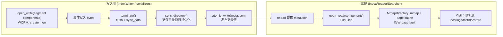

# P1-03 Directory 与 mmap：I/O 抽象与“把缓存交给 OS”

> 版本基线：tantivy 0.24.0（本仓库）
>
> 本文主问题：Directory trait 抽象了什么？为什么 Tantivy 强依赖 mmap？
>
> 本文产出：Directory 读写契约速查 + `MmapDirectory`/`RamDirectory` 对比 + 交互时序图 1 张 + 可运行实验 1 个（观察 flush/terminate 与 mmap cache hit/miss）

## 本文目标

- 读懂 `Directory` trait 的能力边界（为什么不支持“就地修改文件”）
- 对比 `MmapDirectory` 与 `RamDirectory` 的实现思路与使用场景
- 理解：打开 index 为何“几乎是 O(1)”（准确说是**几乎与 index 大小无关**，主要靠 mmap + page cache）

## 读前准备

- 读过 P1-02 更好：你已经知道 `meta.json` 是“manifest/目录索引”，commit 通过 `atomic_write` 发布新快照
- 对文件系统有一点直觉：flush/rename/fsync 的大致意义（不要求能背 POSIX 细节）
- 可选：知道 mmap 是“把文件映射到虚拟内存”，并不是“把整个文件读进内存”

## 关键概念（先给结论）

这一篇最重要的结论只有一句：

> Tantivy 的索引文件是“写一次、读很多次（WORM）”的；Directory 把这个约束变成 trait 契约，从而让读侧可以放心 mmap，让缓存交给 OS。

把这句话拆开，就是下面这些概念。

### 1) `Directory`：WORM 存储抽象，而不是 `Read/Write` 流

`Directory` 定义在 `src/directory/directory.rs`，它不是“打开一个文件，给我一个 `Read`”，而是：

- `open_read(path) -> FileSlice`：返回一个**只读视图**（逻辑切片）
- `open_write(path) -> WritePtr`：返回一个**写入句柄**，但有强约束：文件必须不存在（WORM）
- `atomic_write(path, data)`：对小文件做“原子替换”（典型就是 `meta.json`）

为什么不是 `Read/Write`？因为检索读路径的核心需求是：

- **随机读**（倒排、fast field、docstore 都在不同 offset 读块）
- **可切片**（同一个文件里不同结构共享底层字节，但读取范围不同）
- **快照一致性**（Searcher 生命周期内看到的段文件必须是稳定的）

流式 `Read`/`Write` 很难把这些“不变量”表达清楚，只能靠约定；Tantivy 选择把约束写进 trait。

### 2) `FileSlice` / `FileHandle`：只读视图 + “内容不可变”契约

`open_read` 返回的不是 `File`，而是 `FileSlice`（见 `common/src/file_slice.rs`）：

- `FileSlice = (Arc<dyn FileHandle>, Range<usize>)`
- clone/slice 都很便宜：`FileSlice::slice(...)` 只是调整 range
- `FileHandle::read_bytes(range)` 支持随机读

更关键的是它的契约：**只要 `FileHandle` 还活着，这段数据就不能被改变或销毁**。这直接把“mmap 读只读文件”的前提条件写死了。

### 3) `open_write` + `TerminatingWrite::terminate()`：写入生命周期（不要依赖 Drop）

`Directory::open_write` 返回的是 `WritePtr = BufWriter<Box<dyn TerminatingWrite>>`（见 `src/directory/mod.rs`）：

- `flush()`：把 `BufWriter` 的缓冲刷到下层（让后续 read 能看到）
- `terminate()`：告诉 writer “写完了”，做最终的 flush + 持久化动作（比如 `fsync`）

在 `RamDirectory` 里，忘记 flush/terminate 会在 Drop 时 warn；在 `MmapDirectory` 里，真正的 `sync_data()` 是在 `terminate()` 里做的（见 `src/directory/mmap_directory.rs` 的 `SafeFileWriter`）。

一句话建议：**写段文件时把 `terminate()` 当作“提交/封口”**，而不是只 `flush()`。

### 4) `atomic_write`：让读侧“看不到半截文件”

`atomic_write` 的语义是：读操作永远不应观察到“写了一半的文件”。这对 `meta.json` 这种 manifest 至关重要：

- commit 要发布新快照，只需要原子替换 `meta.json`
- crash 时要么看到旧 `meta.json`，要么看到完整的新 `meta.json`

`MmapDirectory` 的实现方式是：同目录 tempfile → write/flush → `sync_data()` → rename/persist（见 `src/directory/mmap_directory.rs` 的 `atomic_write`）。

### 5) mmap + page cache：打开 index 为何“几乎是 O(1)”

当 Directory 的读侧是 mmap（`MmapDirectory`）时：

- 打开一个段文件通常只做了 `mmap` 系统调用（建立映射），**并不会把整个文件读进内存**
- 真正的 I/O 发生在“首次触碰到某个页面”时（page fault），之后由 OS page cache 负责缓存

这就是 `doc/src/basis.md` 所说的 “Straight from disk”：大部分 reader 直接在磁盘布局之上工作，尽量少用匿名内存，把缓存交给 OS。

### 6) `MmapDirectory` vs `RamDirectory`：一个用于生产，一个用于对照/测试

| 维度 | `MmapDirectory`（`src/directory/mmap_directory.rs`） | `RamDirectory`（`src/directory/ram_directory.rs`） |
|---|---|---|
| 数据落点 | 文件系统目录（持久化） | 进程内匿名内存（不持久化） |
| 读 | `mmap` → `OwnedBytes` → `FileSlice`（几乎零拷贝） | `HashMap<PathBuf, FileSlice>`（直接存 bytes） |
| 写 | `open_write(create_new)`，`terminate()` 时 `sync_data()` | 写到 `VecWriter` buffer，`flush()` 才可见 |
| 原子更新 | tempfile + persist（rename） | 直接替换内存中的 bytes |
| 典型用途 | 真实索引、生产服务 | 单元测试、最小语义验证 |

补充一个容易忽略的点：`MmapDirectory` 内部还有一个 mmap cache（`MmapCache`），用 `Weak` 缓存映射，减少重复 `mmap` 调用（见 `MmapDirectory::get_cache_info`）。

### 7) 两把锁：`INDEX_WRITER_LOCK` 与 `META_LOCK`

Directory 这一层不只管“读写文件”，也承载了索引并发场景里最基础的**互斥/协作**能力（见 `src/directory/directory_lock.rs`）：

- `INDEX_WRITER_LOCK`（`.tantivy-writer.lock`，非阻塞）：保证“同一个 index 同时只有一个 writer”。拿不到通常意味着你重复创建了 `IndexWriter`，或上一次进程崩溃遗留了锁文件。
- `META_LOCK`（`.tantivy-meta.lock`，阻塞）：保护 `IndexReader::reload()` 打开 segment 文件的过程不被 GC 干扰。直觉上它解决的是“读侧刚读到 meta.json，准备 open 段文件，写侧/另一个进程的 GC 就把旧段删了”的竞态。

### 8) `ManagedDirectory`：给 Directory 加一层“文件清单”，便于 GC

从 `Index` 的角度看，它实际持有的是 `ManagedDirectory`（见 `src/index/index.rs`），而不是裸 `MmapDirectory`：

- `ManagedDirectory` 会用 `.managed.json` 记录“被 Tantivy 管理过的文件集合”（见 `src/directory/managed_directory.rs`）
- 有了这份清单，才能在 merge/commit 之后做 GC：删除那些“不再被任何 segment 引用”的旧文件
- 在 Windows 上，如果旧文件还被 mmap/打开，删除可能失败：Tantivy 会把它们记到 `failed_to_delete_files`，下一次 GC 再尝试

## 源码入口（建议阅读顺序）

> 建议按“契约（Directory/FileSlice）→ 两个实现（mmap/ram）→ 周边（锁/GC/managed）”的顺序读。

1. `ARCHITECTURE.md`：directory 小节 + “Straight from mmapped file”那段（建立总览）
2. `src/directory/directory.rs`：`pub trait Directory`（`open_read/open_write/atomic_write/sync_directory/watch` 的语义）
3. `common/src/file_slice.rs`：`FileSlice` / `FileHandle`（为什么需要“可切片 + 随机读”）
4. `src/directory/mod.rs`：`WritePtr`、`TerminatingWrite` re-export（写入生命周期）
5. `src/directory/mmap_directory.rs`：
   - `impl Directory for MmapDirectory`（`get_file_handle/open_write/atomic_write/sync_directory`）
   - `MmapCache` / `get_cache_info`（命中/未命中逻辑）
6. `src/directory/ram_directory.rs`：
   - `impl Directory for RamDirectory`
   - `VecWriter`（flush/Drop 行为）
7. `src/directory/directory_lock.rs`：`INDEX_WRITER_LOCK` / `META_LOCK`（为什么需要两把锁）
8. `src/directory/managed_directory.rs`：`ManagedDirectory::garbage_collect`（mmap 文件在 Windows 上删不掉会发生什么）

## 数据流/时序（建议画图）

下面这张图只画“写入产出只读文件 + meta 原子切换 + 读侧 mmap”的主线。你可以把 Directory 理解成一个“只允许新增大文件 + 原子替换小清单文件”的存储层。



这张图里最“反直觉但关键”的点是：读侧几乎不需要“读入内存再解析”，它直接在磁盘布局之上随机读（很多 reader 只是 `FileSlice::slice + read_bytes_slice` 的组合）。

## 可运行实验

> 目标：用一个最小程序同时观察三件事：
>
> 1) `open_write` 的 WORM 行为（不能覆盖写）  
> 2) `flush/terminate` 对“读可见性/持久化”的意义  
> 3) `MmapDirectory` 的 mmap cache hit/miss（为什么“打开很快”）

### 实验目标

- 直观看到：**写入未 flush 时，读侧拿到的是旧视图/空视图**
- 直观看到：同一路径二次 `open_write` 会报 `File already exists`
- 直观看到：同一文件连续 `open_read` 会产生 1 次 miss + 1 次 hit（在 `FileSlice` 仍存活的前提下）

### 操作步骤

1) 将下面代码保存为 `examples/p1_03_directory_contract.rs`：

```rust
use std::io::Write;
use std::path::Path;

use tantivy::directory::{MmapDirectory, RamDirectory, TerminatingWrite};
use tantivy::Directory;

fn main() -> tantivy::Result<()> {
    println!("== RamDirectory ==");
    let ram = RamDirectory::create();
    let p = Path::new("hello.txt");

    let mut w = ram.open_write(p)?;
    w.write_all(b"hello")?;

    let before = ram.open_read(p)?.read_bytes()?;
    println!("before flush: {} bytes", before.len());

    // 让写入对读侧可见（同时也会把 VecWriter 的 buffer 落到 RamDirectory 的 HashMap 里）
    w.flush()?;

    let after = ram.open_read(p)?.read_bytes()?;
    println!("after  flush: {:?}", String::from_utf8_lossy(after.as_slice()));

    // WORM：同名文件不能二次 open_write
    match ram.open_write(p) {
        Ok(_) => unreachable!("should be WORM"),
        Err(err) => println!("open_write twice: {err}"),
    }

    println!();
    println!("== MmapDirectory ==");
    let tmp = tempfile::TempDir::new()?;
    let mmap_dir = MmapDirectory::open(tmp.path())?;
    let q = Path::new("blob");

    let mut w2 = mmap_dir.open_write(q)?;
    w2.write_all(b"abcdef")?;
    // 结束写入：对 MmapDirectory 来说，这一步会 sync_data()
    w2.terminate()?;

    // 关键：保持 a/b 两个 FileSlice 存活，才能看到 mmap cache 的 hit
    let a = mmap_dir.open_read(q)?;
    let b = mmap_dir.open_read(q)?;
    let info = mmap_dir.get_cache_info();
    println!("cache counters: hit={}, miss={}", info.counters.hit, info.counters.miss);

    let a_bytes = a.read_bytes()?;
    let b_bytes = b.read_bytes()?;
    println!("read a: {:?}", String::from_utf8_lossy(a_bytes.as_slice()));
    println!("read b: {:?}", String::from_utf8_lossy(b_bytes.as_slice()));

    Ok(())
}
```

2) 运行：

```bash
cargo run --example p1_03_directory_contract
```

### 验证点

- 输出里 `before flush: 0 bytes`，`after flush: "hello"`（说明 flush 才让写入对读侧可见）
- 输出里出现 `open_write twice: File already exists: 'hello.txt'`（说明 WORM）
- 输出里 `cache counters: hit=1, miss=1`（第一次 open_read miss，第二次 hit；前提是第一个 `FileSlice` 还活着）

## 常见坑 & FAQ（≤ 5）

1. **Q：为什么 Directory 不提供“修改文件某个 range”的 API？**  
   A：因为 Tantivy 的 reader 依赖 “`FileSlice` 内容不可变” 才能安全 mmap；一旦允许原地修改，Searcher 快照、mmap 共享、GC 都会变得非常复杂。相反，Tantivy 选择“写新文件 + 原子切换 meta.json”这条路（log-structured）。

2. **Q：`flush()` 和 `terminate()` 有什么区别？我应该用哪个？**  
   A：`flush()` 的目标是让缓冲写入对后续读可见；`terminate()` 表示“写完了”，会触发最终持久化动作（例如 `MmapDirectory` 的 `sync_data()`）。在 Tantivy 的段文件写入里，建议把 `terminate()` 当作必做步骤。

3. **Q：为什么 Directory 抽象不是 `Read/Write + Seek`？**  
   A：检索读路径是“随机读 + 切片复用”的：同一个段文件会被拆成很多逻辑子结构读不同 offset。`FileSlice` 把“可切片 + 内容不可变 + 随机读”变成一等公民；这比拿一个 `Read/Seek` 自己管理 offset/caching/snapshot 要清晰也更安全。

4. **Q：mmap 会不会把整个索引一次性加载进内存？**  
   A：不会。mmap 更像是建立“虚拟地址到文件页”的映射；真正读盘发生在首次访问某个页面时。好处是启动/打开快，坏处是第一次查询可能会有 page fault 抖动（之后 OS page cache 会热起来）。

5. **Q：Windows 上为什么 GC 有时删不掉文件？**  
   A：Windows 对正在被 mmap/打开的文件删除限制更严格。Tantivy 在 GC 结果里单独记录 `failed_to_delete_files`（见 `src/directory/mod.rs` 的注释）；文件通常会在没有 Searcher 持有它们之后的下一次 GC 被删掉。

## 延伸阅读（可选）

- `doc/src/basis.md`：Straight from disk / log method（把“只读段文件 + meta.json”串起来）
- `ARCHITECTURE.md`：directory 小节 + reader/snapshot 的描述
- `common/src/file_slice.rs`：`FileSlice::slice` 与 `read_bytes_slice`（理解“为什么不是 Read 流”）
- `src/directory/managed_directory.rs`：`.managed.json`、GC、`META_LOCK`（理解“目录为什么需要管理层”）
- `src/directory/mmap_directory.rs`：`atomic_write` 与 `MmapCache`（理解“打开快”和“崩溃一致性”）

## TODO

- [ ] 把 `Directory` 的 API 用“索引生命周期”串成一页速查（create/open/commit/reload/merge/GC 各用到哪些方法）
- [ ] 补充：`Directory::watch` 与 `ReloadPolicy::OnCommitWithDelay` 的关联（为什么只监听 `meta.json` 的 atomic_write）
