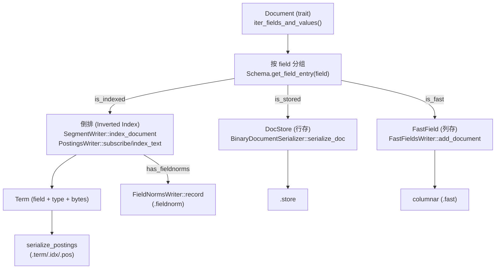

# P1-04 Schema/Document/Term：数据模型如何决定索引结构

> 版本基线：tantivy 0.24.0（本仓库）
>
> 本文主问题：Schema 的字段选项（TEXT/STORED/FAST）如何决定落到哪些结构里？
>
> 本文产出：字段选项 → 数据结构对照表 1 张 + 写入侧分流图 1 张 + 可运行实验 1 个（同时验证 TEXT/STORED/FAST/TermQuery）

## 本文目标

- 读懂 Schema 如何描述字段类型与索引选项
- 理解 Document 在 Tantivy 内部的表示（以及为何有 trait 化）
- 把 “Term = (field, bytes)” 与倒排索引连接起来

## 读前准备

- 读过 P1-01 更好：你已经跑过 `IndexWriter::add_document/commit` 与 `Searcher::search`
- 对倒排有个直觉就够：term 字典 → postings（本篇只讲“term 从哪来”，倒排细节在 P2-06）
- 你愿意接受一个现实：**Schema 一旦写入索引（meta.json），就很难再“改结构不重建”**

## 关键概念（先给结论）

- `Schema`：索引的**强约束数据模型**。它决定“同一份 Document”会被写入哪些结构：倒排（inverted index）、行存（docstore）、列存（fast field）。
- `Field`：字段句柄，本质是一个 `u32 field_id`（不是字符串）。Schema 负责把 `name ↔ field_id` 映射起来（见 `src/schema/schema.rs`）。
- `FieldEntry = (name, FieldType)`：Schema 的每一列配置项。`FieldType` 里既有“值类型”（text/u64/...），也有“选项”（indexed/stored/fast/...）（见 `src/schema/field_entry.rs`、`src/schema/field_type.rs`）。
- `Document`：写入侧输入数据的抽象（trait）。Tantivy 通过它拿到 `(Field, Value)` 序列，而不是强制你必须构造 `TantivyDocument`（见 `src/schema/document/mod.rs`）。
- `TantivyDocument`：默认文档类型（旧模型保留），当前是 `CompactDoc` 的别名：用更紧凑的二进制布局存储字段和值（见 `src/schema/document/default_document.rs`）。
- `Term`：倒排里的最小 key（你可以先记成：`(field, type, bytes)`）。写入侧把 token/数值编码成 Term，查询侧再用 Term 去找 postings（见 `src/schema/term.rs`、`src/query/term_query/term_query.rs`）。

## 一张表：字段选项 → “写到哪” → “能干啥”

> 注意：这些选项彼此是正交的（你可以只 FAST、不 INDEX；也可以 STORED 但不 INDEX）。Schema 决定的是“写入侧要不要走某条管线”，而不是“文件是否存在”（组件文件可能会创建但为空/无列）。

| 你在 Schema 里写的选项 | 写入侧落点（核心 writer） | 典型落盘组件（P1-02 已列扩展名） | 你得到的能力/代价 |
|---|---|---|---|
| `TEXT` / `STRING` / `INDEXED`（可搜索） | `SegmentWriter::index_document` → `PerFieldPostingsWriter`（见 `src/indexer/segment_writer.rs`、`src/postings/postings_writer.rs`） | `.term`/`.idx`（以及可能的 `.pos`） | 能查（TermQuery/QueryParser/短语等取决于 record option）；代价是写入 CPU/磁盘与查询时的 postings 解码 |
| `STORED`（可取回原值） | `BinaryDocumentSerializer::serialize_doc` 只序列化 stored 字段（见 `src/schema/document/se.rs`） | `.store` | `searcher.doc(...)` 能取回；代价是读回较慢（压缩行存），不适合打分/聚合热路径 |
| `FAST`（列存快速随机读） | `FastFieldsWriter::add_document` → `columnar::ColumnarWriter`（见 `src/fastfield/writer.rs`） | `.fast` | 排序/聚合/自定义 collector/打分特征很快；代价是写入时要额外编码列存、占用空间 |
| `fieldnorms=true/false`（长度归一化） | `FieldNormsWriter::record`（见 `src/indexer/segment_writer.rs`、`src/fieldnorm/*`） | `.fieldnorm` | 影响 BM25 等相似度（“字段长度”）；关闭可省空间/写入，但评分解释会不同 |

## 源码入口（建议阅读顺序）

> 建议先把“Schema 选项怎么表达”读明白，再去看写入侧如何按选项分流。

1. `src/schema/text_options.rs`：`TEXT`/`STRING`、`TextOptions`、`TextFieldIndexing::set_tokenizer`
2. `src/schema/flags.rs`：`STORED`/`FAST`/`INDEXED` 这些 flag 的含义（以及为何能用 `|`）
3. `src/schema/schema.rs`：`Schema`/`SchemaBuilder`（name ↔ field_id）、`get_field_entry`
4. `src/schema/field_entry.rs`：`FieldEntry::is_indexed/is_stored/is_fast/has_fieldnorms`
5. `src/schema/field_type.rs`：`FieldType` 与 `value_from_json`（Schema 如何“约束输入值类型”）
6. `src/schema/document/mod.rs`：`Document`/`Value`/`ReferenceValue`（trait 化的动机与约束）
7. `src/schema/document/default_document.rs`：`CompactDoc`（`TantivyDocument`）的紧凑布局与 `parse_json`
8. `src/schema/document/se.rs`：`BinaryDocumentSerializer::serialize_doc`（STORED 的真正落点）
9. `src/schema/term.rs`：`Term` 的编码（field_id + type + bytes）
10. `src/indexer/segment_writer.rs`：`SegmentWriter::index_document`（TEXT/INDEXED 如何产出 term）
11. `src/fastfield/writer.rs`：`FastFieldsWriter::add_document`（FAST 如何写入列存）
12. `src/query/term_query/term_query.rs`：`TermQuery::specialized_weight`（TermQuery 为什么会报“field not indexed”）

## Schema：从“字段声明”到“能力开关”

这一节解决两个常见误会：

1) “`TEXT | STORED` 是语法糖还是魔法？”  
2) “为什么说 Schema 决定了索引结构？”

### 1) `TEXT/STRING` 是 `TextOptions`，`STORED/FAST` 是 flag，`|` 只是组合配置

在 `src/schema/text_options.rs` 里你能看到：

- `pub const TEXT: TextOptions = ...`（默认 tokenizer=`default`，record=`WithFreqsAndPositions`）
- `pub const STRING: TextOptions = ...`（tokenizer=`raw`，record=`Basic`）

在 `src/schema/flags.rs` 里你能看到：

- `pub const STORED: SchemaFlagList<StoredFlag, ()> = ...`
- `pub const FAST: SchemaFlagList<FastFlag, ()> = ...`

关键点在于：这些类型实现了 `BitOr`，并且 `StoredFlag/FastFlag` 通过 `From<...>` 被转换成各自的 `*Options`，最后合并成一个 options：

- `TextOptions | StoredFlag` → 得到 “indexing=TEXT 的 indexing + stored=true”
- `NumericOptions | FastFlag` → 得到 “fast=true”（是否 indexed/stored 取决于你是否也 OR 了别的 flag）

所以代码里的

```rust
schema_builder.add_text_field("title", TEXT | STORED);
schema_builder.add_u64_field("price", FAST);
```

本质上就是“把一堆布尔开关拼到一个 Options struct”。

### 2) 一个字段在 Schema 里至少有 4 个关键问法

拿到 `FieldEntry`（`src/schema/field_entry.rs`）后，你经常会问：

- `is_indexed()`：要不要进倒排（能不能查）
- `is_stored()`：要不要进 docstore（能不能取回原值）
- `is_fast()`：要不要进 fast field（能不能快速随机读做排序/聚合）
- `has_fieldnorms()`：要不要写 fieldnorm（BM25 要用）

后面你会在写入侧看到它们是怎样决定“走不走某条管线”的。

## Document：为什么要 trait 化？默认 `TantivyDocument` 到底长什么样？

### 1) 先记住一句话：IndexWriter 需要“能迭代字段值”的东西，而不关心你的业务 struct

`src/schema/document/mod.rs` 里 `pub trait Document` 的核心方法只有一个：

- `iter_fields_and_values() -> Iterator<Item = (Field, Value)>`

为什么要这样做？

- 写入侧是多线程流水线，`Document: Send + Sync + 'static` 能跨线程传递
- Tantivy 只需要“字段 + 值”，不想强迫你把业务对象先转成 `TantivyDocument` 再转一次
- `Value` trait 让 Tantivy 能以**尽量少的分配**访问值（`ReferenceValue` 借用为主）

> 你依然可以用 `doc!(...)`：它只是一个宏，帮你快速构造默认的 `TantivyDocument`（见 `src/macros.rs`）。

### 2) 默认 `TantivyDocument` 其实是 `CompactDoc`

在 `src/schema/document/default_document.rs` 顶部有一行：

- `pub use CompactDoc as TantivyDocument;`

`CompactDoc` 的两个核心字段：

- `node_data: Vec<u8>`：把各种值序列化成紧凑 bytes 存起来
- `field_values: Vec<FieldValueAddr>`：记录 `(field_id, value_addr)`，value_addr 指向 node_data 的某个位置

因此 `TantivyDocument` 不是 “HashMap<String, Value>”，而是更偏向“紧凑列车厢 + 地址表”的结构（这对写入吞吐和存储局部性更友好）。

### 3) `STORED` 的真正落点：docstore 序列化时会筛掉非 stored 字段

在 `src/schema/document/se.rs` 的 `BinaryDocumentSerializer::serialize_doc` 里有一段非常关键的过滤：

- `filter(|(field, _)| schema.get_field_entry(*field).is_stored())`

这就是为什么：

- 你不加 `STORED`，`searcher.doc(doc_address)` 取回来的文档里就没有这个字段
- `STORED` 适合“展示/回填”，不适合“每个 hit 都读一遍做打分/聚合”

如果你想在热路径里读某个字段，请优先考虑 `FAST`（列存随机读）。

## Term：把 Schema 与倒排索引连起来的那根线

### 1) Term 的编码：`field_id (4 bytes) + type (1 byte) + payload bytes`

`src/schema/term.rs` 顶部注释写得很直白：

- 前 4 字节：field id（big-endian）
- 第 5 字节：type code
- 后面：value bytes（text 就是 utf8；数值走 big-endian 的 u64 表示，保持字典序）

你会看到一系列构造函数：

- `Term::from_field_text(field, "sea")`
- `Term::from_field_u64(field, 1937u64)`
- `Term::from_field_json_path(field, "k8s.node.id", expand_dots)`（JSON 字段）

另外还有一个非常重要的提醒（同文件）：

> `Term::serialized_term()` 的字节表示不要当作索引格式依赖，它未来可能变。

Term 的 byte 表示是“内部实现细节”，但 **Term 作为 (field, value) 的抽象是稳定的**：查询侧与写入侧都围绕它工作。

### 2) 写入侧怎么产出 Term？看 `SegmentWriter::index_document`

`src/indexer/segment_writer.rs` 的 `SegmentWriter::index_document` 是这篇的“主线入口”：

- 它遍历 `Document::iter_fields_and_values()`，按 field 分组
- 对每个 field：先 `field_entry.is_indexed()` 决定要不要进倒排
- 对 text：拿到该 field 的 tokenizer（`per_field_text_analyzers`）→ `PostingsWriter::index_text(...)`
  - `index_text` 会把 `token.text` append 到 `term_buffer`（见 `src/postings/postings_writer.rs`）
- 对数值：`term_buffer.set_u64/set_i64/...` 然后 `postings_writer.subscribe(...)`
- 如果 `field_entry.has_fieldnorms()`：记录 fieldnorm（BM25 会用）

你可以把它理解为：

> Schema 决定“某个 field 的 value”会不会被 token/编码成 Term，并写入倒排。

### 3) 查询侧怎么用 Term？看 `TermQuery`

`src/query/term_query/term_query.rs` 里 `TermQuery::specialized_weight` 会先检查：

- `schema.get_field_entry(term.field()).is_indexed()`

所以 TermQuery 在一个 “FAST 但不 INDEXED” 的字段上会报错：**fast field 不是倒排**，TermQuery 也不是 fast field 查询。

另一个经常踩坑的点：

- `TermQuery` 不会替你做 tokenizer 分析；它是“低层精确 term”
- `QueryParser` 才会按 field 的 tokenizer 把输入字符串分析成 term

这也解释了为什么实际业务中你常用 `QueryParser`，而不是手写 TermQuery。

## 写入侧“分流”图：同一份 Document 如何被写到 3 套结构里

下面这张图刻意只画“按 Schema 分流”的主线：你读 `SegmentWriter`/`FastFieldsWriter`/`BinaryDocumentSerializer` 时可以对照。



你现在应该能回答本文主问题了：

- `TEXT/STRING/INDEXED`：会触发“倒排写入路径”（term → postings）
- `STORED`：会触发“docstore 写入路径”（只存 stored 字段，供 doc() 取回）
- `FAST`：会触发“列存写入路径”（供快速随机读、排序/聚合）

## 可运行实验：同时验证 TEXT/STORED/FAST/TermQuery 的行为边界

### 实验目标

- 直观看到：**STORED 决定 `searcher.doc(...)` 取回哪些字段**
- 直观看到：**FAST 字段可以从 fast field 读出值，但 TermQuery 不一定能用**
- 直观看到：**TEXT 字段的 TermQuery 不会自动走 tokenizer（大小写差异能造成 0 命中）**

### 操作步骤

运行下面示例：

```bash
cargo run --example p1_04_schema_doc_term
```

示例文件在：`examples/p1_04_schema_doc_term.rs`（本篇已随仓库提供，便于复现）。

### 验证点

你应该能观察到类似现象（输出文案可能略有差异）：

- `stored doc = ...` 里只有 `id/title`（因为它们是 `STORED`），看不到 `body/price`
- fast field 能打印出 `price[doc0] = ...`（因为 `price` 是 `FAST`）
- `TermQuery(title="Sea")` 命中为 0，但 `TermQuery(title="sea")` 命中为 1（`TEXT` 默认 tokenizer 会 lower-case）
- `QueryParser("title:Sea")` 能命中 1（QueryParser 会按 schema 的 tokenizer 分析）
- `TermQuery(price=...)` 会返回 “field is not indexed” 类错误（FAST 不等于 INDEXED）

## 常见坑 & FAQ（≤ 5）

1. **Q：`STORED` 和 `FAST` 都能“拿到字段值”，我该用哪个？**  
   A：用途不同。`STORED` 面向“取回展示”（压缩行存，按 doc 解压较慢）；`FAST` 面向“热路径随机读”（排序/聚合/打分特征），不适合把大字段原文全塞进去。

2. **Q：为什么我用 `TermQuery(Term::from_field_text(title, \"Sea\"))` 查不到？**  
   A：因为 `TermQuery` 不会替你做 tokenizer 分析；`TEXT` 字段默认 tokenizer 会 lower-case，所以索引里存的是 `sea`。你要么手动用同样的 analyzer 产出 term，要么用 `QueryParser`。

3. **Q：我能不能“同一个字段用两套 tokenizer 索引两次”？**  
   A：在当前模型下不行：每个 text field 只有一个 `TextFieldIndexing.tokenizer`（见 `src/schema/text_options.rs`）。如果你需要两套分析链，常见做法是建两个字段（例如 `title` 用 TEXT，`title_ngram` 用自定义 tokenizer），写入时把同一份内容写两份，查询时用 `BooleanQuery/DisMax` 或 QueryParser 配多个 default fields。

4. **Q：`FAST` 字段一定要 `INDEXED` 吗？**  
   A：不一定。`FAST` 解决的是“读”（随机访问列存）；`INDEXED` 解决的是“查”（倒排/term）。你可以只 FAST（用于排序/聚合），也可以只 INDEXED（用于过滤/term/range），也可以两个都要（常见于数值字段）。

5. **Q：什么时候该自定义 `Document` trait，而不是用 `TantivyDocument`？**  
   A：当你有高吞吐写入、并且已经有自己的业务 struct/内存布局时，自定义 Document 可以省掉把数据拷贝进 `TantivyDocument` 的分配与转换成本。否则用 `doc!(...)`/`TantivyDocument` 足够简单。

## 延伸阅读（可选）

- `src/indexer/segment_writer.rs`：`SegmentWriter::index_document`（本文主线）
- `src/postings/postings_writer.rs`：`PostingsWriter::index_text`（token → term 的拼接位置）
- `src/schema/document/se.rs`：docstore 只存 stored 字段（STORED 的真正含义）
- `examples/basic_search.rs`：`TEXT | STORED` 与“取回只有 stored 字段”的最直观例子
- `src/query/term_query/term_query.rs`：TermQuery 的边界与报错来源

## TODO

- [ ] 补一张“字段选项 → 数据结构”的对照表
- [ ] FAQ：`TantivyDocument` 与自定义 Document 的取舍？
