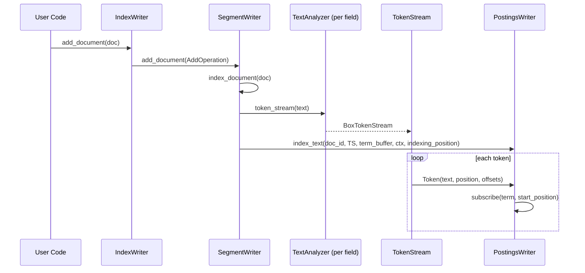

# P2-05 Tokenizer：分析链与可配置的文本处理

> 版本基线：tantivy 0.24.0（本仓库）
>
> 本文主问题：Tokenizer/TokenFilter 这一套抽象，如何影响召回、精度与索引结构？
>
> 本文产出：1 张时序图 + 1 张 token 变换表 + 2 个可运行实验

## 本文目标

- 读懂：Tokenizer 是什么、TokenFilter 是什么、如何组合成 pipeline
- 跑通：自定义 tokenizer 的例子，并观察 token 流变化
- 理解：tokenization 发生在写入侧哪些位置

## 读前准备

- Rust 基础：trait/泛型/生命周期（至少能读懂）
- 知道倒排索引的基本概念更好（term/postings/positions），但不是必须
- 可选：看过 Part1 的 `P1-04 Schema/Document/Term`，知道“Schema 决定写入结构”

## 关键概念（先给结论）

这一节先把关键对象与“不变量”说清楚，后面再沿着调用链验证它们。

- `Tokenizer`：把 `&str` 切成 `TokenStream`。**决定“切词边界”**（按空格？按正则？按 ngram？）。
  - 入口：`tokenizer-api/src/lib.rs`：`pub trait Tokenizer`
- `TokenStream`：一个可消费的 token 流（pull 模式）。对外暴露 `advance()/token()/token_mut()`。
  - 入口：`tokenizer-api/src/lib.rs`：`pub trait TokenStream`
- `Token`：每个 token 的结构体。最关键的四个字段：
  - `text`：进入倒排索引的 term bytes（最核心）
  - `position`：位置（用于 phrase query、BM25 里的频率/长度统计也会间接受影响）
  - `offset_from/offset_to`：原始文本的**字节**区间（用于 snippet/highlight），**TokenFilter 不应修改 offsets**
  - 入口：`tokenizer-api/src/lib.rs`：`pub struct Token`
- `TokenFilter`：把一个 `Tokenizer` 包一层，形成新的 `Tokenizer`，从而“链式处理” token。
  - 入口：`tokenizer-api/src/lib.rs`：`pub trait TokenFilter`
- `TextAnalyzer`：tantivy 侧对“tokenizer + filters”这一整条链的封装（你最终注册到 `TokenizerManager` 的对象）。
  - 入口：`src/tokenizer/tokenizer.rs`：`pub struct TextAnalyzer` / `TextAnalyzerBuilder`
- `TokenizerManager`：名字 → `TextAnalyzer` 的注册表。Schema 里只存“tokenizer 名字”，真正的实现来自这里。
  - 入口：`src/tokenizer/tokenizer_manager.rs`：`pub struct TokenizerManager`

一句话总结：

> “Tokenizer 决定切分；TokenFilter 决定规范化/增删改 token；两者组合后的输出，直接决定倒排索引里有什么 term、term 的 positions 怎么分布、以及 fieldnorm（长度）统计值。”

## 一个最小分析链：`en_stem` 到底做了什么

tantivy 自带的 `en_stem` tokenizer 是最典型的分析链示例，它在 `TokenizerManager::default()` 里被定义：`SimpleTokenizer → RemoveLongFilter → LowerCaser → Stemmer(English)`（见 `src/tokenizer/tokenizer_manager.rs`）。

先用一段固定输入，观察“每一步到底改变了什么”。下面这张表来自 repo 里的单元测试用例（同一段文本在 `SimpleTokenizer` 和 `en_stem` 上的输出可以直接对照 `src/tokenizer/mod.rs` 中的测试）。

输入文本：`"Hello, happy tax payer!"`

| 阶段 | 组件 | 输出 token（`text@position [from,to)`） | 变化点 |
|---|---|---|---|
| 1 | `SimpleTokenizer` | `Hello@0 [0,5)` `happy@1 [7,12)` `tax@2 [13,16)` `payer@3 [17,22)` | 按标点/空白切词；填充 offsets/position |
| 2 | `RemoveLongFilter::limit(40)` | 同上 | 过滤超长 token（此例无变化） |
| 3 | `LowerCaser` | `hello@0 [0,5)` `happy@1 [7,12)` `tax@2 [13,16)` `payer@3 [17,22)` | 仅改变 `text`（大小写归一） |
| 4 | `Stemmer(Language::English)` | `hello@0 [0,5)` `happi@1 [7,12)` `tax@2 [13,16)` `payer@3 [17,22)` | 词干化：`happy → happi`（召回↑，可能精度↓） |

观察要点：

- offsets（`[from,to)`）不变：因为它们用于 snippet/highlight，TokenFilter 不应修改 offsets（`tokenizer-api/src/lib.rs` 对 offsets 有约束说明）。
- “召回/精度”的核心来源就是 `Token.text` 的变换策略：lowercase、stemming、ascii folding、stopwords、ngram… 都是在改变“term 的归一化规则”。

## 源码入口（建议阅读顺序）

建议按“先看接口，再看组合，再看写入侧消费”的顺序读。

1. `tokenizer-api/src/lib.rs`：`Tokenizer` / `TokenStream` / `Token` / `TokenFilter` 的最小契约与字段含义
2. `src/tokenizer/tokenizer.rs`：`TextAnalyzer` / `TextAnalyzerBuilder::filter(...)`（分析链如何组合）
3. `src/tokenizer/tokenizer_manager.rs`：`TokenizerManager::default()`（`default/en_stem/raw/whitespace` 如何定义）
4. `src/indexer/segment_writer.rs`：`SegmentWriter::for_segment` / `SegmentWriter::index_document`（写入侧在哪里调用 analyzer）
5. `src/postings/postings_writer.rs`：`PostingsWriter::index_text`（如何消费 `TokenStream` 并写 postings/positions/fieldnorm）
6. `examples/stop_words.rs`：用 `TextAnalyzer::builder(...).filter(...)` 自定义分析链，并验证“查询侧也会应用 stopwords”
7. `examples/custom_tokenizer.rs`：注册 `NgramTokenizer`，验证“substring/模糊匹配”的典型用法
8. （可选）`examples/pre_tokenized_text.rs`：如何绕过 tokenizer，直接写入预分词的 token（以及会带来什么语义差异）

## Tokenizer/TokenFilter：组合方式与“为什么是流式的”

### 1) `TokenStream` 是 pull 模式

`TokenStream` 的核心接口是：

- `advance()`：推进到下一个 token
- `token()`：读当前 token（不可变）
- `token_mut()`：读当前 token（可变）

它是“流式”的：分析链不会先构造 `Vec<Token>` 再处理，而是边产生边消费。好处是：

- 内存占用低（对大文本更稳）
- filter 可以“包一层”实现增删改 token（典型实现就是在 `advance()` 里循环跳过不需要的 token）

你可以在这些 filter 里看到标准写法：

- `src/tokenizer/remove_long.rs`：`RemoveLongFilterStream::advance()` 会跳过超长 token
- `src/tokenizer/stop_word_filter/mod.rs`：`StopWordFilterStream::advance()` 会跳过 stopwords
- `src/tokenizer/lower_caser.rs`：`LowerCaserTokenStream::advance()` 会修改 `token.text`

### 2) `TextAnalyzerBuilder` 负责把链“叠起来”

`TextAnalyzer::builder(tokenizer).filter(filter).filter(filter)...build()` 的关键点是：

- 每个 `TokenFilter` 的 `transform()` 会把一个 `Tokenizer` 包成新的 `Tokenizer`（见 `tokenizer-api/src/lib.rs` 的 `TokenFilter` trait）
- `TextAnalyzer` 最终把“具体类型”抹掉成可 clone 的 boxed tokenizer（`src/tokenizer/tokenizer.rs`：`BoxableTokenizer`/`BoxTokenStream`）

你不需要把泛型类型推导看懂，但建议记住一个事实：

> **分析链是“在编译期组合类型，在运行时以 TokenStream 形式逐 token 处理”。**

## 写入侧：tokenization 发生在什么位置？

这部分回答本文的“写入管线视角”问题：Tokenizer 不只是一个“工具函数”，它是写入倒排索引的入口之一。

### 写入时序图：从 `add_document` 到写入 postings



### 1) `SegmentWriter::for_segment`：把 analyzer “预编译”到每个 field

`SegmentWriter` 初始化时，会遍历 schema 的每个 field，取出该 field 的 tokenizer 名字，然后从 `TokenizerManager` 里取出 `TextAnalyzer`，放进 `per_field_text_analyzers`（见 `src/indexer/segment_writer.rs`：`SegmentWriter::for_segment`）。

关键细节：

- 如果 field 没有设置 indexing options（例如不是 text/json 或未 indexed），不会有 analyzer
- 如果 field 没显式设置 tokenizer 名字，会 fallback 到 `"default"`
- 如果 schema 里引用了某个 tokenizer 名字，但 `TokenizerManager` 没注册，会直接报错（这是“tokenizer 配置属于 schema 一部分”的现实体现）

### 2) `SegmentWriter::index_document`：对每个字符串值产生 `TokenStream`

在 `src/indexer/segment_writer.rs` 里，`FieldType::Str(_)` 分支会：

- 取 `&mut self.per_field_text_analyzers[field_id]`
- 调用 `text_analyzer.token_stream(text)` 得到 `BoxTokenStream`
- 把 token stream 交给 `postings_writer.index_text(...)`

另外还有两个容易忽略的分支：

- **Facet**：用 `FacetTokenizer`（路径分层）产生 token（见 `FieldType::Facet(_)` 分支）
- **Pre-tokenized**：如果字段值是 `PreTokenizedString`，会走 `PreTokenizedStream`，绕过 tokenizer（这常用于中文分词/业务自定义分词）

### 3) `PostingsWriter::index_text`：TokenStream 真正被消费的地方

`src/postings/postings_writer.rs` 的 `index_text` 做了三件非常“写入管线”核心的事：

1. 遍历 `token_stream.process(...)` 消费 token
2. 把 `token.text` 追加进 `Term` buffer，调用 `subscribe(doc_id, position, term, ctx)` 写入倒排结构
3. 用 `indexing_position` 维护：
   - `num_tokens`：给 fieldnorm 用（影响 BM25）
   - `end_position`：用于同一 field 的多 value 之间插入 `POSITION_GAP`，避免 phrase query 跨 value 误匹配

并且还有一个重要的“安全阀”：

- 如果 `token.text.len() > MAX_TOKEN_LEN`，该 token 会被直接丢弃并记录 warn（`MAX_TOKEN_LEN` 在 `src/tokenizer/mod.rs`）

> 小结：Tokenizer/Filter 的输出，会直接决定 postings 里写了哪些 term，以及 positions/fieldnorm 的统计值。

## 查询侧：为什么说 tokenizer 配置属于 Schema 的一部分？

如果 tokenizer 只影响写入，那你“改一下 tokenizer 让它更聪明”也许还能凑合；但在 tantivy 里，**查询解析同样依赖 tokenizer**。

最直观的证据是：

- `QueryParser::for_index(&index, ...)` 会 clone `index.tokenizers()`（见 `src/query/query_parser/query_parser.rs`：`for_index`）
- 解析某个 text field 的字面量/短语时，会拿到该 field 的 `indexing_options.tokenizer()`，并从 `TokenizerManager` 里取出 analyzer，对 query 文本做同样的 tokenization（见同文件的 `compute_logical_ast_for_leaf`）

因此你需要形成一个工程直觉：

> “tokenizer 名字写进了 schema（字段 indexing options），而 tokenizer 的实现注册在 TokenizerManager。两者必须一致，否则‘写入时产生的 term’与‘查询时产生的 term’对不上，表现就是：索引里明明有内容，但查不到。”

这也是为什么实践中推荐：

- 不要“原地修改”同名 tokenizer 的 pipeline（除非你准备全量重建索引）
- tokenizer 变更时，用新名字做版本化（例如 `en_stem_v2`），并重建索引

## 召回/精度/索引结构：常见 tokenizer 选择的取舍

下面按“典型场景 → 推荐策略 → 代价”给一个可以直接落地的 checklist。

### `default`：通用全文（大小写不敏感）

- 组成：`SimpleTokenizer + RemoveLongFilter(40) + LowerCaser`
- 优点：快、稳、召回不错（大小写归一）
- 代价：不做 stemming，`running`/`run` 不会归一（英文召回可能略差）

### `en_stem`：英文全文（召回优先）

- 组成：`default + Stemmer(English)`
- 优点：召回更好（inflection 归一）
- 代价：可能精度下降（不同词被归到同一 stem），且更慢

### Stopwords：减少索引与噪声（但要小心 phrase）

- 优点：减小 postings/positions，减少常见词噪声，查询也会同步应用 stopwords（见 `examples/stop_words.rs`）
- 代价：**会产生 position gap**（filter 只是跳过 token，不会重排 position），phrase query 可能变得难以直觉理解

你可以用 `src/tokenizer/stop_word_filter/mod.rs` 的测试输入理解 position gap：

- 输入：`"i am a cat. as yet i have no name."`
- stopwords 移除后，第一个 token 是 `cat@3`（注意 position 从 3 开始）

### Ngram：子串匹配/补全（典型：autocomplete）

- 优点：把一个词切成大量子串（例如 3-gram），能支持 `ken` 命中 `Frankenstein`
- 代价：索引体积暴涨（term 数量激增）；并且 ngram 的 position 设计不适合 phrase 语义（`NgramTokenizer` 的 `position` 固定为 0）

工程建议：ngram 通常单独建一个字段（例如 `title_ngram`），不要和正常全文字段混用。

### `raw`：ID/URL/精确匹配

- 语义：整个字符串作为单个 token
- 典型：uuid、外部主键、URL、路径等（不希望被切碎）

## 可运行实验

### 实验 1：Ngram 支持子串命中（`ken` → `Frankenstein`）

目标：理解“tokenizer 改变 term 生成规则 → 直接改变可匹配的 query”。

操作步骤：

```bash
cargo run --example custom_tokenizer
```

验证点：

- 输出 JSON 中包含标题为 `Frankenstein` 的文档（因为 `title` 字段用 `ngram3`，`Frankenstein` 会产生 `ken` 这个 3-gram）。
- 你能解释：为什么同样的 query（`ken`）对 `body` 字段通常不命中（`body` 用默认 tokenizer，不会产生 `ken` 这种子串 term）。

### 实验 2：Stop words 同时作用于索引与查询（短语变成单词）

目标：理解“QueryParser 也会用 field 的 tokenizer 分析 query”。

操作步骤：

```bash
cargo run --example stop_words
```

验证点：

- `title:"the Frankenstein"` 仍然能命中 `Frankenstein`（示例代码里写了这条 query）。
- 你能解释：为什么这不是“查询时特判”，而是 tokenizer pipeline 的自然结果。

### （加餐）快速定位：tokenization 的写入侧入口在哪里

```bash
rg -n "per_field_text_analyzers|token_stream\\(|index_text\\(" src/indexer/segment_writer.rs
rg -n "fn index_text\\(" src/postings/postings_writer.rs
```

验证点：

- 你能指出：`TokenStream` 是在哪个函数里被 `process(...)` 消费的？
- 你能指出：`fieldnorm` 统计的“长度”来自哪里（哪个变量/哪个字段）？

## 常见坑 & FAQ（≤ 5）

1. **Q：为什么我注册了 tokenizer，但查询还是搜不到？**  
   A：确认 schema 的 field indexing options 里引用的 tokenizer 名字，与 `index.tokenizers().register(name, analyzer)` 的名字完全一致。Schema 只存名字，不会把 analyzer pipeline 序列化进索引。

2. **Q：我能“在线修改” tokenizer 的配置而不重建索引吗？**  
   A：不推荐。因为老 segment 的 term 已经按旧规则写入；你把同名 tokenizer 换成新规则后，QueryParser 会用新规则分析 query，term 对不上就会“查不到”。实践里请用新名字做版本化并重建索引。

3. **Q：中文分词怎么办？tantivy 内置 tokenizer 够用吗？**  
   A：内置 tokenizer 主要面向按字母/空白/标点切词的语言。中文通常需要第三方分词（实现 `tantivy-tokenizer-api` 的 `Tokenizer`）或直接写入 `PreTokenizedString`（见 `examples/pre_tokenized_text.rs`）。

4. **Q：StopWordFilter 会不会把 phrase query 搞坏？**  
   A：可能。因为它是“跳过 token”而不是“重排 positions”，positions 会出现 gap，导致严格 phrase 语义变得不直觉。要么别对需要 phrase 的字段用 stopwords，要么调 slop/改 query 设计。

5. **Q：为什么 TokenFilter 不应该修改 offsets？**  
   A：offsets 用于 snippet/highlight 之类“从原文切片”的功能（例如 snippet 模块会重新用 field 的 tokenizer 分析原文并依赖 offsets）。修改 offsets 会导致高亮错位或 panic。

## 延伸阅读（下一篇怎么接）

- `src/postings/postings_writer.rs`：你已经看到 `index_text` 如何把 token 订阅进倒排；下一篇 `P2-06` 会把 “TermDict → TermInfo → Postings” 的两级映射讲透。
- `src/tokenizer/mod.rs`：内置 tokenizer/filter 的总览与 doc tests（想扩展时先从这里找有没有现成组件）。
- `examples/pre_tokenized_text.rs`：业务分词与 tantivy tokenizer 的边界（特别适合中文场景）。

## TODO

- [x] 补一个“token 流前后对比”的表格
- [x] FAQ：中文分词为什么需要第三方 crate？
