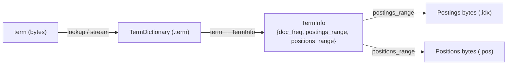

<<<<<<< HEAD
# P2-06 倒排总览：TermDict → TermInfo → Postings 的两级映射

> 本文主问题：为什么倒排索引要拆成“字典（Term → TermInfo）+ postings（TermInfo → docset）”？

## 本文目标

- 画清楚倒排索引的两级映射与查找路径
- 读懂 termdict 的实现轮廓（fst / sstable）
- 了解 TermInfo 里有哪些关键信息（offset、doc_freq 等）

## 源码入口（建议阅读顺序）

1. `ARCHITECTURE.md` 的 inverted index/termdict/postings 小节
2. `src/termdict/mod.rs`：TermDictionary 抽象与实现选择
3. `src/termdict/fst_termdict/*`：fst 词典实现（Term → ordinal）
4. `src/postings/term_info.rs`：TermInfo 数据结构
5. `src/postings/mod.rs`：postings 的组织与访问入口

## 可运行实验（推荐）

```bash
cargo run --example iterating_docs_and_positions
```

### 验证点

- 你能描述：一次 term 查询时，如何从 termdict 找到 postings
- 你能解释：term ordinal 的意义是什么

## TODO

- [ ] 画一张“term lookup 路径图”（Term → TermInfo → Postings）
- [ ] FAQ：为什么不用 HashMap 存 term → postings？

=======
# 06 倒排总览：TermDict / TermInfo / Postings

> - 目标：把 **一个 field 在一个 segment 里的倒排索引** 讲清楚：`.term` / `.idx` / `.pos` 三件套分别存什么？`TermDictionary`、`TermInfo`、`Postings` 怎么串起来？
> - 代码基准：以本仓库当前版本为准
> - 参考写作约定：见 [`说明.md`](../说明.md) 与 [`文章模板.md`](../文章模板.md)

## 0. 这篇要解决什么问题？

- 在 tantivy 里，**“倒排索引”到底由哪些文件/数据结构组成**？
- 给定一个 term，查询时如何从 **term → TermInfo → postings/positions bytes → 游标**？
- 写入时（build segment）谁负责落盘？**TermDict、TermInfo、Postings 的边界**在哪里？

## 1. 先给结论（TL;DR）

- 倒排索引可以粗略理解为三段链路：`TermDictionary(term → TermInfo)` + `postings(.idx)` + `positions(.pos)`。
- `TermInfo` 是“路标”：记录 `doc_freq`，以及该 term 在 `.idx/.pos` 中的 **byte range**（区间偏移）。
- `.term/.idx/.pos` 在 segment 层面是 **CompositeFile**：同一个 segment 内只有一份对应文件，内部按 field 分区写入，并在文件尾部用 footer 记录各 field 的 byte range；读取时先切出 field slice，再用 `TermInfo` 的 range 做二次切片。
- `.term`（term dictionary）负责：  
  1) term 的有序集合与查找/遍历（FST 或 SSTable）；  
  2) `term_ord → TermInfo` 的快速随机访问（`TermInfoStore` 或 SSTable block）。
- `.idx`（postings）按 term 依次追加写入 postings 数据，内部是**分块压缩**（bitpacking + vint），并可带 skip 信息以支持快速 seek / block-wand。
- `.pos`（positions）与 `.idx` 解耦：只有当 schema 要求 positions 时才写入；按 term 依次追加写入 positions 数据（同样按块压缩）。

## 2. 核心对象与关系图



> 视角强调：`TermInfo` 不“解释” postings 的编码细节，它只告诉你 **在哪**（range）以及 **有多少文档**（doc_freq）。

## 3. 关键数据结构（源码级）

### 3.1 `TermInfo`：倒排中的“路标”

位置：`src/postings/term_info.rs`

它是一个 segment-local 的元信息结构：

- `doc_freq: u32`：当前 segment 中包含该 term 的文档数
- `postings_range: Range<usize>`：该 term 在 postings（`.idx`）里的字节区间
- `positions_range: Range<usize>`：该 term 在 positions（`.pos`）里的字节区间

注意两个容易混淆的点：

- `postings_range` 的 offset **是相对 postings “body”** 的（即跳过了 `.idx` 里开头的 `total_num_tokens: u64` 头部；见第 5 节）。
- 两个 range 的单位都是 **byte**，不是 doc/position 的计数。

### 3.2 `TermDictionary`：term 的有序集合 + term → TermInfo

位置：`src/termdict/mod.rs`（封装层） + `src/termdict/fst_termdict/*`（默认实现）

`TermDictionary` 的“产品形态”：

- **查找**：`get(term_bytes) -> Option<TermInfo>`
- **遍历**：`stream()` / `range()` / `search(automaton)`，按字典序输出 term
- **双向映射的一部分**：`term_ord(term) -> ord`，以及 `ord_to_term(ord) -> term`

实现上（默认非 `quickwit` feature）：

- 通过 `tantivy_fst::Map` 保存 `term_bytes → term_ord`（有序、可做 range/automaton）。
- 通过 `TermInfoStore` 保存 `term_ord → TermInfo` 的紧凑数组存储（支持随机访问）。

另外一个与“写入管线”相关的细节：`TermDictionary` 要求 **term 必须按字典序插入**。

> 在 `src/termdict/mod.rs` 的模块注释里，还提到数值型 term 会采用特定序列化（例如 u64 BigEndian）来保证“字节序”与“数值序”一致，从而让 range 扫描语义成立。

## 4. `.term`：TermDict 如何落盘（FST 版本）

这里以默认的 `fst_termdict` 为例（不启用 `quickwit` feature）。

### 4.1 写入入口：`TermDictionaryBuilder`

位置：`src/termdict/fst_termdict/termdict.rs`

写入时，builder 同时做两件事：

1. 往 FST 里插入 `term_bytes → term_ord`
2. 往 `TermInfoStoreWriter` 里追加写入该 term 对应的 `TermInfo`

并且强约束：**必须按 key 有序插入**（否则 MapBuilder 会报错）。

### 4.2 `TermInfoStore`：`term_ord → TermInfo` 的紧凑存储

位置：`src/termdict/fst_termdict/term_info_store.rs`

核心思路：

- 以 `BLOCK_LEN = 256` 为一组，把 TermInfo 分块。
- 每块的第一个 TermInfo 作为 `ref_term_info` **原样存储**（作为参照点）。
- 块内剩余 TermInfo 只存 **相对 ref 的增量**，并按所需 bitwidth 做 bitpacking：
  - `doc_freq`（u32）
  - `postings_range.start` / `positions_range.start`（以 ref 的 start 为基准做 delta）
  - 同时额外写入该块的 postings/positions 的 end delta，用于还原 range 的 end

这样做的结果是：

- `term_ord → TermInfo` 可以 O(1) 定位到块，再在块内解码得到对应 TermInfo；
- 存储比“每个 TermInfo 定长 serialize”更紧凑（尤其是大量 term 的场景）。

### 4.3 `.term` 文件的“粗略布局”

（以封装后的 `src/termdict/mod.rs` + FST 内部实现为准）

- `FST map bytes`
- `TermInfoStore bytes`
- `footer_size: u64`（TermInfoStore 的长度）
- `fst_version: u32`
- `dictionary_type: u32`（封装层追加，用于区分 FST / SSTable）

> 开启 `quickwit` feature 时，底层可能变为 `sstable_termdict`（`src/termdict/sstable_termdict/mod.rs`），term→TermInfo 的 value 编码也会随之改变，但 **对上层 `TermDictionary` API 透明**。

## 5. `.idx`：Postings 如何落盘（写入顺序与编码层次）

倒排写入由 `InvertedIndexSerializer` 负责，按 field 分区写入 `.term/.idx/.pos`。

### 5.1 写入入口与调用约束：`InvertedIndexSerializer` / `FieldSerializer`

位置：`src/postings/serializer.rs`

关键入口：

- `InvertedIndexSerializer::open(segment)`
- `new_field(field, total_num_tokens, fieldnorm_reader) -> FieldSerializer`
- `FieldSerializer::{ new_term, write_doc, close_term, close }`

`FieldSerializer` 对调用顺序有明确假设（源码注释中写得很清楚）：

- 先 `new_field(...)`
- 然后 term 必须按 **字典序** 调 `new_term(...)`
- 同一个 term 内 doc 必须按 **DocId 递增** 调 `write_doc(...)`
- 每个 term 必须以 `close_term()` 结束

这些约束是为了让后续压缩与 skip/seek 成本更低，并且让 termdict builder 能按序插入。

### 5.2 `.idx` 的 field slice 头部：`total_num_tokens: u64`

`FieldSerializer::create(...)` 会先把 `total_num_tokens` 写入 postings 文件（`.idx`）：

- 位置：`src/postings/serializer.rs` 的 `FieldSerializer::create`
- 读取：`InvertedIndexReader::new`（`src/index/inverted_index_reader.rs`）会把 postings slice 拆成：
  - 前 8 bytes：`total_num_tokens`
  - 后续 bytes：真正的 postings “body”（这也是 `TermInfo.postings_range` 的基准）

### 5.3 每个 term 的 postings 数据：`skip + blocks + remainder`

位置：`src/postings/serializer.rs`（`PostingsSerializer`）与 `src/postings/block_segment_postings.rs`（读取端拆解）

写入端（`PostingsSerializer::close_term`）做的事可以按层次理解：

1. **分块**：DocId（以及可选 TF）被凑成固定大小的 block（`COMPRESSION_BLOCK_SIZE`）  
   - 满 block：bitpacking 压缩  
   - 末尾不满：vint 编码（变长整数序列）
2. **skip 信息（可选）**：当 `doc_freq >= COMPRESSION_BLOCK_SIZE` 时，会写入 skip 区，便于快速 seek 到目标 doc 所在 block，并支持 block-wand（block max score）  
   - 写入格式是：`VInt(skip_len) + skip_bytes`
3. **postings 数据本体**：紧随其后

读取端对应逻辑（`BlockSegmentPostings::open`）：

- 当 `doc_freq < COMPRESSION_BLOCK_SIZE`：认为 **没有 skip 区**，整个 slice 都是 postings 数据
- 否则：先读一个 `VInt(skip_len)`，切出 `skip_bytes` 与 `postings_bytes`

> 你可以把 `.idx` 理解成“对 term 的串联 append-only 日志”，TermInfo 记录每个 term 在这份日志里的区间。

## 6. `.pos`：Positions 如何落盘（按 term 追加）

位置：`src/positions/serializer.rs`

positions 只在 schema 需要时写入（`IndexRecordOption::WithFreqsAndPositions`）。

写入端（`PositionSerializer`）的关键点：

- 输入是 **positions delta**（同一 doc 内 position 的差分序列）
- 同样按固定大小 block 压缩：
  - 满 block：bitpacking，并记录每个 block 的 bitwidth
  - 末尾不满：vint 编码
- 每个 term 结束时（`close_term`）会写：
  1. `VInt(num_full_blocks)`
  2. `bit_widths`（每个满 block 一个 byte）
  3. `positions_buffer`（拼接后的压缩数据）

`TermInfo.positions_range` 正是指向这一段 term 级别的 bytes。

## 7. 读取时怎么串起来？（term → postings/positions 游标）

位置：`src/index/inverted_index_reader.rs`

典型流程：

1. `InvertedIndexReader::get_term_info(term)`  
   - 通过 `TermDictionary::get(term.serialized_value_bytes())` 拿到 `TermInfo`
2. `postings_slice = postings_file_slice.slice(term_info.postings_range)`  
   - 注意：这里的 `postings_file_slice` 已经是“跳过 total_num_tokens 的 postings body”
3. 用 `BlockSegmentPostings::open(term_info.doc_freq, postings_slice, record_option, requested_option)` 解码 doc/tf
4. 若需要 positions：用 `positions_file_slice.read_bytes_slice(term_info.positions_range)` 打开 `PositionReader`

最终对上层暴露的是 `SegmentPostings`（一个带 seek/advance 的 postings 游标），以及按需读取 positions 的能力。

## 8. 代码导航

- `src/postings/term_info.rs`：`TermInfo` 的定义与序列化
- `src/termdict/mod.rs`：`TermDictionary` 封装层（FST/SSTable 选择、字典类型 footer）
- `src/termdict/fst_termdict/termdict.rs`：FST termdict 写入/打开、`term_ord → TermInfo` 串联
- `src/termdict/fst_termdict/term_info_store.rs`：`TermInfoStore` 的 block + bitpacking 编码
- `src/postings/serializer.rs`：`.term/.idx/.pos` 的写入入口（`InvertedIndexSerializer` / `FieldSerializer`）
- `src/postings/block_segment_postings.rs`：读取端如何拆解 `skip + postings` 并解码 block
- `src/positions/serializer.rs`：positions 的 term 级别编码格式
- `src/index/inverted_index_reader.rs`：查询侧 term→TermInfo→postings/positions 的组装入口
- `src/directory/composite_file.rs`：`.term/.idx/.pos` 作为 composite file 的按 field 分区与 footer 索引
>>>>>>> 917ca254 (Codex changes)
