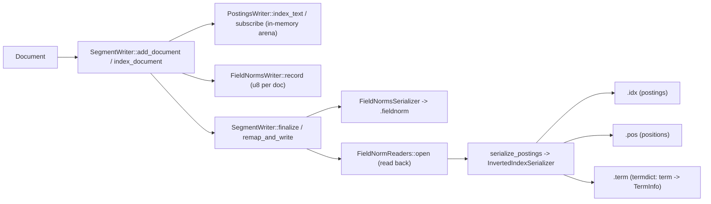

<<<<<<< HEAD
# P2-07 Postings/Positions/FieldNorm：为 BM25 与短语查询服务

> 本文主问题：postings 为什么按 block 组织？positions/fieldnorm 在搜索时如何被用到？

## 本文目标

- 理解 postings block（例如 128 文档一块）与压缩思路
- 理解 positions 文件如何支撑 phrase query
- 理解 fieldnorm 如何参与 BM25（长度归一化）

## 源码入口（建议阅读顺序）

1. `src/postings/postings.rs` / `src/postings/serializer.rs`：postings 写入与读取轮廓
2. `src/postings/compression/*`：压缩与编码细节
3. `src/positions/*`：positions 相关 reader/writer
4. `src/fieldnorm/*`：fieldnorm 的存储与读取
5. `src/query/bm25.rs`：BM25 计算与统计量

## 可运行实验

```bash
cargo run --example phrase_prefix_search
```

### 验证点

- 你能回答：没有 positions 的 field 是否支持 phrase query？为什么？
- 你能把 fieldnorm 和 BM25 公式中的“文档长度”对应起来

## TODO

- [ ] 画一张 postings/positions/fieldnorm 的“文件组件图”
- [ ] FAQ：为什么 postings 迭代要求 docid 有序？

=======
# 07 Postings / Positions / FieldNorm：短语与 BM25

> 代码版本：tantivy @ `d0c5ffb0`（2026-02-28）
>
> 相关模块：`src/postings/*`、`src/positions/*`、`src/fieldnorm/*`、`src/index/inverted_index_reader.rs`、`src/query/bm25.rs`、`src/query/phrase_query/*`
>
> 目标：把“倒排表（postings）/ 位置（positions）/ 字段长度（fieldnorm）”这三件事在 **写入侧如何落盘**、在 **查询侧如何支持短语与 BM25** 讲清楚，并能回到代码定位每一步。

## TL;DR

- **postings（`.idx`）**：按 term 存 docid 列表（可选：term_freq），并带 skip 信息；它是“这个 term 出现在哪些文档里”的主干。
- **positions（`.pos`）**：按 term 存每个 doc 内的出现位置（position deltas）；它让 `PhraseQuery` 能验证“是否相邻/是否在 slop 内”。
- **fieldnorm（`.fieldnorm`）**：每个 doc、每个 field 存 1 byte 的“字段长度近似值”（fieldnorm_id）；BM25 用它做长度归一化，并且写入侧会把它用于 Block-WAND 的块级评分提示。

## 背景：为什么要把信息拆成这三份？

倒排检索里，“一个 term 命中的文档集合”只是第一步。实际查询至少还会遇到三类需求：

1. **过滤/召回**：我要所有包含 term 的 doc → 只需要 docid 列表（postings 的最小形态）。
2. **相关性排序（BM25）**：我不仅要 docid，还要 term 在 doc 中出现了多少次（`term_freq`），以及 doc 的字段长度（`fieldnorm`）来做归一化。
3. **短语/近邻（Phrase / Proximity）**：我要 `"a b"` 这样的严格相邻，或 slop 内近邻 → 需要每次出现的 **位置序列**（positions）。

把这些信息拆开存储有两个直接收益：

- **空间与 CPU 可控**：很多场景只要过滤，不要 positions；很多场景要 BM25，但不需要 positions。通过 schema 的 `IndexRecordOption`（Basic/WithFreqs/WithFreqsAndPositions）可以选择“存多少”。
- **I/O 访问更局部**：短语查询只在候选 doc 上拉取 positions；BM25 只要频次与 fieldnorm 的 1 byte，不用把 store/fastfield 一起拖进来。

## 关键概念与数据结构

### Segment 与文件组件

tantivy 的倒排相关数据以 segment 为粒度落盘。相关的 segment 组件与扩展名在 `src/index/segment_component.rs` 和 `src/index/index_meta.rs` 里可以看到：

- `SegmentComponent::Postings` → `*.idx`
- `SegmentComponent::Positions` → `*.pos`
- `SegmentComponent::Terms` → `*.term`
- `SegmentComponent::FieldNorms` → `*.fieldnorm`

它们之间最关键的“连接件”是 `TermInfo`：对每个 term 记录 postings/positions 在文件中的 byte range。

### IndexRecordOption：到底存多少信息？

`src/schema/index_record_option.rs`：

- `Basic`：只存 docid
- `WithFreqs`：docid + term_freq（BM25 更“像那么回事”）
- `WithFreqsAndPositions`：docid + term_freq + positions（支持短语）

短语查询会在构建 weight 时检查 positions 是否存在：`PhraseQuery::phrase_weight` 要求目标 field 的 `get_index_record_option().has_positions()` 为真，否则直接返回 schema error。

### Postings 与 Positions：term 级别与 doc 级别的两层“列表”

可以把它们理解成两层倒排结构：

- postings（倒排表）回答：term 出现在哪些 doc？（docid 列表；可选 tf）
- positions（位置表）回答：term 在某个 doc 的哪些位置出现？（positions 列表）

在读取侧，这两者会组合成 `SegmentPostings`（`src/postings/segment_postings.rs`）：

- 没有 positions 时：只是一个 docset +（可选）tf
- 有 positions 时：`SegmentPostings` 会携带一个 `PositionReader`，只有在你调用 `positions*` API 时才会去读取并还原 positions

### TermInfo：term → postings/positions 的“索引”

`src/postings/term_info.rs`：

- `doc_freq`：该 term 在本 segment 里出现在哪些 doc 的数量
- `postings_range`：该 term 的 postings 数据在 `.idx`（当前 field 的 slice 内）的 byte range
- `positions_range`：该 term 的 positions 数据在 `.pos`（当前 field 的 slice 内）的 byte range

查询时 `InvertedIndexReader` 会先在 `.term` 里找到 `TermInfo`，再按 range 去 `.idx/.pos` 切片读取对应数据（见 `src/index/inverted_index_reader.rs`）。

### FieldNorm：字段长度的 1 byte 近似

`src/fieldnorm/mod.rs` 的注释把它的目的讲得很直白：字段越短，命中同样的 term 通常越“显著”。实现上：

- 写入侧按 doc 记录字段长度（token 数 / 值的个数），压缩成 1 byte 的 `fieldnorm_id`（Lucene 同款 log-scale 表，见 `src/fieldnorm/code.rs`）。
- 查询侧通过 `FieldNormReader::fieldnorm_id(doc)` 拿到这个 byte，在 BM25 里做长度归一化（见 `src/query/bm25.rs`）。

注意：fieldnorm 是 **近似值**，并且按代码实现它保证“等于或小于真实 token 数”（见 `FieldNormReader::fieldnorm()` 的注释）。

## 写入侧：从 `SegmentWriter` 到 `.idx/.pos/.term/.fieldnorm`

下面以文本字段（`FieldType::Str`）为主线（数值字段和 JSON 会略有差异，但核心组件相同）。

### 总览图（数据流）



关键点：**fieldnorm 会先落盘再被读回**（`remap_and_write` 里先 serialize fieldnorm，再打开 reader），因为 postings 序列化时需要 fieldnorm（用于平均长度与 Block-WAND 提示）。

### 1）采集：token → (term, doc, position)

入口：`src/indexer/segment_writer.rs` 的 `SegmentWriter::index_document`。

对 `FieldType::Str`：

- 为每个 value 创建 `token_stream`
- 调用 `postings_writer.index_text(...)` 将每个 token 订阅到倒排构建上下文
- 累加 `IndexingPosition.num_tokens` 用于 fieldnorm
- 最后若 field 配置了 fieldnorm，则 `fieldnorms_writer.record(doc_id, field, indexing_position.num_tokens)`

其中 `PostingsWriter::index_text` 在 `src/postings/postings_writer.rs`。它做了两件和“短语/位置”直接相关的事：

1. **计算 position**：`start_position = indexing_position.end_position + token.position as u32`，并考虑 `token.position_length` 更新 `end_position`。
2. **多值字段的 position gap**：每个 value 结束后 `indexing_position.end_position = end_position + POSITION_GAP`（常量在文件顶部，当前是 1）。

这个 gap 的作用是：避免短语查询跨 value 边界“拼起来”。因为下一段 value 的首 token 会从“上一段 value 的 end_position + gap”开始，确保不可能和上一段最后一个 token 满足“相邻”的关系。

### 2）在内存里组织 postings：Recorder

`PostingsWriter::subscribe` 会把 (doc, position, term) 交给某种 recorder 记录在 arena 里（`src/postings/recorder.rs`）。

你可以把 recorder 理解成“按 term 聚合的临时缓冲”，不同 recorder 对应不同信息量：

- `DocIdRecorder`：只记录 docid（Basic）
- `TermFrequencyRecorder`：记录 docid + tf（WithFreqs）
- `TfAndPositionRecorder`：记录 docid + positions（并由 positions 数量推导 tf）（WithFreqsAndPositions）

`TfAndPositionRecorder` 的一个实现细节很关键：它记录的是 `position+1`，用 `0` 作为 doc 内 positions 的终止标记（`POSITION_END`），序列化时再转成 **position deltas**（差分）交给 positions serializer。

### 3）落盘：`serialize_postings` → `InvertedIndexSerializer`

总入口：`src/postings/postings_writer.rs` 的 `serialize_postings(...)`。

它做的工作可以概括为：

1. 把所有 term 的地址收集出来，并按 `(field, path_id, term_bytes)` 排序（JSON 额外包含 path）。
2. 以 field 为单位切分。
3. 对每个 field：
   - 取对应的 postings writer（`per_field_postings_writers.get_for_field(field)`）
   - 取 fieldnorm reader（`fieldnorm_readers.get_field(field)?`，可能为 `None`）
   - 创建 `FieldSerializer`：`serializer.new_field(field, total_num_tokens, fieldnorm_reader)?`
   - 遍历 term，调用 `FieldSerializer::new_term` / `write_doc` / `close_term` 写出 postings + positions，并在 termdict 里写入 `TermInfo`

真正把数据写进 `.idx/.pos/.term` 的核心在 `src/postings/serializer.rs`：

- `InvertedIndexSerializer`：分别持有三个 `CompositeWrite`（terms/postings/positions），按 field 取子 writer。
- `FieldSerializer`：按 term 驱动 `PostingsSerializer` 与 `PositionSerializer`，同时维护当前 term 的 `TermInfo`。

## `.idx/.pos/.term/.fieldnorm` 里到底长什么样（概念层）

这一节不试图把所有二进制细节讲到“可手写解析器”，而是抓住“查询侧会怎么读”需要的结构。

### `.term`：term dictionary + TermInfo

写入：`FieldSerializer::close_term` 在 term 关闭时调用 `term_dictionary_builder.insert_value(&self.current_term_info)`。

读取：`InvertedIndexReader::get_term_info` 返回 `Option<TermInfo>`，用于后续切片读取。

你可以把 `.term` 理解成：

- key：term bytes（要求按字典序写入）
- value：`TermInfo { doc_freq, postings_range, positions_range }`

### `.idx`：postings（docid / tf / skip / block-wand hint）

写入侧有两个层次：

1. **每个 field 的开头**会先写一个 `u64 total_num_tokens`（见 `FieldSerializer::create`）。查询侧在 `InvertedIndexReader::new` 里直接 `split(8)` 读掉它，用于 BM25 的平均字段长度统计（`Bm25StatisticsProvider::total_num_tokens`）。
2. 对每个 term：
   - docid 以块为单位压缩（常量 `COMPRESSION_BLOCK_SIZE`，当前是 128）
   - 若 schema 允许且 term 记录了频次，则 tf 也按块压缩
   - 对 doc_freq ≥ 128 的 term，会写一段 skip 数据（长度用 `VInt` 前缀），用于快速跳块与 positions 偏移计算（`src/postings/skip.rs`）

`src/postings/serializer.rs::PostingsSerializer` 的实现可以抓住三点：

- docid 是 **递增**的，所以可以用“前缀/差分 + bitpacking”压缩；
- block 不满（最后一个 block）就退化为 VInt 编码；
- skip 信息里除了“如何跳过 doc block”，还会写入：
  - `tf_sum`：该 block 内 tf 的总和（当需要 positions 时，用于定位 positions 的读取 offset）
  - `block_wand_max`：该 block 内一个“尽量能代表最大 BM25 贡献”的 `(fieldnorm_id, term_freq)` 对（用于 Block-WAND）

关于 Block-WAND：写入侧在 `PostingsSerializer::write_block` 里，会结合 `fieldnorm_reader` 与 `Bm25Weight::tf_factor`，为 block 找到一个“在当前 segment 平均 fieldnorm 下 tf 因子最大”的 doc 的 `(fieldnorm_id, term_freq)`，写进 skip。查询侧在 `SkipReader::block_max_score` / `BlockSegmentPostings::block_max_score` 里用它快速估计 block 的最大可能得分。

> 提醒：这类“块级最大分数”在代码注释里被定位为 *best-effort hint*，理论上可能出现低估（见 `src/query/term_query/term_scorer.rs` 对 `block_max_score` 的说明）。

### `.pos`：positions（position deltas）

positions 写入在 `src/positions/serializer.rs`，关键点：

- `FieldSerializer::write_doc` 收到的是 `position_deltas`（差分后的 positions），并断言 `term_freq == position_deltas.len()`。
- `PositionSerializer` 以 128 为块：
  - 满块：bitpacking，并把每个 block 的 bit width 记录到 `bit_widths` 数组；
  - 尾块（不足 128）：VInt 编码；
- 每个 term 结束时 `close_term` 会写：
  1. `VInt(bit_widths.len())`
  2. `bit_widths` 数组
  3. positions 压缩数据

读取侧的对应实现是 `src/positions/reader.rs::PositionReader`：它先读出 bit widths，再用它实现“跳过 N 个 block 不解压”的快速定位。

### `.fieldnorm`：每 doc 每 field 一个 byte

写入入口：`SegmentWriter::finalize` → `FieldNormsWriter::serialize`（`src/fieldnorm/writer.rs`）。

- `FieldNormsWriter` 为每个“启用 fieldnorm 的 field”维护一个 `Vec<u8>`，每个 doc push 一个 `fieldnorm_id`。
- `fieldnorm_to_id` 的量化表在 `src/fieldnorm/code.rs`，它是 256 个单调递增的 u32 值（Lucene 方案）。
- 读取端 `FieldNormReaders::get_field` 返回 `Option<FieldNormReader>`；若 field 没有 fieldnorm（例如 schema 禁用），查询端会退化为常量 fieldnorm（见 `TermWeight::fieldnorm_reader` / `PhraseWeight::fieldnorm_reader`）。

## 查询侧：短语与 BM25 如何消费这些数据？

把写入侧的输出“对齐”到查询侧代码，你会更容易理解为什么文件要这么切分、为什么 terminfo 要存 range。

### TermQuery：BM25 需要 tf + fieldnorm_id

读倒排的入口是 `SegmentReader::inverted_index(field)`，内部是 `InvertedIndexReader`（`src/index/inverted_index_reader.rs`）。

典型调用链：

1. `get_term_info(term)` 从 `.term` 拿 `TermInfo`
2. `read_postings_from_terminfo(term_info, requested_option)` 按 `TermInfo.postings_range` 切 `.idx`，按需解码 docid/tf（positions 同理）
3. 构造 `TermScorer`（`src/query/term_query/term_scorer.rs`）：
   - `postings: SegmentPostings`
   - `fieldnorm_reader: FieldNormReader`
   - `similarity_weight: Bm25Weight`

BM25 的实现见 `src/query/bm25.rs`：

- 常量：`K1 = 1.2`，`B = 0.75`
- `idf(doc_freq, doc_count)`：`ln(1 + (N - n + 0.5) / (n + 0.5))`
- `tf_factor(fieldnorm_id, term_freq)`：`freq / (freq + k1*(1-b + b*dl/avgdl))`

其中 `dl` 来自 `FieldNormReader::id_to_fieldnorm(fieldnorm_id)`，而 `fieldnorm_id` 就来自 `.fieldnorm` 的那个 1 byte。

### PhraseQuery：positions + offset + 交集

短语查询的“硬门槛”是：schema 必须索引 positions（`PhraseQuery::phrase_weight` 会检查 `has_positions`，否则报错）。

执行链条（核心文件：`src/query/phrase_query/*`）：

1. `PhraseWeight::phrase_scorer` 对每个 term 调 `read_postings(..., WithFreqsAndPositions)` 拿到 `SegmentPostings`（包含 positions 读取能力）。
2. `PhraseScorer` 先对 docset 做交集（所有 term 同时出现的 doc 才是候选）。
3. 对每个候选 doc：
   - 拉取每个 term 的 positions（`postings.positions_with_offset(offset, output)`）
   - 通过“positions 列表求交/带 slop 的匹配”判断短语是否成立，并计算 `phrase_count`（短语出现次数）

offset 的意义：把第 i 个 term 的 positions 平移到同一坐标系上，使得“相邻关系”可以退化为“相等求交”。

以 `"a b"` 为例（offset 0 和 1）：

- `a` 的 positions：`[2, 10]`
- `b` 的 positions：`[3, 11]`
- 给 `a` 加 offset 1：`[3, 11]`
- 和 `b` 求交：`[3, 11]` → 短语出现 2 次

打分上，`PhraseScorer::score()` 会把 `phrase_count` 当作“频次”，丢给 `Bm25Weight.score(fieldnorm_id, phrase_count)`。也就是说：**短语查询的 tf 是“短语命中次数”而不是单个 term 的命中次数**，而 idf 是 phrase 中各 term 的 idf 之和（见 `Bm25Weight::for_terms` 对多 term 的处理）。

## 设计取舍与常见坑

1. **positions 很贵，但短语离不开它**
   - 想要 `PhraseQuery`（含 slop）就必须 `WithFreqsAndPositions`。
   - 只做过滤/精确匹配时，`Basic` 更省空间与 CPU。

2. **fieldnorm 不是“精确 token 数”**
   - 它是 1 byte 量化后的近似值，且不大于真实长度。
   - 对极长字段会被粗粒度量化（表是 log-scale 的），这通常是可接受的相关性折中。

3. **多值字段会插入 position gap**
   - gap 的存在会影响短语/邻近查询：它阻止跨 value 的短语命中，这是多数用户期望的语义。

4. **Block-WAND 的块级最大分数是提示，不是严格证明**
   - 写入侧存的 `(fieldnorm_id, term_freq)` 来自 segment 局部统计（平均 fieldnorm），查询侧 BM25 统计可能基于全局，存在理论上的偏差。
   - 如果你在 debug TopDocs 的“偶现排序差异”，可以从 `TermScorer::block_max_score` 的注释与 `src/postings/skip.rs` 的编码入手排查。

## 小结

- postings（`.idx`）提供“term → doc 集合”（可选 tf），positions（`.pos`）提供“doc 内位置”，fieldnorm（`.fieldnorm`）提供“doc 字段长度近似”。
- `.term` 里的 `TermInfo` 把三者串起来：定位 postings/positions 的 byte range。
- `PhraseQuery` 依赖 positions；BM25 依赖 tf + fieldnorm；写入侧还会把 fieldnorm 用于 Block-WAND 的块级评分提示以优化 TopDocs。

## 延伸阅读（代码入口）

- 写入侧总入口：`src/indexer/segment_writer.rs`（`finalize` / `remap_and_write`）
- postings/positions/termdict 序列化：`src/postings/serializer.rs`、`src/positions/serializer.rs`
- in-memory recorder：`src/postings/recorder.rs`
- 查询侧倒排读取：`src/index/inverted_index_reader.rs`
- BM25：`src/query/bm25.rs`
- Phrase：`src/query/phrase_query/phrase_weight.rs`、`src/query/phrase_query/phrase_scorer.rs`
>>>>>>> a067d925 (Codex changes)
