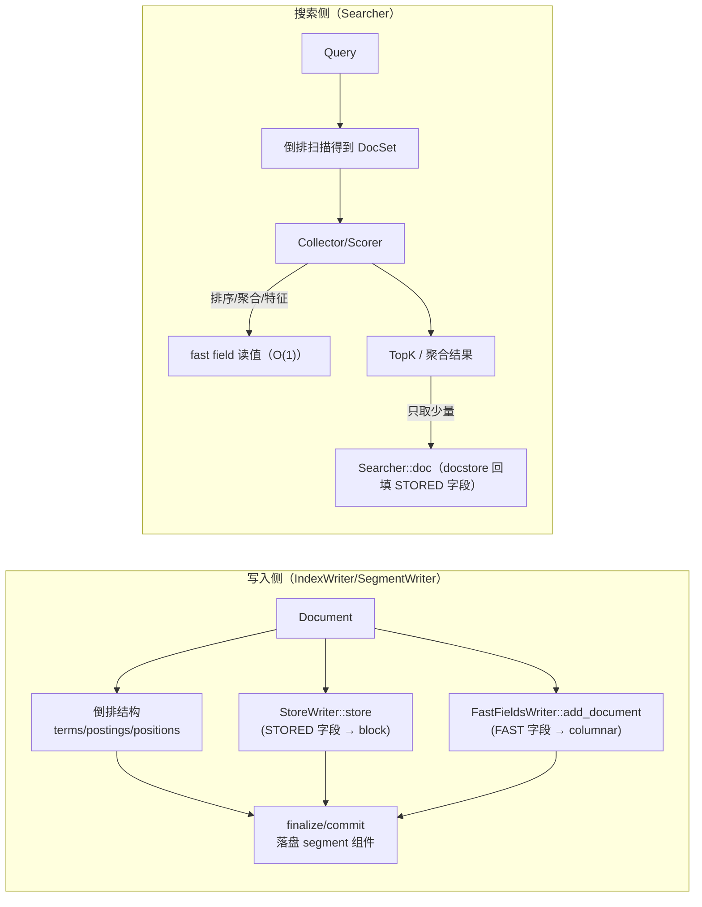

# P2-08 DocStore vs FastField：行存/列存的取舍与正确用法

> 版本基线：tantivy 0.24.0（本仓库）
>
> 本文主问题：为什么展示结果用 store（docstore），而排序/聚合/打分特征用 fast field？
>
> 本文产出：对比表 1 张 + 数据流图 1 张 + 可运行实验 1 个（观察 docstore block 解压与 fast field 读值）

## 本文目标

- 读懂 docstore 的读取成本来自哪里（定位 block + 解压 + 反序列化）
- 读懂 fast field 的 O(1) 随机访问为何成立（min_value/gcd + bitpacking / columnar）
- 给出“正确用法”的经验法则（避免滥用 store，也避免无脑 FAST）

## 读前准备

- 你已经知道 `DocId` / `DocAddress` / `Segment` 是什么（建议先看 P1-01 / P1-02）
- 知道 Schema 三个开关：`STORED` / `FAST` / `INDEXED` 的意义（可扫 `src/schema/mod.rs`）
- 可选：先读 `ARCHITECTURE.md` 的 store/fastfield 小节（本文很多结论来自那里）

## 关键概念（先给结论）

- `DocStore`（`.store`）：**行存（row-oriented）**。按“文档”为单位存一部分字段（标了 `STORED` 的字段），为了把 TopK 结果回填成 `Document`（展示/摘要/高亮原文）。
- `FastField`（`.fast`）：**列存（column-oriented）**。按“字段列”为单位存值（标了 `FAST` 的字段），为了在评分/收集阶段对大量 `DocId` 做快速取值（排序/聚合/过滤/特征）。
- `INDEXED` vs `FAST`：`INDEXED` 是“能查”（走倒排/terms/postings），`FAST` 是“能快读值”（走 columnar/bitpacking）。常见组合：
  - 只展示：`STORED`
  - 只排序/聚合：`FAST`
  - 既要查又要聚合：`INDEXED | FAST`
  - 既要展示又要排序：`STORED | FAST`（注意空间会重复）
- 经验法则（来自 `ARCHITECTURE.md`）：如果每次查询要 hit docstore 超过 ~100 次，你大概率在误用（应该改用 fast field 或改 Collector/分页策略）。

## 一张表记住：DocStore vs FastField

| 维度 | DocStore（`.store`） | FastField（`.fast`） |
|---|---|---|
| 存储形态 | 行存：按 doc 写入 | 列存：按 field 写入 |
| Schema 开关 | `STORED` | `FAST` |
| 压缩/编码 | 通用压缩（LZ4/Zstd/None）+ block | 轻量编码（bitpacking/dict/列式 codec 自动选择） |
| 单点随机访问 | `doc_id → checkpoint → 读压缩块 → 解压整块 → 切片 doc bytes → 反序列化` | `doc_id → 计算偏移/查 ord → 读少量字节 → 还原值` |
| 擅长的工作 | TopK 回填原文、snippet、debug 展示 | 排序（TopDocs）、聚合（Facet/Histogram）、过滤、打分特征 |
| 不擅长的工作 | 对大量命中逐个取 doc（很慢） | 返回“原文/完整字段集合”（信息可能不足或不想重复存） |
| 典型访问量 | 每 query 10~50 次（TopK） | 每 query 成百上千、甚至全量 docset 扫描 |
| 调参点 | `IndexSettings.docstore_blocksize`、`docstore_compression`、Reader 的 `doc_store_cache_num_blocks` | 主要是“哪些字段需要 FAST + 数据分布”，codec 自动选择 |

## 源码入口（建议阅读顺序）

1. `ARCHITECTURE.md`：store/fastfield 两节（结论与使用姿势）
2. `src/indexer/segment_writer.rs`：`SegmentWriter::add_document`（docstore/fastfield 在写入侧的落点）
3. `src/indexer/segment_serializer.rs`：`.store/.fast` 文件如何被创建与关闭
4. `src/core/searcher.rs`：`Searcher::doc` + `doc_store_cache_stats`（读侧为什么“回填在最后”）
5. `src/store/writer.rs` / `src/store/reader.rs`：docstore 的 block 写入与读取（缓存/解压）
6. `src/store/index/*`：`SkipIndex`（doc_id → block checkpoint 的“紧凑树”）
7. `src/fastfield/writer.rs` / `src/fastfield/readers.rs`：fast field 写读（ColumnarWriter/Reader）
8. `columnar/src/column_values/u64_based/bitpacked.rs`：数值列的核心取值公式（`min_value + gcd * unpack(doc)`）
9. `src/collector/top_score_collector.rs`：`TopDocs::order_by_fast_field`（排序怎么“直接读 fast field”）
10. `src/fastfield/facet_reader.rs`：Facet 是 fast field 的特例（ord ↔ facet 字典）

## 数据流/时序（先把大图画出来）

这一张图刻意强调一个原则：

> **搜索阶段尽量不碰 docstore**。先用倒排 + fast field 把 TopK/聚合结果算出来，最后才对 TopK 回填 docstore。



## DocStore：为什么它“慢”是设计目标之一？

docstore 的目标从来不是“每个命中文档都秒级返回原文”，而是：

- **用很小的 IO/CPU 成本**把 TopK 的文档回填出来
- 用**通用压缩**把“要展示的字段”压得更小（典型是 title/body/url…）

### 1) 写入：边 add_document 边写 block（而不是 finalize 才写）

看 `SegmentWriter::add_document`（`src/indexer/segment_writer.rs`）里三行核心调用：

- `self.fast_field_writers.add_document(&document)?;`
- `self.index_document(&document)?;`（倒排相关）
- `doc_writer.store(&document, &self.schema)?;`（docstore）

这里有一个容易忽略的点：docstore 是“追加写”的（`StoreWriter` 注释也强调了这一点），而 skip index（block → doc_range/byte_range）是在内存里构建，close 时写到文件尾部。

### 2) `.store` 文件布局：数据块 + skip index + footer

读 `StoreReader::open`（`src/store/reader.rs`）就能看出来它怎么拆文件：

- 先从文件尾部 `extract_footer`，拿到
  - `offset`：skip index 开始的字节位置
  - `decompressor`：用什么算法解压
  - `doc_store_version`
- 再 `split(offset)` 把文件切成两段：`data_file`（压缩 blocks）+ `offset_index_file`（skip index）

逻辑上的布局可以画成这样：

```text
<segment>.store
  [compressed block 0][compressed block 1] ... [compressed block N]
  [skip index bytes]
  [DocStoreFooter (固定 28 bytes)]
```

### 3) block 的“二级索引”：在解压后的 block 尾部

`StoreWriter::send_current_block_to_compressor`（`src/store/writer.rs`）在 flush block 时，会把每个 doc 的起始偏移（u32）追加到 block 尾部，并在最后追加 `index_len`：

```text
uncompressed block
  [doc0 bytes][doc1 bytes]...[docM bytes]
  [offset[0]..offset[M] as u32 ...][index_len as u32]
```

读取时 `block_read_index`（`src/store/reader.rs`）会：

- 从尾部读出 `index_len`
- 找到 offsets 数组
- 用 `offset[doc_pos]..offset[doc_pos+1]` 切出 doc bytes

这就是 docstore “定位成本”的第二部分：**解压后还要再做一次 block 内切片**。

### 4) 读取成本拆解：为什么不要在 Collector/Scorer 里读 store

`Searcher::doc`（`src/core/searcher.rs`）最终会走到 `StoreReader::get`（`src/store/reader.rs`），路径非常固定：

1. `SkipIndex::seek(doc_id)`：doc_id → block checkpoint（doc_range + byte_range）
2. 读取压缩块：`data.slice(byte_range).read_bytes()`
3. 解压整块：`decompressor.decompress(...)`
4. block 内切片：`block_read_index(...)`
5. 反序列化：`BinaryDocumentDeserializer` + `DocumentDeserialize`

其中最“贵”的通常是第 2~4 步：定位 + 读块 + 解压。

所以 Tantivy 公开 API 把它放在 `Searcher::doc` 里，而不是让你在评分时随手拿 doc ——这是一种“引导正确用法”的 API 设计。

### 5) 缓存：docstore 不是“缓存整篇 doc”，而是缓存解压后的 block

`StoreReader` 内部有一个 decompressed block 的 LRU（见 `src/store/reader.rs` 的 `BlockCache`），`IndexReaderBuilder::doc_store_cache_num_blocks(...)`（`src/reader/mod.rs`）可以调节缓存块数（默认 100）。

你应该记住的是：

- **同一个 block 内**读多个 doc 会很快（解压一次，多次切片）
- **跨很多 block**随机读会很慢（反复解压）

这也是为什么“TopK 回填”很合适：TopDocs 的 doc_id 往往有一定局部性，而且数量很小。

## FastField：为什么它能做到“像数组一样读”？

fast field 的设计目标就是：给定 doc_id，快速拿到某个字段的值。

在 `src/fastfield/mod.rs` 顶部注释里写得很直白：它相当于 Lucene 的 DocValues，读性能“接近数组下标访问”。

### 1) 写入：FastFieldsWriter 只是记录“按 doc_id 的列值”

`FastFieldsWriter::add_document`（`src/fastfield/writer.rs`）会遍历 doc 的所有 field/value，对 `field_entry.is_fast()` 的字段记录到 `ColumnarWriter`：

- 数值：`record_numerical`
- 字符串/Facet：`record_str`
- bytes/ip/bool/date：分别有对应 record 方法
- JSON fast field：会展开 path，编码成 column name（更高级的用法，本篇先不展开）

注意它的“写入侧语义”是：**doc_id 单调递增**，因此天然适合列式编码。

### 2) 读值：数值列的核心就是 bitpacking + 线性变换

以 `BitpackedReader::get_val` 为例（`columnar/src/column_values/u64_based/bitpacked.rs`）：

```text
value(doc) = min_value + gcd * unpack_bits(doc)
```

其中：

- `unpack_bits(doc)` 本质就是从 bitpacked 数组里按位取出第 `doc` 个值
- `min_value / gcd` 来自整列统计（压缩元数据），用来降低需要的 bit 宽

这个过程是 O(1) 的：算偏移 → 读少量字节 → 还原值。

> 备注：Tantivy 的 columnar 不止 bitpacked 一种 codec（会自动选择），但“按 doc_id 快速取值”的性质是一致的。

### 3) Facet 为什么属于 fast field？

`FacetReader`（`src/fastfield/facet_reader.rs`）包装的是 `StrColumn`：

- doc → facet ords（可能多值）
- facet ord → facet string（字典解码）

Facet 的典型用法是“对大量命中做计数/聚合”，因此它天然属于 fast field，而不是 docstore。

## 正确用法：把 store 与 fast field 放回它们该在的位置

1. **展示/回填**：TopDocs 拿到 `(Score/SortKey, DocAddress)` 后，对 TopK 调 `searcher.doc(...)`。
2. **排序**：用 `TopDocs::order_by_fast_field(...)`，而不是把所有命中都 `doc()` 出来再排序。
3. **聚合/统计**：Collector 里读 fast field（FacetCollector/HistogramCollector 都是这个模式）。
4. **过滤**：
   - 精确过滤（term/range）：优先走 `INDEXED`（倒排/范围查询）
   - 后置过滤（post-filter）：当过滤掉的比例足够高时，用 fast field 在 collector 端读值过滤（`ARCHITECTURE.md` 有提到这种用法）
5. **字段要不要同时 `STORED | FAST`？**
   - 需要“展示 + 排序/聚合”的字段（如价格、评分、时间）通常值得同时开
   - 大字段（body、json 原文）通常只 `STORED`，不要 `FAST`
   - 只用于排序但不展示的字段（比如内部特征）只 `FAST` 即可

## 可运行实验：用 cache stats 直观看到“docstore 解压次数”

这个实验不靠“跑得快/跑得慢”的时间对比（容易受机器影响），而是直接读 `Searcher::doc_store_cache_stats()`：

- 每次 cache miss 基本对应一次“读压缩块 + 解压 block”
- cache hit 对应“复用已解压 block”

### 实验目标

- 观察：只读 fast field 不会触发 docstore cache 变化
- 观察：顺序读 docstore 命中率高；随机读 docstore miss 更多
- 观察：TopK 回填只会触发很少的 docstore miss

### 操作步骤

1) 新建一个示例文件 `examples/p2_08_store_vs_fastfield.rs`，内容如下：

```rust
use tantivy::collector::TopDocs;
use tantivy::query::AllQuery;
use tantivy::schema::*;
use tantivy::{doc, DocAddress, Index, IndexSettings, Order, TantivyDocument};

fn main() -> tantivy::Result<()> {
    let mut schema_builder = Schema::builder();
    let title = schema_builder.add_text_field("title", STORED);
    let rating = schema_builder.add_u64_field("rating", FAST | STORED);
    let schema = schema_builder.build();

    // 为了让 block 更容易“被打散”，把 docstore blocksize 调小一点（默认 16KB）
    let settings = IndexSettings {
        docstore_blocksize: 4 * 1024,
        ..Default::default()
    };

    let index = Index::builder()
        .schema(schema)
        .settings(settings)
        .create_in_ram();

    let mut writer = index.writer_with_num_threads(1, 50_000_000)?;
    for i in 0..50_000u64 {
        writer.add_document(doc!(
            title => format!("doc-{i}"),
            rating => (i % 10_000)
        ))?;
    }
    writer.commit()?;

    let reader = index
        .reader_builder()
        .doc_store_cache_num_blocks(100)
        .try_into()?;
    let searcher = reader.searcher();

    // 1) 排序：只读 fast field（不触发 docstore 读取）
    let top_by_rating = TopDocs::with_limit(5).order_by_fast_field::<u64>("rating", Order::Desc);
    let top_docs = searcher.search(&AllQuery, &top_by_rating)?;
    println!("top5_by_rating: {top_docs:?}");
    println!("cache after sort-only: {:?}", searcher.doc_store_cache_stats());

    // 2) TopK 回填：只读少量 docstore
    let before = searcher.doc_store_cache_stats();
    for (_rating, addr) in &top_docs {
        let _doc: TantivyDocument = searcher.doc(*addr)?;
    }
    let after = searcher.doc_store_cache_stats();
    println!(
        "cache delta (top5 doc): hits +{}, misses +{}",
        after.cache_hits - before.cache_hits,
        after.cache_misses - before.cache_misses
    );

    // 3) 顺序读一段 docstore：同 block 内会大量复用（hit 多）
    let before = searcher.doc_store_cache_stats();
    let max_doc_seg0 = searcher.segment_reader(0u32).max_doc();
    let num_docs = 1000u32.min(max_doc_seg0);
    for doc_id in 0u32..num_docs {
        let _doc: TantivyDocument = searcher.doc(DocAddress::new(0u32, doc_id))?;
    }
    let after = searcher.doc_store_cache_stats();
    println!(
        "cache delta (seq 0..{num_docs} doc): hits +{}, misses +{}",
        after.cache_hits - before.cache_hits,
        after.cache_misses - before.cache_misses
    );

    // 4) “打散”读取 docstore：跨 block 随机读（miss 多）
    let before = searcher.doc_store_cache_stats();
    for i in 0u32..num_docs {
        // 一个确定性的“伪随机”映射，避免引入 rand 依赖
        let doc_id = (i * 97) % max_doc_seg0;
        let _doc: TantivyDocument = searcher.doc(DocAddress::new(0u32, doc_id))?;
    }
    let after = searcher.doc_store_cache_stats();
    println!(
        "cache delta (pseudo-rand {num_docs} doc): hits +{}, misses +{}",
        after.cache_hits - before.cache_hits,
        after.cache_misses - before.cache_misses
    );

    // 5) 读 fast field N 次（不改变 docstore cache stats）
    let before = searcher.doc_store_cache_stats();
    let seg = searcher.segment_reader(0u32);
    let rating_col = seg.fast_fields().u64("rating")?.first_or_default_col(0u64);
    let mut sum = 0u64;
    for doc_id in 0u32..num_docs {
        sum += rating_col.get_val(doc_id);
    }
    let after = searcher.doc_store_cache_stats();
    println!("sum(rating[0..{num_docs}]) = {sum}");
    println!(
        "cache delta (fastfield 0..{num_docs}): hits +{}, misses +{}",
        after.cache_hits - before.cache_hits,
        after.cache_misses - before.cache_misses
    );

    Ok(())
}
```

2) 运行示例：

```bash
cargo run --example p2_08_store_vs_fastfield
```

### 验证点

- `cache after sort-only` 里 hits/misses 仍为 0（排序阶段只读 fast field）
- `cache delta (top5 doc)` 的 misses 很小（只回填 TopK）
- `seq 0..N` 的 hits 明显大于 misses（同 block 内复用解压结果）
- `pseudo-rand N` 的 misses 明显更大（跨 block 解压更多次）
- `fastfield 0..N` 的 cache delta 仍是 0（读 fast field 不碰 docstore）

## 常见坑 & FAQ（≤ 5）

1. **Q：我能不能只用 STORED 字段做排序？**  
   A：理论上你可以“把所有命中 doc() 出来再排序”，但这通常是灾难性的（大量 block 解压 + 反序列化）。正确做法是把排序字段设为 `FAST`，用 `TopDocs::order_by_fast_field`。

2. **Q：`FAST` 和 `INDEXED` 我该选哪个？**  
   A：两者解决的问题不同：`INDEXED` 让你能根据该字段做查询（term/range），`FAST` 让你能在评分/聚合/排序时快速读值。很多字段需要 `INDEXED | FAST`（例如价格：既要范围过滤也要排序/聚合）。

3. **Q：什么时候需要 `STORED | FAST`？会不会浪费空间？**  
   A：会重复存一份值，所以会增加索引体积与写入成本。但如果你既要展示该字段，又要排序/聚合它（例如时间、价格、评分），这通常是值得的。

4. **Q：facet 字段为什么默认拿不到（doc() 里没有）？**  
   A：facet 的主要用途是聚合与过滤，它走 fast field（`FacetReader`）。如果你确实需要在回填文档时返回 facet 字符串，可以把 facet 字段也设为 `STORED`（见 `src/fastfield/facet_reader.rs` 的测试）。

5. **Q：docstore 的 blocksize/compressor 应该怎么选？**  
   A：这是一个“随机读 vs 压缩率”的权衡：
   - block 越大、压缩率通常越好，但随机读单 doc 的解压成本更高
   - LZ4 更偏吞吐，Zstd 更偏压缩比（高压缩级别会拖慢写入）
   - 如果你主要做 TopK 回填，默认值通常够用；如果你的业务经常需要回填更多字段/更多 doc，优先考虑“减少回填次数/改用 fast field”，再考虑调参

## 延伸阅读（可选）

- `ARCHITECTURE.md`：store/fastfield 小节（非常贴近本文主问题）
- `src/schema/mod.rs`：`STORED/FAST/INDEXED` 的语义（以及示例）
- `examples/faceted_search.rs`：FacetCollector 的使用姿势（聚合不读 docstore）
- `src/collector/top_score_collector.rs`：TopDocs 的 fast field 排序实现（u64 lenient）

## TODO

- [x] 做一张“store vs fastfield”的对比表（访问模式、压缩、典型用途）
- [x] FAQ：什么时候该把字段同时设为 `STORED | FAST`？
- [ ] 再补一个“range filter：INDEXED vs fast field post-filter”的对照实验
- [ ] 展开 columnar 的 codec 选择逻辑（什么时候会用 bitpacked/linear/blockwise_linear）
