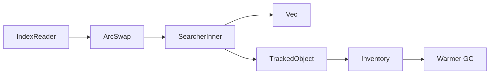
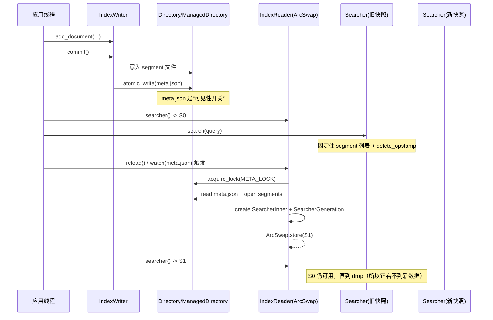

# P3-09 Searcher 快照一致性：SegmentReader 与 generation

> 版本基线：tantivy 0.24.0（本仓库）
>
> 本文主问题：为什么 commit 后旧的 searcher 看不到新数据？这如何保证一致性？
>
> 本文产出：时序/结构图 1 张 + 可运行实验 2 个 + 关键源码入口清单

## 本文目标

- 读懂 Searcher 持有的是什么（`Vec<SegmentReader>` + `SearcherGeneration`）
- 理解：Searcher 为什么必须是“不可变快照”，它解决了哪些并发一致性问题
- 理解：`SearcherGeneration` 的设计动机，以及它如何支撑 `Warmer` 的缓存与 GC

## 读前准备

- Rust 基础（trait/泛型/Arc/Atomic/RwLock）
- 基本检索概念（segment、commit、delete bitset、合并/GC）
- 可选：读过 `ARCHITECTURE.md` 中关于 reader/writer/segment 的章节

## 关键概念（先给结论）

- `Searcher`：一次搜索请求使用的只读视图（快照）。
  - **快照内容**：固定住一组 `SegmentReader`（也就固定住“哪些 segment + 每个 segment 的 delete 状态”）。
  - **重要不变量**：同一个 `Searcher` 生命周期内，它看到的 segment 集合不变；所以“旧 searcher 看不到新数据”是**设计目标**，不是 bug。
- `IndexReader`：维护“当前最新 Searcher”的容器。
  - 内部用 `ArcSwap<SearcherInner>` 保存当前快照；`reader.searcher()` 只是把当前快照 clone 出来（非常便宜）。
  - `reader.reload()` 才会打开最新的 segment 并 **swap** 成新快照。
- `ReloadPolicy`：决定 reload 由谁触发。
  - `OnCommitWithDelay`：监控 `meta.json` 的变化，后台自动触发 `reload()`（有毫秒级延迟）。
  - `Manual`：完全由调用方显式 `reload()`，最可控也最适合写可复现实验/单测。
- `SegmentReader`：单个 segment 的只读入口，打开并持有该 segment 的所有组件（terms/postings/store/fastfield/fieldnorms/delete bitset…）。
  - `SegmentReader::delete_opstamp()` 表示这个 segment 当前使用的 delete 文件版本（见下文）。
- `SearcherGeneration`：给一个 searcher 打“版本号”的结构。
  - `generation_id`：每次 `IndexReader` 构建新 searcher 都会自增（即使 segment 没变化也会变）。
  - `segments: BTreeMap<SegmentId, Option<Opstamp>>`：描述这代 searcher 由哪些 segment 组成，以及每个 segment 的 `delete_opstamp`。
  - 该结构主要服务 `Warmer`：你可以按 generation / segment / delete 版本维度组织缓存，并在 GC 时准确回收。
- `META_LOCK`：保护“打开新 segment reader（reload）”与“文件垃圾回收（GC）”之间的竞态。
  - reader reload 打开文件时会持有 `META_LOCK`；
  - GC 删除文件前也会持有 `META_LOCK`；
  - 这样就避免“读进程刚读到 meta.json，文件却被 GC 删掉，来不及 open”的窗口期。

## 源码入口（建议阅读顺序）

1. `src/reader/mod.rs`：`IndexReader`、`ReloadPolicy`、`InnerIndexReader::{reload, open_segment_readers, create_searcher}`、`ArcSwap<SearcherInner>`
2. `src/core/searcher.rs`：`Searcher`、`SearcherInner`、`SearcherGeneration`、`Searcher::search_with_executor`
3. `src/index/segment_reader.rs`：`SegmentReader::open`、`SegmentReader::{segment_id, delete_opstamp, alive_bitset, doc_ids_alive}`
4. `src/index/index_meta.rs`：`SegmentMeta::{delete_opstamp, relative_path}`（delete 文件名里包含 opstamp）
5. `src/directory/directory_lock.rs` + `src/directory/managed_directory.rs`：`META_LOCK`、`ManagedDirectory::garbage_collect`
6. `src/reader/warming.rs` + `examples/warmer.rs`：`Warmer`、`WarmingStateInner::gc_maybe`、generation 生命周期

## 数据流/时序（建议画图）

### 结构图：谁持有谁？



### 时序图：commit / reload / 旧 searcher 的关系



## 把主问题回答清楚：为什么 commit 后旧 Searcher 看不到新数据？

把图里的三件事连起来，其实就一句话：**commit 改变的是“索引的最新版本”，而 Searcher 持有的是“某一刻的版本快照”。**

- `IndexWriter::commit()` 的关键动作是把新 segment “发布”到 `meta.json`（写入是原子的，见 `src/indexer/segment_updater.rs` 的 `save_metas(...)`）。
- `IndexReader` 只有在 `reload()`（或 `OnCommitWithDelay` 的 watch 回调触发）时，才会去读取最新 `meta.json` 并打开新一批 `SegmentReader`，最后把新 `SearcherInner` 存进 `ArcSwap`。
- 老的 `Searcher` 里已经握着一组 `SegmentReader` 了；它既不会去读 `meta.json`，也不会被 `IndexReader` “原地更新”。所以它自然看不到新 commit 的 segment。

最小心智模型可以写成这样：

```rust
let s0 = reader.searcher(); // 快照 0

writer.commit()?;
reader.reload()?; // 生成快照 1 并替换“当前最新”

let s1 = reader.searcher(); // 快照 1
// 注意：s0 仍然是快照 0
```

这带来的好处是：一次查询（甚至一次复杂请求包含多次查询）只要复用同一个 `Searcher`，就可以保证“结果自洽”，不会在执行过程中被并发写入/合并打断。

## delete_opstamp：删除也是版本的一部分

很多人只把“新增文档”当成版本变化，但在 Tantivy 里，**deletes 同样会让 segment 的可见状态发生版本变化**。

- `SegmentMeta::relative_path(SegmentComponent::Delete)` 会把 `delete_opstamp` 编进 delete 文件名：`.uuid.<opstamp>.del`（见 `src/index/index_meta.rs`）。
- `SegmentReader::open(...)` 在 `segment.meta().has_deletes()` 时会读取对应的 delete 文件并构造 `AliveBitSet`（见 `src/index/segment_reader.rs`）。

因此：

- 对搜索结果而言，“同一个 segment_id，但 delete_opstamp 不同”就意味着**活跃 doc 集合不同**；
- 对 `Warmer` 而言，如果你的缓存会被 deletes 影响，把 key 绑定到 `(segment_id, delete_opstamp)` 往往比只用 `segment_id` 更安全；
- 这也是 `SearcherGeneration` 要把 `(SegmentId -> delete_opstamp)` 放进来的原因之一。

## 可运行实验

### 实验 1：commit 之后，旧 Searcher 永远是旧快照（直到 drop）

#### 实验目标

- 观察到：第二次 commit 后，**不 reload** 时 `IndexReader` 仍旧返回旧快照
- 观察到：即使 `reload()` 之后，**旧的** `Searcher` 仍然只能看到旧数据
- 观察到：`SearcherGeneration::generation_id()` 会随着 reload 自增

#### 操作步骤

```bash
cargo run --example searcher_snapshot_consistency
```

#### 验证点

- 输出中会出现类似信息（segment_id 不同属于正常）：
  - `old searcher after commit2 (no reload): ... count=1`
  - `after reload: ... count=2`
  - `old searcher after reload: ... count=1`
- 你能解释：为什么“旧 searcher 看不到新数据”是快照语义的一部分

### 实验 2：Warmer 为什么需要 generation（以及一个容易踩的坑）

`Warmer` 典型用于维护“与 segment 生命周期绑定”的外部状态（缓存/外部列等）。

#### 操作步骤

```bash
cargo run --example warmer
```

#### 验证点

- 你能解释：为什么示例里 `reader.reload()` 之后，哪怕仍然使用同一个 `searcher` 变量，结果也可能变化
  - 关键点：warm 的缓存 key 由 `Warmer` 决定；如果按 `(segment_id, delete_opstamp)` 组织缓存，那么 reload 会刷新同一 key 下的缓存，从而影响旧 searcher 的行为
- 你能解释：`SearcherGeneration::segments()` 为什么要包含 `delete_opstamp`
  - 删除会生成新的 `.del` 文件（文件名包含 opstamp），对缓存而言这通常意味着一个新的“版本”

## 常见坑 & FAQ（≤ 5）

1. Q：`IndexWriter::commit()` 都成功了，为什么查询还看不到新文档？  
   A：commit 只会把新 segment “发布”到 `meta.json`；`Searcher` 是快照，旧 searcher 不会自动更新。要看到新数据，需要让 `IndexReader` reload 并在新请求里拿到新的 `Searcher`（或显式 `reader.reload()`）。
2. Q：一个请求里我能多次 `reader.searcher()` 吗？  
   A：能，但不建议。`IndexReader::searcher()` 的文档明确建议：**一次 query/一次请求要复用同一个 searcher**，否则你可能在一次业务流程中混用不同快照，造成结果不自洽。
3. Q：`ReloadPolicy::OnCommitWithDelay` 既然会自动 reload，为啥还要手动 `reload()`？  
   A：自动 reload 依赖文件 watch，有毫秒级延迟；测试/批处理需要确定性时，手动 `reload()` 更可靠。生产里如果你需要“commit 完立刻可见”，也可以在写入线程 commit 后显式 reload。
4. Q：`SearcherGeneration` 里为什么既要 `generation_id` 又要 `(segment_id -> delete_opstamp)`？  
   A：两者服务不同维度的缓存/GC：`generation_id` 适合“严格快照级”的产物；`segment_id/delete_opstamp` 适合“segment 级/带删除版本”的产物。两者组合能覆盖更多工程化场景。
5. Q：我应该怎么为 Warmer 的缓存选 key，才不会破坏快照一致性？  
   A：如果你希望“旧 searcher 永远用旧缓存”，就把 key 绑定到 `generation_id`（每次 reload 都是新 key）。如果缓存只依赖 segment 的不可变数据，可以按 `segment_id`；如果缓存还受 deletes 影响，就按 `(segment_id, delete_opstamp)`。

## 延伸阅读（可选）

- `ARCHITECTURE.md`：reader/writer/segment 的整体视角
- `examples/deleting_updating_documents.rs`：commit + reload 的最直观用法（更新=删+插）
- `examples/basic_search.rs`：searcher 作为快照的基本概念
- `src/directory/managed_directory.rs`：GC 如何与 `META_LOCK` 协作，避免误删

## TODO

- [x] 补 1 张图（结构/时序）
- [x] 补 1 个最小可复现实验（快照不变 + reload 生成新 searcher）
- [x] 写 ≤ 5 条 FAQ（覆盖 reload、generation、warmer key）

- [ ] 进一步补充：segment merge/GC 时，快照如何保证“文件打开安全”（`META_LOCK` 的完整竞态场景）
