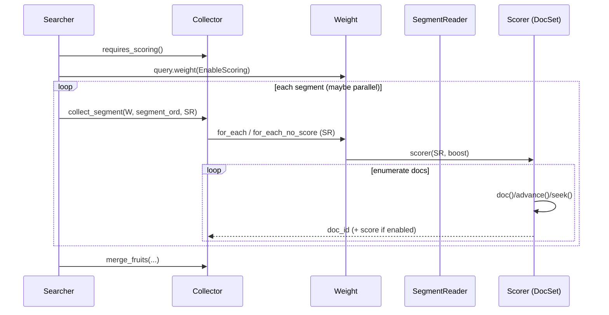

# P3-10 Query/Weight/Scorer：三段式接口与扩展套路

<<<<<<< HEAD
> 本文主问题：为什么 Query 不直接返回 DocSet？Weight/Scorer 的分层解决了什么问题？
=======
> 版本基线：tantivy 0.26.0（本仓库 `Cargo.toml`）
>
> 本文主问题：为什么 Query 不直接返回 DocSet？Weight/Scorer 的分层解决了什么问题？
>
> 本文产出：三段式数据流图 1 张 + 源码阅读实验 1 个 + 自定义 Query 最小骨架
>>>>>>> ff32627b (Codex changes)

## 本文目标

- 建立 Query → Weight → Scorer 的心智模型（“配方 → 绑定 searcher → 绑定 segment”）
<<<<<<< HEAD
- 读懂一个典型 Query（如 TermQuery/BooleanQuery）的实现结构
- 给出自定义 Query 的最小实现骨架

## 源码入口（建议阅读顺序）

1. `src/query/query.rs`：Query trait 文档与默认实现
2. `src/query/weight.rs` / `src/query/scorer.rs`：Weight/Scorer 接口
3. `src/query/term_query/*`：TermQuery 的实现（推荐作为第一个样例）
4. `src/query/boolean_query/*`：组合查询
5. `src/query/bm25.rs`：打分与统计

## 可运行实验

```bash
cargo run --example fuzzy_search
```

### 验证点

- 你能解释：为什么 Weight 需要绑到 Searcher（统计量/字段信息）
- 你能解释：为什么 Scorer 需要绑到 SegmentReader（局部 docid 空间）

## TODO

- [ ] 写一个“自定义 Query 骨架”小节（只到结构，不展开优化）
- [ ] FAQ：EnableScoring 关闭后哪些路径会变快？
=======
- 能从 `Searcher::search` 一路定位到 `Query::weight`、`Weight::scorer`、`DocSet::advance/seek`
- 读懂一个典型 Query（TermQuery/BooleanQuery）的实现结构，知道三层分别放什么
- 给出自定义 Query 的两种最小扩展套路（wrapper vs 自己实现 Scorer）

## 读前准备

- 读过 P3-09（Searcher 快照/SegmentReader）更顺：你需要先接受“一个 index = 多个 segment”
- 读过 P3-11（Collector）更顺：Collector 决定是否需要 score，从而影响 EnableScoring
- 能看懂 Rust trait + dyn dispatch：`Box<dyn Query>` / `Box<dyn Weight>`

## 关键概念（先给结论）

- `Query`：**配方**。描述“匹配哪些文档 + 如何打分”，但不直接触碰 segment 资源；执行时先变成 `Weight`。
- `Weight`：**绑定 Searcher 的配方**。可以缓存全局统计（BM25 的 idf / average fieldnorm 等）、根据 `EnableScoring` 选择快路径，并能为每个 segment 生成 `Scorer`。
- `Scorer`：**绑定 SegmentReader 的游标**。本质是 `DocSet + score()`：在一个 segment 的 docid 空间里按升序枚举命中文档并计算分数。
- `EnableScoring`：**执行开关**。来自 `Collector::requires_scoring()`：不需要 TopK/排序时就关闭 scoring，让 Query/Weight/Collector 走更轻的路径。
- `DocId` vs `DocAddress`：`Scorer` 产出的 `DocId` 是 **segment-local**；跨 segment 合并/返回结果时需要 `(segment_ord, doc_id)` 组成 `DocAddress`。

## 源码入口（建议阅读顺序）

1. `src/query/query.rs`：`Query` / `EnableScoring` / `Query::weight` 文档（官方解释三段式原因）
2. `src/core/searcher.rs`：`Searcher::search_with_executor`（创建 weight 的位置 + 并行按 segment 执行）
3. `src/collector/mod.rs`：`Collector::requires_scoring`、`Collector::collect_segment`、`default_collect_segment_impl`
4. `src/query/weight.rs`：`Weight` trait（`for_each` / `for_each_no_score` / `for_each_pruning`）
5. `src/query/scorer.rs` + `src/docset.rs`：`Scorer` / `DocSet`（advance/seek/fill_buffer/TERMINATED）
6. `src/query/term_query/*`：一个“完整三段式”实现（`TermQuery` → `TermWeight` → `TermScorer`）
7. `src/query/boost_query.rs` / `src/query/const_score_query.rs`：典型 wrapper 扩展套路（只包 Weight/Scorer）

## 三段式接口到底解决了什么问题？

### 1) segment 是天然边界：Scorer 必须是 segment-local

Tantivy 的倒排、fast field、docstore 都按 segment 存储。postings 里的 docid、fieldnorm 的下标、alive bitset 都是 segment-local。

因此“可枚举命中 docid 的游标”天然要绑定 `SegmentReader` —— 这就是 `Scorer`（同时它还实现了 `DocSet`，提供 `advance/seek` 等游标能力）。

### 2) scoring 同时依赖全局信息与局部信息：Weight 是缓存层

以 BM25 为例：

- idf 依赖全局统计（doc_freq / total_docs），需要 `Searcher` 或统计提供者（见 `EnableScoring::Enabled { statistics_provider, .. }`）
- term frequency / fieldnorm 等来自具体 segment 的 postings/fieldnorm reader

把“全局可复用”的东西放到 Weight，可以做到：

- `Query::weight(...)` 只算一次（每次 search 一次），而不是每个 segment 重算
- `Weight` 可跨 segment/线程共享（`Weight: Send + Sync`），而 `Scorer` 按 segment 创建并在一个线程里消费

### 3) Collector 决定是否需要 score：EnableScoring 贯穿整个调用链

`Searcher::search_with_statistics_provider` 先问 `collector.requires_scoring()`：

- 需要排序/TopK → `EnableScoring::Enabled { ... }` → Query/Weight/Scorer 走打分路径
- 只做计数/过滤/聚合等 → `EnableScoring::Disabled { ... }` → Query/Weight 选择更轻的数据读取，Collector 也能批量收集 docid

你会在 `src/collector/mod.rs` 的 `default_collect_segment_impl` 看到对应分支：

- with_scoring = true：`weight.for_each(...)` → callback(doc, score)
- with_scoring = false：`weight.for_each_no_score(...)` → callback(docs)（批量 docid）或 score 直接填 0.0（取决于是否存在 deletes）

## 数据流/时序（建议画图）

下面这张图刻意把“谁调用谁”画清楚：Query 只参与生成 Weight；真正驱动 Scorer 枚举的是 Collector（间接通过 Weight）。



如果你想把它翻译成“心智模型”，就是一句话：

> Query 是配方；Weight 是把配方绑定到当前 Searcher 的版本；Scorer 是把配方绑定到某个 SegmentReader 的游标。

## 以 TermQuery 为样例：三层分别放什么？

### Query 层：只保留“表达式”与配置

见 `src/query/term_query/term_query.rs` 的 `pub struct TermQuery`：

- 保存 `term: Term`（表达式的核心）
- 保存 `index_record_option: IndexRecordOption`（要不要 positions 等）

它的关键工作是实现 `Query::weight(...)`，并把“与 scoring 是否开启有关的决策”提前做掉（同一个 Query，在不同 collector 下可能走不同执行路径）：

- `EnableScoring::Enabled`：构造 `Bm25Weight::for_terms(...)`
- `EnableScoring::Disabled`：构造一个 `<no score>` 的 `Bm25Weight`，并把 `index_record_option` 降到 `Basic`（不读 positions）

### Weight 层：缓存统计 + 负责创建 segment-local scorer

见 `src/query/term_query/term_weight.rs` 的 `pub struct TermWeight`：

- 缓存 `Bm25Weight`（已经绑定了统计与 boost 逻辑）
- 缓存 `scoring_enabled`，用于选择快路径

`fn scorer(&self, reader: &SegmentReader, boost: Score)` 的典型流程是：

1. 通过 `reader.inverted_index(field)` 打开 segment 的倒排索引
2. `get_term_info` 找 term 的元信息（doc_freq 等）
3. `read_postings_from_terminfo` 读出 `SegmentPostings`
4. 构造 `FieldNormReader`（scoring 关闭时可用常量 fieldnorm）
5. 最终返回 `TermScorer`

同一个文件里还有两个非常“Weight 层才做得好”的点：

- `count()`：在没有 deletes 的情况下，直接用 term_info.doc_freq 作为 count（避免扫 postings）
- `for_each_no_score()` / `for_each_pruning()`：为 Collector（尤其 TopDocs）提供更高层的遍历/剪枝接口

### Scorer 层：一个 segment 内的“游标 + score()”

见 `src/query/term_query/term_scorer.rs` 的 `pub struct TermScorer`：

- 实现 `DocSet`：advance/seek/doc/size_hint 委托给 postings cursor
- 实现 `Scorer::score()`：用 `Bm25Weight` + term_freq + fieldnorm 计算分数
- 额外提供 `block_max_score()`：为 BlockWAND 等剪枝优化提供块级上界

你可以把它当作“一个 segment 内的迭代器”，区别只在于它是高性能游标（seek/块读取）而不是 Rust 的 `Iterator`。

## 扩展套路：写自己的 Query（最小骨架）

实现自定义 Query 时，建议按“从轻到重”的顺序选路。

### 套路 A：先写 wrapper（不自己实现 DocSet）

如果你的需求是“改分数/改 boost/加一个过滤层”，优先包一层现成 query：

- `src/query/boost_query.rs`：只在 Weight 层把 boost 乘进去
- `src/query/const_score_query.rs`：把 scorer 的 score 变成常量

它们的共同点是：

- Query 层只负责拿到 inner_weight
- scoring 关闭时直接返回 inner_weight（避免无意义的包装）
- Weight 层要么改 boost，要么包一层 scorer

最小骨架（伪代码）：

```rust
use tantivy::query::{EnableScoring, Explanation, Query, Scorer, Weight};
use tantivy::{DocId, Score, SegmentReader};

#[derive(Clone, Debug)]
pub struct MyWrapQuery {
    inner: Box<dyn Query>,
}

impl Query for MyWrapQuery {
    fn weight(&self, enable_scoring: EnableScoring<'_>) -> tantivy::Result<Box<dyn Weight>> {
        let inner_weight = self.inner.weight(enable_scoring)?;
        if enable_scoring.is_scoring_enabled() {
            Ok(Box::new(MyWrapWeight { inner: inner_weight }))
        } else {
            Ok(inner_weight)
        }
    }
}

pub struct MyWrapWeight {
    inner: Box<dyn Weight>,
}

impl Weight for MyWrapWeight {
    fn scorer(&self, reader: &SegmentReader, boost: Score) -> tantivy::Result<Box<dyn Scorer>> {
        let inner_scorer = self.inner.scorer(reader, boost)?;
        Ok(inner_scorer) // TODO: 包一层 scorer 或调整 boost/score
    }

    fn explain(&self, reader: &SegmentReader, doc: DocId) -> tantivy::Result<Explanation> {
        self.inner.explain(reader, doc)
    }
}
```

### 套路 B：自己实现完整三段式（需要写 DocSet/Scorer）

当你真的要“换一种枚举方式”（比如全量扫描 fastfield、特殊的跳跃策略、把多个子 scorers 做 union/intersection），就需要自己写 scorer。

最小可参考实现：

- `src/query/all_query.rs`：不依赖倒排，直接枚举 `0..max_doc`
- `src/query/empty_query.rs`：边界条件处理

## 可运行实验

### 实验目标

- 明确三段式的“调用点”：`Query::weight` 只在 search 开始时创建一次，`Weight::scorer` 按 segment 创建多次
- 看见 scoring 开关如何影响执行路径（`for_each` vs `for_each_no_score`）

### 操作步骤

```bash
# 1) 定位 Query/Weight/Scorer 三段式定义
rg -n "pub trait Query\\b|enum EnableScoring\\b" src/query/query.rs
rg -n "pub trait Weight\\b|for_each_no_score\\b|for_each_pruning\\b" src/query/weight.rs
rg -n "pub trait Scorer\\b" src/query/scorer.rs
rg -n "pub trait DocSet\\b|TERMINATED\\b" src/docset.rs

# 2) 找到 search 执行时创建 Weight 的位置（只在这里）
rg -n "query\\.weight\\(|search_with_executor\\b" src/core/searcher.rs

# 3) 找到 Collector 决定 scoring 的分支（with_scoring / no_score）
rg -n "requires_scoring\\b|default_collect_segment_impl\\b|for_each_no_score\\b" src/collector/mod.rs

# 4) 追一个具体 Query 的三层：TermQuery -> TermWeight -> TermScorer
rg -n "impl Query for TermQuery\\b|specialized_weight\\b" src/query/term_query/term_query.rs
rg -n "impl Weight for TermWeight\\b|specialized_scorer\\b" src/query/term_query/term_weight.rs
rg -n "impl Scorer for TermScorer\\b|impl DocSet for TermScorer\\b" src/query/term_query/term_scorer.rs
```

> 可选（如果你本地可以编译）：跑 `examples/basic_search.rs`，最后会打印一段 `explain()` 的 pretty json，
> 你可以把它当作“Weight/Scorer 打分细节”在运行时的展开结果：
>
> ```bash
> cargo run --example basic_search
> ```

### 验证点

- 你能在 `src/core/searcher.rs` 里指出：`let weight = query.weight(...)` 只发生一次（每次 search 一次）。
- 你能在 `src/collector/mod.rs` 里指出：scoring 关闭时走 `for_each_no_score`，并且可能走 `collect_block`（批量 docid）。
- 你能解释：为什么 `Scorer` 的 `DocId` 不能跨 segment 使用，以及 `DocAddress(segment_ord, doc_id)` 的含义。
- 你能说出 TermQuery 在 scoring 关闭时做的两处“降级”（提示：`IndexRecordOption` 与 fieldnorm）。

## 常见坑 & FAQ（≤ 5）

1. **Q：为什么 Query 不直接实现 DocSet？**  
   A：DocSet/Scorer 必须绑定具体 segment（docid 空间与 postings 资源都是 segment-local）；Query 作为“表达式”需要可复用、可 clone，并能先绑定到 Searcher 做统计缓存。

2. **Q：Weight 为什么要求 `Send + Sync`？**  
   A：`Searcher::search_with_executor` 会按 segment 并行执行；同一个 weight 会被多个线程共享，每个线程各自创建 scorer。

3. **Q：`EnableScoring::Disabled` 时 score 会怎么样？**  
   A：Collector 通常不会读 score（它自己声明不需要）；执行侧会尽量走 `for_each_no_score` / `collect_block`，Query/Weight 也会选择更便宜的数据读取。

4. **Q：`boost` 应该加在哪一层？**  
   A：通常在 Weight::scorer 里把 boost 乘到 similarity_weight 上（见 TermWeight），或写一个 wrapper Weight（见 BoostQuery）。

5. **Q：自定义 Query 一定要实现 `explain` 吗？**  
   A：是的（Weight trait 要求）。最小实现可以像 `AllQuery`/`EmptyQuery` 一样给出简单 explanation；复杂 query 可以组合/嵌套下层 explanation。

## 延伸阅读（可选）

- `src/query/boolean_query/*`：多个子 scorer 的组合（union/intersection）以及剪枝优化（BlockWAND）
- `src/query/bm25.rs`：BM25 的统计与打分公式实现
- `examples/basic_search.rs`：`query.explain(&searcher, doc_address)` 的实际使用

## TODO

- [ ] 补一张“TermQuery 三层对象结构图”（字段/成员对照）
- [ ] 读 `src/query/boolean_query/*`，把 union/intersection 的 scorer 组合方式总结成 10 行
- [ ] FAQ：`seek_danger` 的“危险区”具体对哪些 scorer 有意义？
>>>>>>> ff32627b (Codex changes)

