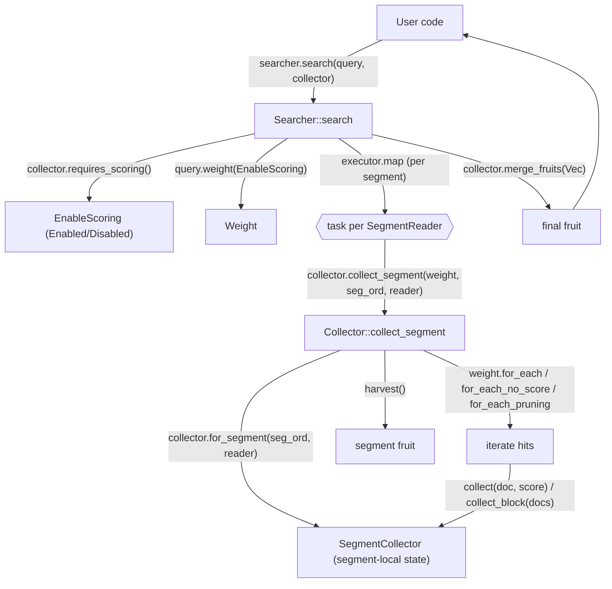

# P3-11 Collector：把“匹配”与“收集/聚合”解耦

> 版本基线：tantivy 0.24.0（本仓库）
>
> 本文主问题：Collector 的抽象如何让搜索执行可复用，并承载 TopK / 计数 / 聚合？
>
> 本文产出：Collector/SegmentCollector 数据流图 1 张 + 可运行实验 1 个 + 关键源码入口清单

## 本文目标

- 读懂 `Collector` / `SegmentCollector` 的职责边界（以及为什么一定要分段）
- 跑通一个自定义 collector 的例子，并能把它映射回“按段收集 → 合并”的框架
- 理解 `requires_scoring` 的意义：能关掉就关掉（否则会平白付出打分成本）

## 读前准备

- Rust 基础：trait / associated type / 泛型 / `Send + Sync`
- 了解 Tantivy 的“分段模型”与 `Searcher` 快照（见 `P3-09`）
- 看过 `Query → Weight → Scorer` 的三段式接口更佳（见 `P3-10`）

## 关键概念（先给结论）

- `Collector`：定义“命中后我要什么结果”。它本质上是 **segment 级 `SegmentCollector` 的工厂**，并负责把各 segment 的结果合并成一个最终结果（`merge_fruits`）。
- `SegmentCollector`：真正跑在“热路径”里的收集器，接收 `(DocId, Score)`（或块级 `&[DocId]`），并在结束时 `harvest()` 产出本段的 fruit。
- `Fruit`：收集结果的类型别名/约束（`Send + Downcast`）。Tantivy 把搜索结果叫作“fruit”，因为它可能是 TopK、计数、facet、直方图、统计量……不止一种形态。
- `requires_scoring`：Collector 对外宣告“我是否需要 query 的相关性分数”。`Searcher` 会据此构造 `EnableScoring`，进而影响 `Query::weight(...)` 以及遍历命中文档时走 `Weight::for_each(...)` 还是 `Weight::for_each_no_score(...)`。
- `DocId` vs `DocAddress`：`DocId` 只在 segment 内有效；跨 segment 唯一定位一个文档需要 `DocAddress { segment_ord, doc_id }`。Collector 设计强迫你“先按段做局部，再把段号带上合并”。

## 源码入口（建议阅读顺序）

1. `src/core/searcher.rs`：`Searcher::search` / `search_with_executor`（如何驱动 collector、如何按段并行）
2. `src/collector/mod.rs`：`Collector` / `SegmentCollector` / `Fruit`、默认 `collect_segment`（四种分支）
3. `src/query/query.rs`：`EnableScoring`（为什么 collector 能决定“是否打分”）
4. `src/query/weight.rs`：`Weight::for_each` / `for_each_no_score` / `for_each_pruning`
5. `src/collector/count_collector.rs`：最小 Collector 样例（不需要 score）
6. `src/collector/top_score_collector.rs`：`TopDocs`（需要 score，并且 override `collect_segment` 做 pruning）
7. `src/collector/custom_score_top_collector.rs`：`CustomScoreTopCollector`（TopK 也可以不需要 query score）
8. `src/collector/multi_collector.rs`：`MultiCollector`（动态组合 collectors：boxing + downcast）
9. `examples/custom_collector.rs`：自定义 collector 完整示例（fast field 统计）
10. （选读）`src/collector/filter_collector_wrapper.rs`：wrapper collector（在“收集阶段”加过滤逻辑）

## 数据流/时序（Collector 在搜索执行链里的位置）

下面这张图刻意把 `Query/Weight/Scorer` 和 `Collector/SegmentCollector` 放在一张图里：你会发现它们是两条“正交”的扩展线——Query 决定“命中哪些 doc + 如何给分”，Collector 决定“命中后要做什么”。



## 为什么 Collector 一定要“按 segment 收集再合并”？

Tantivy 的基本事实是：**Index = 多个 segment 的集合**。因此搜索执行天然是“按段分治”的：

- **docid 空间是 segment-local 的**：同一个 `doc_id = 42` 在不同 segment 指的是完全不同的文档。Collector 如果想返回“文档标识”，就必须把 `segment_ord` 一并带上，形成 `DocAddress`。
- **segment 是并行执行的自然边界**：`Searcher::search_with_executor` 直接把 `(segment_ord, &SegmentReader)` 交给 `Executor::map`，每个 segment 一份任务。Collector 设计成 `Collector (shared) + SegmentCollector (per segment)`，可以最大化并行、最小化锁。
- **segment-local 资源适合在 `for_segment` 一次性准备**：例如 fast field reader、facet reader、一些 per-segment 的缓存/映射。这样 `collect(doc, ...)` 就只做 O(1) 的热路径工作。

所以你可以把 Collector 视为一种“MapReduce 模式”：

- map：每个 segment 用一个 `SegmentCollector` 做局部收集；
- reduce：`merge_fruits` 合并局部结果，得到最终 fruit。

## `Collector` / `SegmentCollector` 接口：边界与不变量

### 1) `Collector`：工厂 + 合并器

在 `src/collector/mod.rs` 里，`Collector` trait 的核心 API 是：

- `type Fruit`：最终返回给调用方的结果类型（例如 `usize`、`Vec<(Score, DocAddress)>`、自定义结构体等）
- `type Child: SegmentCollector`：每个 segment 对应的收集器类型
- `for_segment(segment_ord, &SegmentReader) -> Child`：为一个 segment 构造 child collector
- `requires_scoring() -> bool`：是否需要 `Score`
- `merge_fruits(Vec<Child::Fruit>) -> Fruit`：合并每个 segment 的 fruit

一个容易忽略但很关键的点：`Collector: Sync + Send`，并且 `for_segment` 只有 `&self`。

这意味着：

- **Collector 本身不能保存“可变的收集状态”**（否则需要锁/原子等同步原语）；
- 正确的做法是把状态放进 `SegmentCollector`（每段一个实例），或者把结果聚合逻辑放进 `merge_fruits`。

### 2) `SegmentCollector`：热路径回调对象

`SegmentCollector` trait 的核心 API 是：

- `collect(doc: DocId, score: Score)`：逐 doc 收集（score 可能无意义，见下文）
- `collect_block(docs: &[DocId])`：块级收集（仅在“不需要 score”的路径下使用），默认实现是循环调用 `collect`
- `harvest(self) -> Fruit`：结束时产出本段 fruit（交给 `merge_fruits`）

不变量/边界：

- `doc` 是 segment-local `DocId`，**不要跨 segment 混用**。
- 当 `Collector::requires_scoring() == false` 时，`collect(doc, score)` 的 `score` 会被填成 `0.0`（或直接走 `collect_block`），所以**不要在这种 collector 里读取 score 来做排序/阈值判断**。

### 3) 默认 `collect_segment`：四种分支（删除 + 打分）

`Collector` trait 里提供了一个默认的 `collect_segment` 实现，用于驱动 `Weight` 遍历命中文档并调用 `SegmentCollector`：

它根据两件事切分执行路径：

1) `SegmentReader::alive_bitset()`：本段是否存在删除（需要过滤掉 deleted docs）  
2) `Collector::requires_scoring()`：是否需要评分（决定遍历 API：`for_each` vs `for_each_no_score`）

对应到 `src/collector/mod.rs` 的四种情况：

- 有删除 + 需要 score：`weight.for_each(..., |doc, score| ...)`，并用 alive_bitset 过滤
- 有删除 + 不需要 score：`weight.for_each_no_score(..., |docs| ...)`，但需要对每个 doc 做 alive 检查
- 无删除 + 需要 score：`weight.for_each(..., |doc, score| ...)`
- 无删除 + 不需要 score：`weight.for_each_no_score(..., |docs| segment_collector.collect_block(docs))`

这里也解释了 `collect_block` 的存在意义：当“不需要 score 且没有删除”时，Tantivy 可以把 docid 以 block 的形式推给 collector，减少虚调用与函数调用开销（collector 也可以 override `collect_block` 做更紧凑的处理）。

### 4) 高级用法：Collector 可以 override `collect_segment`

默认 `collect_segment` 的优点是“通用、正确、可复用”，但它不一定最优。

典型例子是 `TopDocs`：它 override 了 `collect_segment`，走 `Weight::for_each_pruning(...)`，把“动态阈值”反馈给 scorer，从而让一些 scorer 能做 WAND/BlockWAND 等剪枝优化（见 `src/query/weight.rs` 的注释）。

## `Searcher::search` 是如何驱动 collector 的？

你可以用 `src/core/searcher.rs` 里的 `Searcher::search_with_executor` 把整个过程概括成三步：

1) **根据 collector 决定是否打分**

`search_with_statistics_provider` 里会先判断：

- 若 `collector.requires_scoring()` 为 `true`：构造 `EnableScoring::Enabled { searcher, statistics_provider }`
- 否则：构造 `EnableScoring::Disabled { schema, searcher_opt }`

然后把它交给 `query.weight(enabled_scoring)`。

2) **按 segment 并行执行 `collector.collect_segment(...)`**

`Executor::map` 的输入是 `segment_readers.iter().enumerate()`，也就是每个 segment 一份任务；任务体里调用：

- `collector.collect_segment(weight.as_ref(), segment_ord, segment_reader)`

这一步里：

- 绝大多数 collectors 会用默认 `collect_segment`：创建 `SegmentCollector`，遍历命中 doc，`collect`，最后 `harvest`
- 少数 collectors（如 `TopDocs`）会 override `collect_segment` 做更强的优化

3) **合并结果**

拿到每段的 fruit 之后，调用：

- `collector.merge_fruits(fruits)`

得到最终 fruit 返回给用户代码。

## `requires_scoring`：为什么说“能关掉就关掉”？

打分（尤其是 BM25）不只是一个 `score()` 的浮点计算，它会牵扯到：

- `Query::weight(EnableScoring::Enabled)` 可能需要收集统计量（例如 idf / average fieldnorm 等）
- 遍历命中文档时需要不断调用 `scorer.score()`（热路径）
- 一些查询（尤其是组合查询）会在“知道阈值”的情况下做额外剪枝；但若你根本不需要 score，就没必要走这条更重的路径

当你把 `requires_scoring` 设为 `false` 时，Tantivy 会尽可能走：

- `EnableScoring::Disabled`（在 Query/Weight 层面允许跳过打分相关的准备工作）
- `Weight::for_each_no_score`（遍历 docset 时只产出 docid blocks，不计算 score）

反过来，如果你把 `requires_scoring` 设为 `true` 但实际上不需要 score，你就会“被迫”走更重的执行路径。

### 组合 collector 时的一个常见误区

在 `src/collector/mod.rs` 的 tuple 实现里，`requires_scoring` 的规则是 **OR**：

- `(Count, TopDocs::with_limit(10)).requires_scoring() == true`

也就是说，只要你在一组 collectors 里塞了一个需要 score 的 collector，整个 search 就会开启 scoring。

如果你的“TopK 排序”并不需要 query score（例如只按 fast field 排序），可以考虑：

- 用 `TopDocs::order_by_fast_field(...)` 或 `TopDocs::custom_score(...)` 这类返回 `requires_scoring() == false` 的 collector（见 `src/collector/custom_score_top_collector.rs`）

## 经典实现拆解：`TopDocs` 为什么要 override `collect_segment`？

`TopDocs`（定义在 `src/collector/top_score_collector.rs`）有两个很典型的设计点：

1) **它的目标是 TopK，而不是“收集所有 hits”**  
   因此它内部维护一个 `TopNComputer`（top-k 堆/缓冲），动态维护阈值 `threshold`。

2) **它把阈值反馈给 Weight/Scorer，实现 pruning**  
   `TopDocs::collect_segment` 调用 `weight.for_each_pruning(initial_threshold, reader, callback)`，callback 返回新的 threshold。  
   对某些 scorer 来说，知道阈值意味着可以跳过整块不可能进入 TopK 的候选，从而显著减少评分与遍历成本。

同时它还需要处理删除：如果 `reader.alive_bitset()` 存在，会过滤掉 deleted docs（你可以对照默认 `collect_segment` 的四分支理解它做了同样的事，只是遍历 API 换成了 pruning 版本）。

## 组合与复用：Tuple / `MultiCollector` / Wrapper

这一节的目标是：让你知道“我该怎么把多个需求一次 search 做完”，以及各自的代价。

- **Tuple collectors（推荐，类型已知时零成本）**  
  在 `src/collector/mod.rs` 里，Tantivy 为 `(A, B)` / `(A, B, C)` / `(A, B, C, D)` 实现了 `Collector`。  
  搜索的 fruit 也会变成同样结构的 tuple（编译期确定、无需 boxing）。

- **`MultiCollector`（类型未知时的运行期组合）**  
  在 `src/collector/multi_collector.rs` 里，`MultiCollector` 通过 boxing + downcast 把多个 collector 装进一个容器，返回 `MultiFruit`，再用 `FruitHandle<T>::extract(...)` 抽取具体结果。  
  优点是灵活；代价是动态分发与 downcast（通常只有“collector 集合由请求参数决定”时才需要）。

- **Wrapper collectors（在收集阶段做变换/过滤）**  
  例如 `FilterCollector` / `BytesFilterCollector`（`src/collector/filter_collector_wrapper.rs`）会在 `collect(doc, score)` 时额外读取 fast field 并做 predicate 过滤，然后把通过的 doc 再交给内部 collector。  
  这种方式把“过滤逻辑”放在 Collector 侧，而不是 Query 侧：适合过滤条件是 fast field 且你想复用同一 Query 的场景。

## 可运行实验：跑通一个自定义 collector（fast field 统计）

本仓库提供了一个完整的自定义 collector 示例：`examples/custom_collector.rs`。它实现了一个 `StatsCollector`，对命中 doc 的 `price` fast field 做均值与标准差统计。

### 实验目标

- 跑通自定义 collector 的最小闭环（实现 `Collector`/`SegmentCollector`，返回自定义 fruit）
- 验证 `requires_scoring == false` 时，search 会走“无打分”路径（至少能在源码里定位到分支）
- 能用自己的话解释：为什么 fruit 要“按段收集 → merge”

### 操作步骤

```bash
# 1) 运行自定义 collector 示例
cargo run --example custom_collector

# 如果你在无网络环境（如沙盒/CI），加上 --offline（前提是依赖已缓存）
cargo run --example custom_collector --offline

# 2) 从示例反查实现骨架
rg -n "impl Collector for StatsCollector|impl SegmentCollector for StatsSegmentCollector" examples/custom_collector.rs

# 3) 定位 searcher 如何根据 requires_scoring 选择 EnableScoring
rg -n "requires_scoring\\(\\)" src/core/searcher.rs

# 4) 定位默认 collect_segment 的“四分支”
rg -n "match \\(reader\\.alive_bitset\\(\\), self\\.requires_scoring\\(\\)\\)" src/collector/mod.rs
```

### 验证点

- 运行输出至少包含三行数值：`count:`、`mean:`、`standard deviation:`（说明 fruit 成功从 segment 收集并 merge 到最终结果）。
- 你能在 `examples/custom_collector.rs` 里指出：`StatsCollector::requires_scoring()` 返回 `false`，并解释这意味着 `collect(doc, score)` 的 `score` 没有意义。
- 你能在 `src/core/searcher.rs` 里找到：`Searcher::search_with_statistics_provider` 根据 `collector.requires_scoring()` 构造 `EnableScoring` 的分支。
- 你能在 `src/collector/mod.rs` 里找到：默认 `collect_segment` 是如何同时处理“删除过滤”和“是否需要 score”的。

## 常见坑 & FAQ（≤ 5）

1. **Q：Collector 会影响“命中哪些文档”吗？**  
   A：不会。命中集合由 `Query/Weight/Scorer` 决定；Collector 只消费 `(doc, score)` 流，决定“把这些命中变成什么结果”。

2. **Q：为什么要拆成 `Collector` 和 `SegmentCollector` 两层？一个 collector 直接收集不行吗？**  
   A：拆层是为了适配分段与并行：segment 是天然的执行边界，`SegmentCollector` 允许你保存 segment-local 状态并避免跨线程共享可变数据；`Collector` 只负责创建/合并，保持 `Sync + Send`。

3. **Q：`requires_scoring` 设错会怎样？**  
   A：  
   - 设成 `false` 但你的逻辑依赖 score：你会读到 `0.0`，结果必错（排序/阈值都会失效）。  
   - 设成 `true` 但其实不需要：会让 Query 走更重的 scoring 路径，通常更慢。

4. **Q：Collector 能做 early termination 吗（例如找到 TopK 就停）？**  
   A：Collector 本身很难“主动停止遍历”。原因是默认遍历 API（`Weight::for_each` / `for_each_no_score`）的 callback 不提供“终止信号”。  
   Tantivy 的优化路线是 **pruning**：例如 `TopDocs` 使用 `for_each_pruning` 把阈值反馈给 scorer，让 scorer 跳过不可能进入 TopK 的候选块；但这仍然是“遍历完 docset，只是跳得更快”，而不是 collector 直接 break。  
   如果你真的需要强 early termination，通常需要在 Query/Scorer 层面做定制（collector 只负责消费输出）。

5. **Q：我能在 collector 里直接拿到文档内容（stored fields）吗？**  
   A：不推荐。Collector 的热路径应尽量只做轻量工作；docstore 读取/解压通常更慢。更常见的模式是 Collector 收集 `DocAddress`（例如 `TopDocs`），再由用户代码用 `Searcher::doc(doc_address)` 拉取需要展示的字段。

## 延伸阅读（可选）

- `doc/column/第3部分-搜索执行/10-Query-Weight-Scorer三段式.md`：理解 Query/Weight/Scorer 后，会更容易看懂 `collect_segment` 的遍历逻辑
- `src/collector/facet_collector.rs` / `src/collector/histogram_collector.rs`：更“像聚合”的 collectors（fruit 合并更接近 MapReduce）
- `src/collector/top_score_collector.rs`：`TopDocs::tweak_score` / `custom_score` / `order_by_fast_field`（把“排序逻辑”移到 fast field 上）

## TODO

- [x] 画一张“search → scorer → collector”的数据流图
- [x] 写 FAQ：Collector 能否做 early termination？限制是什么？
- [ ] 补一个“(Count, TopDocs) vs MultiCollector”的对照小节（适用场景与代价）
- [ ] 补一个“只按 fast field 排序 → 不开 scoring”的最小例子（`order_by_fast_field`）
