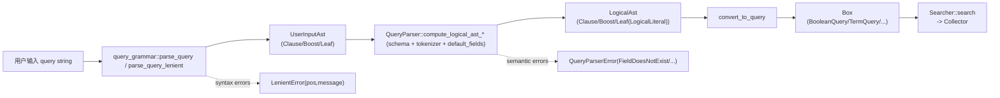

# P3-12 QueryParser 与 query-grammar：从字符串到 AST 再到 Query

<<<<<<< HEAD
> 本文主问题：用户输入字符串如何变成可执行 Query？语法层与执行层如何分离？

## 本文目标

- 读懂 QueryParser 的职责：解析、字段展开、默认字段、短语/范围等
- 读懂 `query-grammar` crate 的定位：把 AST/语法解析从主 crate 解耦
- 了解错误处理与用户体验取舍

## 源码入口（建议阅读顺序）

1. `src/query/query_parser/query_parser.rs`：QueryParser 入口
2. `query-grammar/src/user_input_ast.rs`：AST 定义
3. `query-grammar/src/query_grammar.rs`：语法解析
4. `src/query/query_parser/*`：AST → Query 的转换逻辑

## 可运行实验

```bash
cargo run --example basic_search
=======
> 版本基线：tantivy 0.26.0（本仓库，见 `Cargo.toml`）
>
> 本文主问题：用户输入字符串如何变成可执行 `Box<dyn Query>`？语法层（`query-grammar`）与执行层（`QueryParser`）如何分离？
>
> 本文产出：1 张“字符串 → AST → Query”的数据流图 + 1 个可运行的 playground 示例 + 10+ 条常见查询对照表

## 本文目标

- 搞清 QueryParser 的职责边界：**解析语法** vs **结合 schema/tokenizer 语义化** vs **产出可执行 Query**
- 读懂 `query-grammar` crate 的定位：只做“把字符串变成语法 AST”，不关心 schema/index
- 形成一套排错套路：为什么报 `SyntaxError` / `FieldDoesNotExist` / `FieldNotIndexed`，以及 strict/lenient 的取舍

## 读前准备

- Rust 基础（enum/trait/错误处理/Arc）
- 了解 Tantivy 的基本查询概念：TermQuery / PhraseQuery / BooleanQuery / RangeQuery
- 可选：读过 `ARCHITECTURE.md` 中 `query-grammar` 小节（解释了拆 crate 的动机）

## 关键概念（先给结论）

- **两层 AST（语法层 vs 逻辑层）**
  - 语法层：`query_grammar::UserInputAst`（只保存“用户写了什么”）
  - 逻辑层：`src/query/query_parser/logical_ast.rs::LogicalAst`（保存“要怎么查”，比如已经变成 `Term`、Phrase、Range……）
- **两段式构建**
  1. `query_grammar::parse_query(_lenient)`：字符串 → `UserInputAst`
  2. `QueryParser::{parse_query, build_query_from_user_input_ast}`：`UserInputAst` + schema/tokenizer → `Box<dyn Query>`
- **Occur 只定义一次**
  - `tantivy::query::Occur` 实际上 `pub use query_grammar::Occur;`（见 `src/query/mod.rs`）
  - 这让 grammar 的 `Occur` 能直接复用到执行层的 `BooleanQuery`
- **strict vs lenient**
  - strict：遇到错误就 `Err(...)`，适合“强校验”场景
  - lenient：尽量产出一个可执行 query，同时把错误收集出来（适合搜索框/交互式 UI）

## 源码入口（建议阅读顺序）

1. `query-grammar/src/lib.rs`：`parse_query` / `parse_query_lenient` 的对外 API
2. `query-grammar/src/user_input_ast.rs`：`UserInputAst` / `UserInputLeaf` / `UserInputLiteral` / `UserInputBound`
3. `query-grammar/src/query_grammar.rs`：核心语法（AND/OR、括号、field:、range、IN、regex、boost、宽松解析）
4. `src/query/query_parser/query_parser.rs`：`QueryParser`（把 `UserInputAst` 解释成 index-aware 的 query）
5. `src/query/query_parser/logical_ast.rs`：`LogicalAst` / `LogicalLiteral`（QueryParser 的中间表示）
6. `src/schema/schema.rs`：`Schema::find_field`（field + json path 拆分；“最长 field name 优先”）
7. `ARCHITECTURE.md`：`query-grammar` 小节（拆 crate 的动机：减轻编译器负担）

## 数据流/时序（建议画图）



下面我们按这条链路拆开讲：每一层到底“负责什么”，以及你在调试时应该看哪个中间产物。

## 1) 语法层：query-grammar 把字符串解析成 UserInputAst

### UserInputAst 长什么样？

`query-grammar/src/user_input_ast.rs::UserInputAst` 是一个很克制的语法树：

- `UserInputAst::Clause(Vec<(Option<Occur>, UserInputAst)>)`
  - `Option<Occur>` 的含义是：**这个子句是否显式写了 occur（+/-/AND/OR）**。如果是 `None`，后面会交给 `QueryParser` 用默认规则补上（OR 还是 AND）。
- `UserInputAst::Boost(Box<UserInputAst>, boost)`
  - 对应用户输入的 `^2.0`。
- `UserInputAst::Leaf(Box<UserInputLeaf>)`
  - 叶子节点（literal/range/set/regex/...）

`UserInputLeaf` 则覆盖了 QueryParser 支持（或未来可能支持）的 leaf 类型：

- `Literal(UserInputLiteral)`：普通 term 或引号短语
- `All`：裸 `*`
- `Range { field, lower, upper }`：`[a TO b]` / `>10` / `<=5` 等
- `Set { field, elements }`：`field: IN [a b cd]`
- `Regex { field, pattern }`：`field:/.*b/`
- `Exists { field }`：语法上支持 `field:*`，但 **QueryParser 目前不支持**（后面会解释）

### 严格解析 vs 宽松解析

对外 API 在 `query-grammar/src/lib.rs`：

- `parse_query(query: &str) -> Result<UserInputAst, Error>`
  - strict：失败只返回一个空壳 `Error`（没有 pos/message）
- `parse_query_lenient(query: &str) -> (UserInputAst, Vec<LenientError>)`
  - lenient：返回 AST + 可恢复错误（含 `pos` 与 `message`）
  - 典型错误：缺少词、缺少右括号、意外的 AND/OR 等

宽松解析的“技术实现”在 `query-grammar/src/infallible.rs`：它把 nom combinator 改造成**尽可能不失败**，用 `ErrorList` 累积错误并继续前进。

### 语法侧最重要的一个点：AND 优先级高于 OR

在 `query-grammar/src/query_grammar.rs`，`aggregate_infallible_expressions(...)` 会把 token 流聚合成 clause：

- `a AND b OR c` 会聚合为 `(a AND b) OR c`
- 你也可以用 `+/-` 这种 occur 语法表达同样的约束：`(+a +b) c`

QueryParser 只是“解释 occur + leaf”，**不会再重新定义 AND/OR 的优先级**。

## 2) 语义层：QueryParser 把 UserInputAst 解释成 LogicalAst

入口文件：`src/query/query_parser/query_parser.rs`

`QueryParser` 是“有 schema 背景”的解释器，它持有：

- `schema: Schema`
- `default_fields: Vec<Field>`：用户不写 `field:` 时，默认查询哪些字段
- `tokenizer_manager: TokenizerManager`：用字段配置的 tokenizer 把 phrase 切成 term
- 一些“策略开关/配置”：
  - `conjunction_by_default`：空格分隔的词，默认 OR 还是 AND（`set_conjunction_by_default`）
  - `boost: FxHashMap<Field, Score>`：字段级 boost（`set_field_boost`）
  - `fuzzy: FxHashMap<Field, Fuzzy>`：字段级 fuzzy（`set_field_fuzzy`）
  - `regexes_allowed`：是否允许 regex（`allow_regexes`）

### QueryParser 做的第一件事：先把字符串变成 UserInputAst

- strict：`QueryParser::parse_query` → `parse_query_to_logical_ast` → `query_grammar::parse_query`
  - grammar 抛错会被映射成 `QueryParserError::SyntaxError(query.to_string())`（注意：**没有 pos 信息**）
- lenient：`QueryParser::parse_query_lenient` → `parse_query_to_logical_ast_lenient` → `query_grammar::parse_query_lenient`
  - 会把 grammar 的 `LenientError` 转成 `QueryParserError::SyntaxError("{message} at position {pos}")`

如果你要做“搜索框提示用户第 N 个字符附近有问题”，应该优先用 lenient 分支。

### 从 UserInputAst 到 LogicalAst：核心是 compute_* 系列

核心函数链路：

1. `compute_logical_ast_lenient(user_input_ast)`
2. `compute_logical_ast_with_occur_lenient(user_input_ast)`
3. `compute_logical_ast_from_leaf_lenient(UserInputLeaf)`
4. `compute_logical_ast_for_leaf(field, json_path, phrase, slop, prefix)`

这个过程会把“字符串字段名/字符串字面量”变成 Tantivy 能跑的“Term/Range/Phrase/Regex”。

### 字段解析：split_full_path + Schema::find_field

一个用户字面量可能长这样：`identity.username:fulmicoton`。

QueryParser 会调用 `QueryParser::split_full_path`（内部就是 `Schema::find_field`）：

- 如果 schema 里存在完整字段名 `identity.username`，直接命中
- 否则会在未转义的 `.` 上切分，优先匹配**最长**的字段名，剩下的部分当做 JSON path

对应代码：

- `src/schema/schema.rs::Schema::find_field`
- `src/schema/schema.rs::locate_splitting_dots`（注意：`\.` 会阻止切分）

这条规则能解释很多“为什么我写了 `a.b:c` 却查到的是字段 `a` 的 json path `b`”的问题。

### 默认字段展开：compute_path_triplets_for_literal

`UserInputLiteral` 的 `field_name` 是可选的：

- 如果用户没写 field：`field_name = None`
  - `compute_path_triplets_for_literal` 会把这个 literal 展开到 `default_fields`
  - 举例：默认字段是 `title` 和 `body`，`hello` 会被解释成：
    - `(title:hello OR body:hello)`（更准确地说：两个子 query 的 Should clause）
- 如果用户写了 field：
  - 先走 `split_full_path` → (Field, json_path)
  - **如果 split_full_path 失败**，还有一个“默认 JSON 字段兜底”的分支：把 `full_path` 当成 json_path 去查询默认 JSON 字段（这是 Quickwit 场景的兼容逻辑）

### 叶子节点解释：Literal/Range/Set/Regex/All

`compute_logical_ast_from_leaf_lenient` 负责把 `UserInputLeaf` 变成 `LogicalAst`（或报错）：

- `Literal`：
  - 用 `compute_logical_ast_for_leaf` 生成 `LogicalLiteral`
  - 对 text 字段会用 tokenizer 产生 1 个 term（TermQuery）或多个 term（PhraseQuery）
  - 把字段级 boost 叠加进 `LogicalAst::boost(...)`
- `Range`：
  - 必须指定 field（`[A TO B]` 会报 `UnsupportedQuery`）
  - `resolve_bound` 会把 `*` 识别为 `Unbounded`
  - 对数值/日期等字段会解析成对应类型的 `Term`
  - 对 fast field（例如 `FAST` 的 u64）也支持（见 `compute_boundary_term` 里对 fast-field range 的判断）
- `Set (IN [...])`：
  - 必须指定 field
  - 每个 element 走 `compute_boundary_term`
  - 最终会落到 `TermSetQuery`
  - 注意：`TermSetQuery` 执行时要求 field indexed；如果你对一个“只有 FAST、未 indexed”的字段做 IN，可能会在执行阶段报 schema error
- `Regex`：
  - 默认不允许，必须先 `QueryParser::allow_regexes()`
  - 必须指定 field，且只能用于 text 字段，且不能带 json path
  - 最终落到 `RegexQuery`
- `All`：裸 `*` → `AllQuery`
- `Exists { field }`：语法层支持，但 QueryParser 目前直接 `UnsupportedQuery`（如果你需要 exists 语义，请看 `src/query/exist_query.rs::ExistsQuery`）

### 一个很“产品化”的判断：禁止纯负查询（all-negative）

QueryParser 有一个显式的策略：

- `-title:pop` 这种“只有排除条件”的查询，strict 模式会报 `AllButQueryForbidden`
- lenient 模式会：
  - 记录错误
  - 但同时合成一个“非纯负”的 AST：给 clause 补一个 `All`（见 `make_non_negative`）
  - 这样执行层得到的语义接近“查所有文档，再排除 pop”

这体现了 QueryParser 的定位：它不仅是 parser，也带了一些“面向最终用户的 UX 取舍”。

## 3) 从 LogicalAst 到可执行 Query：convert_to_query

`src/query/query_parser/query_parser.rs::convert_to_query` 的逻辑很直：

- `LogicalAst::Clause` → `BooleanQuery::new(Vec<(Occur, Box<dyn Query>)>)`
- `LogicalAst::Leaf(LogicalLiteral::Term)` → `TermQuery` 或字段级 `FuzzyTermQuery`
- `LogicalLiteral::Phrase` → `PhraseQuery`（或 `PhrasePrefixQuery`）
- `LogicalLiteral::Range` → `RangeQuery`
- `LogicalLiteral::Set` → `TermSetQuery`
- `LogicalLiteral::Regex` → `RegexQuery`
- `LogicalAst::Boost` → `BoostQuery`
- 空 AST（trim 后为 None）→ `EmptyQuery`

“为什么要先有 LogicalAst，再转 Query？”

- 一方面是为了把“schema/tokenizer 语义化”集中在 QueryParser 的 leaf 解释阶段
- 另一方面，lenient 模式需要能把解析失败的子树变成“空子句”，然后靠 `trim_ast` 把它们剪掉，不影响其它可执行部分

## 常见查询速查表（10+）

下面假设一个典型配置：

- `default_fields = [title, body]`
- 没有调用 `set_conjunction_by_default()`（也就是 **空格默认 OR**）
- 没有设置 fuzzy / field boost（除非示例里写出来）

| 输入字符串 | 语法层（UserInputAst 直觉） | 执行层（简化后的 Query 结构） |
|---|---|---|
| `hello` | literal，无 field | `(title:hello OR body:hello)` |
| `hello world` | clause：两段 literal，occur 都是 None | `((title:hello OR body:hello) OR (title:world OR body:world))`（若默认 AND 则为 AND） |
| `title:hello world` | 第一段有 field，第二段无 field | `(title:hello) OR (title:world OR body:world)`（注意：field 只作用于紧跟其后的一个 leaf） |
| `title:(hello world)` | term group：给组内 leaf 设置默认 field=title | `(title:hello OR title:world)`（若默认 AND 则为 AND） |
| `a AND b OR c` | `AND` 优先级高 | `((a AND b) OR c)`（且每个词都会按 default_fields 展开） |
| `+title:rust -body:java` | occur must/must_not | `(+title:rust -body:java)`（BooleanQuery 的两个子句） |
| `title:"sea wolf"` | literal 的 delimiter=quotes | `PhraseQuery(title, ["sea","wolf"])`（需要 positions） |
| `"a b"~2` | literal + slop | `PhraseQuery(title, ["a","b"], slop=2) OR PhraseQuery(body, ...)` |
| `"big bad wo"*` | literal + prefix=true | `PhrasePrefixQuery(title, phrase_terms=["big","bad"], prefix="wo") OR ...` |
| `signed:{-5 TO 3}` | range leaf | `RangeQuery(signed, (-5, 3) exclusive)` |
| `date:[2002-10-02T15:00:00Z TO *}` | range leaf（上界 unbounded） | `RangeQuery(date, [.., unbounded))`（日期按 RFC3339 解析） |
| `title: IN [a b cd]` | set leaf | `TermSetQuery(title, {"a","b","cd"})` |
| `title:/.*b/` | regex leaf | `RegexQuery(title, /.*b/)`（需 allow_regexes） |
| `text:hello^2.0` | boost ast | `BoostQuery(TermQuery(text:hello), 2.0)`（字段级 boost 会与 ^boost 相乘） |

## 可运行实验：观察“AST → Query”的真实输出

### 实验目标

- 观察同一条输入在三层的形态：
  - `UserInputAst`（语法层）
  - `QueryParser::parse_query(_lenient)` 的错误策略
  - 最终 `Box<dyn Query>` 的 Debug 结构

### 操作步骤

```bash
cargo run --example p3_12_query_parser_playground
>>>>>>> 68c15cbb (Codex changes)
```

### 验证点

<<<<<<< HEAD
- 你能举例解释：`(a AND b) OR "c d"` 这类输入如何落到 Query 组合
- 你能解释：为什么把 grammar 拆成 workspace 子 crate（编译速度/隔离）

## TODO

- [ ] 给出 10 条“常见用户查询字符串”→“对应 Query 结构”的对照
- [ ] FAQ：QueryParser 的错误为什么可能不适合直接展示给用户？
=======
- 你能在输出中对应起来：
  - `"big bad wo"*` 为什么变成 `PhrasePrefixQuery`
  - `-title:sea` strict 为什么报错、lenient 为什么还能跑
  - `user:alice` 在 default_fields 含 JSON 字段时，为什么会变成“查 JSON path”

## 常见坑 & FAQ（≤ 5）

1. Q: 为什么 `QueryParser::parse_query("title:")` 的报错不指出位置？  
   A: strict 分支走的是 `query_grammar::parse_query`，它的错误类型没有 pos/message；需要位置请用 `parse_query_lenient`（或直接用 `query_grammar::parse_query_lenient`）。

2. Q: 为什么 `title:hello world` 里 `world` 没有跟着变成 `title:world`？  
   A: 语法上 `field:` 只作用于**紧随其后的一个 leaf**。要让一组都用 title，请写 `title:(hello world)`。

3. Q: 为什么 `"wo"*` 会报 `PhrasePrefixRequiresAtLeastTwoTerms`？  
   A: phrase prefix 语义是“前面的词是短语，最后一个词做前缀扩展”。只有一个 term 时不成立（见 `generate_literals_for_str` 的检查）。

4. Q: 为什么我写了 `a.b:c`，结果查到的是字段 `a` 的 json path `b`？  
   A: `Schema::find_field` 会在 `.` 上切分并优先匹配最长 field name；如果你真的有字段名包含点，需要把点写成 `\.`（并且 schema 里字段名也要包含这个反斜杠），否则会被当做 json path。

5. Q: QueryParser 的错误可以直接展示给用户吗？  
   A: 不建议“原样展示”。有些错误包含内部字段名/tokenizer 名，或缺少位置；更好的做法是：lenient 模式拿到 `pos` 后做 UI 高亮，并把错误映射成更可读的提示（例如“字段不存在/字段不可检索/短语查询需要 positions”）。

## 延伸阅读（可选）

- `ARCHITECTURE.md`：`query-grammar` 小节
- `query-grammar/src/query_grammar.rs`：语法细节（range/IN/regex/boost/宽松解析）
- `src/query/query_parser/query_parser.rs`：QueryParser 的“语义化”规则全集
- `src/query/exist_query.rs`：如果你需要 `field:*` 语义，参考 `ExistsQuery`

## TODO

- [x] 补 1 张图（字符串 → AST → Query 数据流）
- [x] 补 1 个最小可复现实验（playground 示例）
- [x] 给出 10+ 条常见查询字符串 → Query 结构对照
- [x] 写 3~5 条 FAQ
>>>>>>> 68c15cbb (Codex changes)

