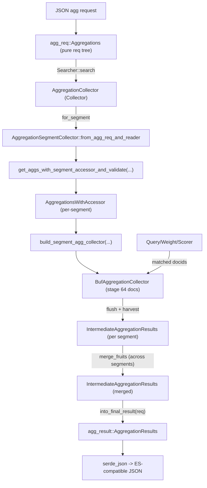

# P4-13 Aggregation：类 Elasticsearch 的聚合执行与合并

> 版本基线：tantivy 0.24.0（本仓库）
>
> 本文主问题：聚合请求如何被解析、在每个 segment 收集、最后合并成结果？
>
> 本文产出：执行流程图 1 张 + 可运行实验 1 个 + 关键源码入口清单

## 本文目标

- 读懂聚合请求树（`agg_req::Aggregations` / `agg_req::Aggregation`）如何表达 bucket/metric 以及嵌套 aggs
- 读懂“把请求绑定到 segment 快速列”（`agg_req_with_accessor`）这一层为什么必须分 segment 构建
- 读懂 segment 内收集 → 中间结果 → 跨 segment 合并 → 最终结果 的全链路

## 读前准备

- 读过 P3-11 Collector（理解 `Collector`/`SegmentCollector` 的分段收集与 merge）
- 知道 fast field 的定位：列式 doc values，按 docid 随机访问/批量访问
- 了解一个基本事实：聚合不需要评分（`requires_scoring=false`）

## 关键概念（先给结论）

- **Aggregation 也是一种 Collector**：`AggregationCollector` 实现 `Collector`，Query 负责把匹配 docid 推给它。
- **Bucket vs Metric**：
  - bucket 负责“分桶”，并且**可以挂子聚合**（`aggs`）。
  - metric 负责“算指标”（avg/min/max/stats/…），通常不需要子聚合。
- **req → with_accessor**：用户请求 `Aggregations` 是“纯描述”；真正执行需要把每个 field 绑定到当前 segment 的 fast field `Column`（因为每个 segment 的 column 独立）。
- **SegmentResult / IntermediateResult / FinalResult**：
  - segment 内的数据结构追求收集性能（hashmap buckets、block accessor 等）。
  - `IntermediateAggregationResults` 追求可合并（`merge_fruits`）。
  - `AggregationResults` 是最终对外的 JSON（计算 avg 等 finalize，排序/裁剪 buckets）。
- **资源上限**：`AggregationLimitsGuard` 用共享计数器控制内存、bucket 数，避免聚合把进程拖死。

## 源码入口（建议阅读顺序）

1. `examples/aggregation.rs`：两个典型请求（range+avg、terms+min），刻意制造 2 个 segment
2. `src/aggregation/mod.rs` / `src/aggregation/README.md`：模块分层（req/with_accessor/segment/intermediate/final）
3. `src/aggregation/agg_req.rs`：请求树 `Aggregations`、`Aggregation`、`AggregationVariants`
4. `src/aggregation/agg_req_with_accessor.rs`：`AggregationWithAccessor` 如何从 `SegmentReader` 打开 fast field 列
5. `src/aggregation/collector.rs`：`AggregationCollector` / `AggregationSegmentCollector` / `merge_fruits`
6. `src/aggregation/segment_agg_result.rs`：segment 级执行树 `SegmentAggregationCollector` trait 与 `build_segment_agg_collector`
7. `src/aggregation/buf_collector.rs`：64-doc block 缓冲，走 `collect_block`
8. `src/aggregation/intermediate_agg_result.rs`：中间结果树 + `merge_fruits` + `into_final_result`
9. `src/aggregation/agg_result.rs`：最终结果 JSON 结构

## 数据流/时序（流程图）



## 从用法到执行：按调用链走一遍

### 1）用法入口：`examples/aggregation.rs`

这个例子做了三件很“教学友好”的事：

- Schema 中把 `category/stock/price` 都设为 fast field（聚合必须）
- `index_writer.commit()` 两次，确保有 **2 个 segment**（可以触发 merge 路径）
- 每个请求都写了 `expected_res` 并 `assert_eq!`（跑通就是验证）

建议先盯住两段 request（都来自 Elasticsearch 风格 JSON）：

- `range(stock) -> sub agg avg(price)`：典型 bucket + metric 嵌套
- `terms(category) order by sub agg min_price desc`：典型“bucket 排序依赖 metric 子聚合”

### 2）请求结构：`agg_req::Aggregations` 如何表达 ES JSON

最外层是 `type Aggregations = HashMap<String, Aggregation>`：key 是用户自定义的名字（比如
`group_by_stock`）。

`Aggregation` 本体包含两块：

- `agg: AggregationVariants`：真正的聚合类型（range/terms/avg/…）
- `sub_aggregation: Aggregations`：bucket 才真正会使用（metric 通常为空）

实现上为了给错误提示更友好，`Aggregation` 用一个中间结构体把 `aggs` 拆出来再解析 flatten enum
（见 `agg_req::AggregationForDeserialization` 与 `TryFrom` 实现）。

一句话记忆：**请求树是一棵“每个节点都有名字”的聚合树，bucket 节点还能挂子树。**

### 3）为什么必须有 with_accessor：聚合需要 per-segment 的 fast field `Column`

请求树里只有 field 名（字符串），但真正收集时需要的是“当前 segment 的列对象”，包括：

- 当前 segment 的 `Column<u64>`（列式 doc values 的底层访问入口）
- 该列的 `ColumnType`（u64/i64/f64/str/datetime/…）
- 执行辅助信息：`ColumnBlockAccessor<u64>`、missing 值、string dictionary 等

这些都集中在 `agg_req_with_accessor::AggregationWithAccessor` 里：

- `accessor: Column<u64>` + `field_type: ColumnType`
- `sub_aggregation: AggregationsWithAccessor`（递归）
- `limits: AggregationLimitsGuard`（共享内存/桶上限）
- `column_block_accessor: ColumnBlockAccessor<u64>`（批量取值的关键）

入口函数是 `get_aggs_with_segment_accessor_and_validate(...)`：它会从
`SegmentReader.fast_fields()` 打开列，并做字段存在性/类型校验与一些特殊 case 处理（例如
terms + missing + 多列）。

一句话：**同一个 index 的不同 segment 拥有不同的 fast field 列对象，所以必须分 segment 绑定
accessor。**

### 4）segment 内收集：`AggregationSegmentCollector` + `SegmentAggregationCollector`

`AggregationCollector` 实现 `Collector`，核心点：

- `requires_scoring() -> false`：聚合不需要 score（能省 CPU）
- `for_segment(...)`：为每个 segment 创建一个 `AggregationSegmentCollector`
- `merge_fruits(...)`：把各 segment 的结果合并

每个 segment 的执行树由 `segment_agg_result::build_segment_agg_collector(...)` 生成，返回
`Box<dyn SegmentAggregationCollector>`（注意：这是 aggregation 模块内部的一套 trait，不是
tantivy 的 `SegmentCollector`）。

这个 trait 提供三件事：

- `collect/collect_block`：接收 docid（单个或块）
- `flush`：收尾（处理 staged docs/子收集器缓存）
- `add_intermediate_aggregation_result`：把内部状态转成可合并的中间结果树

为了提升吞吐，外层还有一层 `BufAggregationCollector`：把 docid 缓冲到 64 个一组再调用
`collect_block`（见 `src/aggregation/buf_collector.rs`）。

### 5）中间结果与最终结果：`merge_fruits` 与 finalize

每个 segment harvest 出的是 `IntermediateAggregationResults`。它的设计点是：

- **可 merge**：`merge_fruits` 按树形递归合并（bucket 合并 map；metric 合并累加器）
- **不可直接 JSON**：中间状态可能是 `sum+count`、percentiles sketch 等，不是最终值

最终对外的 `AggregationResults` 在 `IntermediateAggregationResults::into_final_result(...)` 里生成：

- 用原始 request 决定怎么 finalize（avg = sum/count，stats 展开字段等）
- bucket 结果会在这里排序、裁剪（terms 的 `size`、histogram 的 `keyed` 等）
- 并在最后检查 `bucket_limit`（`AggregationLimitsGuard`）

### 6）Terms 聚合的“近似”与误差字段（很重要）

如果你做 `terms`，需要特别理解两个字段：

- `sum_other_doc_count`：没进 TOP N 的 doc 总数
- `doc_count_error_upper_bound`：doc_count 的理论最大误差上界（可选）

原因在 `bucket/term_agg.rs`：每个 segment 会先做一次 cut-off（`segment_size`），跨 segment 合并时
就可能丢掉一些低频 term 的精确计数；因此 terms 聚合（尤其多 segment）可能是近似的，子聚合也会被
连带影响。

这也是为什么 request 里有 `segment_size`（别名 `shard_size`）：你可以用更大的 `segment_size`
换更准的 terms 结果（但更吃内存/CPU）。

## 可运行实验

> 说明：本仓库首次编译需要能拉取 crates.io 依赖；如果你在离线环境，请先在联网环境完成一次构建/缓存依赖。

### 实验目标

- 跑通 `AggregationCollector` 的完整链路（收集 + 合并 + JSON 兼容）
- 通过“人为增加 segment 数量”验证：合并逻辑能保证最终结果不依赖 segment 划分

### 操作步骤

```bash
# 1) 跑官方 example（包含两段 request，并用 assert 验证结果）
cargo run --example aggregation
```

可选：为了更直观看到结果，把 `examples/aggregation.rs` 里两处 `assert_eq!(expected_json, res);`
前面加一行打印（临时改动即可）：

```rust
println!("{}", serde_json::to_string_pretty(&res).unwrap());
```

### 进一步验证（多 segment 合并）

把 `examples/aggregation.rs` 里“写到第 5 条后 commit”这段逻辑改成“每写 1 条就 commit”，制造更多
segment 后再运行：

- 程序仍然应当正常退出（assert 通过）
- 说明：最终 `AggregationResults` 不依赖 segment 数量（merge 语义正确）

### 验证点

- 程序退出码为 0（断言通过），表示：
  - 聚合请求 JSON 解析成功（`agg_req`）
  - per-segment accessor 绑定成功（`agg_req_with_accessor`）
  - segment 收集、flush、产出中间结果成功（`segment_agg_result` / `buf_collector`）
  - 多 segment 合并 + finalize 成功（`intermediate_agg_result` → `agg_result`）
- 你能解释：为什么聚合天然依赖 fast field（以及为何 store 不适合）
- 你能描述：segment 结果合并时需要处理哪些问题（bucket 合并、metric 合并、terms 误差字段）

## 常见坑 & FAQ（≤ 5）

1. Q: 为什么我的字段做不了聚合？A: 绝大多数情况是没有设置 fast field（Schema 里要 `FAST` 或
   `set_fast`）。聚合代码从 `SegmentReader.fast_fields()` 取列。
2. Q: terms 聚合在多 segment 下 doc_count 为什么可能不准？A: 每个 segment 先 cut-off 到
   `segment_size`，合并时会带来近似与误差上界（见 `bucket/term_agg.rs` 的说明）。
3. Q: 为什么 terms(text) 需要 raw tokenizer？A: terms 需要把“字段值”当作一个整体的 term（而不是
   被分词后的多个 token）；`examples/aggregation.rs` 里对 `category` 的配置给了一个可工作的范例。
4. Q: 聚合会用到 score 吗？A: 默认不会，`AggregationCollector.requires_scoring() == false`。
5. Q: 如何做分布式聚合（多 index/shard）？A: 用 `DistributedAggregationCollector` 先拿
   `IntermediateAggregationResults`，跨节点 merge 后再 `into_final_result()` 得到最终
   `AggregationResults`。

## 延伸阅读（可选）

- `doc/column/第3部分-搜索执行/11-Collector设计.md`：先把 Collector 的分段模型吃透
- `src/aggregation/agg_limits.rs`：`AggregationLimitsGuard`（内存/桶上限的共享计数器）
- `src/aggregation/agg_tests.rs`：大量 request/edge case 的回归测试
- `src/aggregation/bucket/term_agg.rs`：terms 的 cut-off/误差字段/按子聚合排序
- `src/aggregation/metric/`：avg/stats/percentiles/top_hits 等 metric 的中间态与 finalize

## TODO

- [x] 补 1 张“req → with_accessor → segment_collect → merge → result”的流程图
- [x] 补 1 个最小可复现实验（aggregation example）
- [x] 把关键入口与符号名补全（便于全局搜索）
- [x] 写 3~5 条 FAQ
