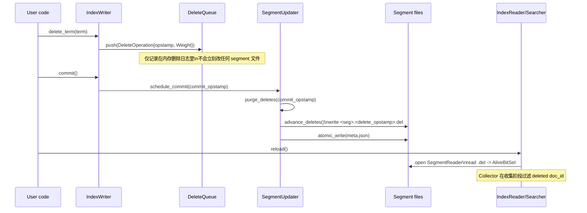

# P4-14 Deletes & Alive Bitset：删的是 term，看的是真相

> 版本基线：tantivy 0.24.0（本仓库）
>
> 本文主问题：Tantivy 的删除为什么是“delete term / delete query”？alive bitset 如何让删除在搜索时可见？
>
> 本文产出：删除可见性时序图 1 张 + 可运行实验 1 个 + 关键源码入口清单

## 本文目标

- 解释清楚：为什么 Tantivy 的删除不是“删 doc”，而是“删 term/删 query”
- 读懂删除的落盘与可见性边界：DeleteQueue → commit → `.del` + `meta.json`
- 读懂 AliveBitSet 的格式与使用位置：SegmentReader 打开、Collector 过滤、merge 回收 tombstone

## 读前准备

- 了解分段模型与快照一致性（可先读 `doc/column/第3部分-搜索执行/09-Searcher快照一致性.md`）
- 知道 `Term` 的含义（`field + value`）以及 `TermQuery` 的基本行为
- 能接受一个事实：doc_id 是 **segment 内部编号**，并不稳定（merge 后会变）

## 关键概念（先给结论）

- **删除是逻辑删除，不改倒排**：删除不会立刻“物理移除”文档；倒排/postings 里仍可能出现这些 doc_id，只是搜索收集阶段会被过滤掉
- **delete_term 本质是 delete(query)**：`IndexWriter::delete_term` 只是把 `Term` 包成 `TermQuery`，内部走 `delete_query`，最终记录的是 `DeleteOperation { opstamp, target: Weight }`
- **Opstamp 决定“先后次序”**：Tantivy 用全局单调递增的 `opstamp` 给 add/delete 排序，保证同一 commit 内“先 delete 再 add”不会误删新文档（靠 `DocToOpstampMapping` 做校验）
- **DeleteQueue 是删除日志**：删除操作会先进入 `DeleteQueue`；每个 segment 对应一个 `DeleteCursor`，记录“我已经吃到哪条 delete 了”
- **AliveBitSet 是删除的真相载体**：每个 segment 有一个 `.del` 文件存活集合（alive doc_id set），文件名里包含 `delete_opstamp`（`<segment_uuid>.<delete_opstamp>.del`）；`meta.json` 里也会记录这个 `delete_opstamp`

## 源码入口（建议阅读顺序）

1. `ARCHITECTURE.md`：Deletes 小节（先建立全局心智模型）
2. `src/indexer/index_writer.rs`：`IndexWriter::delete_term` / `delete_query`（删除操作如何被记录）
3. `src/indexer/delete_queue.rs`：`DeleteQueue` / `DeleteCursor`（删除日志与游标如何工作）
4. `src/indexer/index_writer.rs`：`compute_deleted_bitset` / `apply_deletes`（删除如何作用到 doc_id）
5. `src/indexer/segment_updater.rs`：`SegmentUpdater::schedule_commit` / `purge_deletes`（为什么 commit 才可见）
6. `src/indexer/index_writer.rs`：`advance_deletes`（何时写 `.del` 文件）
7. `src/index/segment_component.rs` + `src/index/index_meta.rs`：`SegmentComponent::Delete` / `SegmentMeta::relative_path`（`.del` 文件命名与 `delete_opstamp`）
8. `src/fastfield/alive_bitset.rs` + `common/src/bitset.rs`：`AliveBitSet` / `BitSet::serialize`（alive bitset 的存储格式）
9. `src/index/segment_reader.rs`：`SegmentReader::open_with_custom_alive_set` / `alive_bitset`（打开 segment 时如何加载删除信息）
10. `src/collector/mod.rs`：`Collector::collect_segment`（搜索阶段如何过滤 deleted docs）
11. `examples/deleting_updating_documents.rs`：用户视角的 delete + insert（update）示例

## 数据流/时序（删除何时“可见”？）



把这张图和代码对上，你会得到两个“边界”：

- **删除写入边界 = commit**：`schedule_commit` 里会统一 `purge_deletes`，必要时写新的 `.del` 文件，并原子更新 `meta.json`
- **删除可见边界 = reader reload（或 reload policy 自动触发）**：Searcher 是快照；旧 searcher 继续用旧的 `meta.json` + 旧 `.del` 文件，新 searcher 才会看到最新删除

## 1. 从 delete_term 看“删的是 term / query”

删除 API 很“像数据库”，但实现思路完全是搜索引擎式的：

- `IndexWriter::delete_term(term)` 并不认识“主键”，也不认识“唯一性”
- 它只是构造 `TermQuery`，并调用 `IndexWriter::delete_query(Box<dyn Query>)`
- `delete_query` 会先把 Query 编译成 `Weight`，然后生成一个 `DeleteOperation { opstamp, target: Weight }`，推入 `DeleteQueue`

为什么要这样设计？关键原因是 **doc_id 不稳定**：

- doc_id 是 segment 内部编号（0..max_doc），merge 后会重新编号
- 因此你没法在一个长期运行的系统里保存“全局 doc_id”并用它删除
- `Term`（或更一般的 Query）在语义上更稳定：它描述的是“内容/条件”，而不是“某次 merge 之后的内部编号”

## 2. DeleteQueue：删除日志 + 多游标消费

`DeleteQueue` 的使用方式非常像“追加日志”：

- `IndexWriter` 是单生产者：不断 `push(DeleteOperation)`
- 每个 segment（以及 commit/merge）都有自己的 `DeleteCursor`（多消费者）
- cursor 通过 `skip_to(opstamp)` 可以跳过“发生在我诞生之前”的删除（这些删除不应影响后来才 add 的文档）

这也是你在 `index_writer.rs` 里看到的关键一行：

- worker 线程在开始处理一批 add 之前，会 `delete_cursor.skip_to(batch[0].opstamp)`
- 直觉：如果某条 delete 的 opstamp < 当前 add 的 opstamp，那么这条 delete “发生得更早”，不应删掉“未来才写入”的文档

## 3. AliveBitSet：删除怎么落到每个 segment 上？

删除真正落到 segment 上，发生在 `advance_deletes`：

- 先打开 `SegmentReader`
- 针对 delete_cursor 中（opstamp ≤ target_opstamp）的 delete operation
- 用 delete 的 `Weight` 在这个 segment 上枚举匹配 doc_id（`for_each_no_score`）
- 对每个 doc_id 再做一次“时序校验”：
  - 已提交 segment 用 `DocToOpstampMapping::None`（默认都可删）
  - 正在构建的新 segment 用 `DocToOpstampMapping::WithMap(doc_opstamps)`，保证只删掉“先 add 后 delete”这类文档
- 最后把 doc_id 从 bitset 里移除（bitset 存的是 alive 集合）

当（新增）删除确实发生时：

- 更新 `SegmentMeta` 的 delete 信息（`SegmentMeta::with_delete_meta(num_deleted_docs, opstamp)`）
- 写出新的 `.del` 文件：`write_alive_bitset(&alive_bitset, writer)`
- `.del` 文件名会包含 `delete_opstamp`（见 `SegmentMeta::relative_path(SegmentComponent::Delete)`）

## 4. `.del` 文件到底长什么样？

AliveBitSet 的序列化非常“朴素”：它就是一个固定大小的 bitset。

- 写入入口：`src/fastfield/alive_bitset.rs` 的 `write_alive_bitset`
- 实际格式：`common/src/bitset.rs` 的 `BitSet::serialize`
  - 4 字节 little-endian：`max_value`（基本等于 `max_doc`）
  - 后面是若干个 `u64`（每 64 个 doc_id 一组）
- 粗略空间：约 `max_doc / 8` 字节（每 doc 1 bit），再加 4 字节 header

这也解释了它为什么叫 AliveBitSet 而不是 DeletedBitSet：文件里存的是“活着的 doc_id”。

## 可运行实验

```bash
cargo test -p tantivy test_ordered_batched_operations
```

### 实验目标

- 跑通一个“先 delete 再 add”与“先 add 再 delete”的混合批次
- 理解 `opstamp` + `DocToOpstampMapping` 如何避免误删

### 验证点

- 测试应通过：最终 `TermQuery("a")` 命中 1 个文档，而 `TermQuery("b")` 命中 0 个文档
- 你能解释：为什么同一批操作里 `Delete(a)` 不会删掉后面新加的 `Add("a")`（doc_opstamp < delete_opstamp 的校验）
- 你能解释：为什么 `Add("b")` 会被后面的 `Delete(b)` 删掉（先 add 后 delete）

> 想用“用户视角”再感受一次 update 语义，可以顺手跑：
>
> `cargo run --example deleting_updating_documents`

## 常见坑 & FAQ（≤ 5）

1. Q: 为什么不提供 `delete_doc_id`？  
   A: doc_id 是 segment 内部编号，merge 后会变化；用它做长期引用会失效。Tantivy 选择用 `Term/Query` 表达“要删谁”。
2. Q: 为什么 delete 需要等 `commit()` 才对搜索可见？  
   A: delete 先写入 `DeleteQueue`（内存日志）。只有 commit 才会 `purge_deletes`、写 `.del`、原子更新 `meta.json`，形成一个新的可被 Searcher 打开的快照。
3. Q: 为什么 commit 之后我还是搜到旧数据？  
   A: `IndexReader` 默认可能是手动 reload（或你的 reload policy 不是 on_commit）。Searcher 是快照；记得 `reader.reload()` 或配置自动 reload。
4. Q: `delete_term` 会删几个文档？  
   A: 会删掉**所有**包含该 term 的文档。Tantivy 不保证 term 唯一性；如果你想“主键更新”，需要自己保证该字段的唯一约束。
5. Q: 大量 delete 会怎样影响查询性能？  
   A: 倒排仍包含被删 doc_id，查询阶段会“扫到但被过滤”，因此 CPU 与 cache 命中会变差；空间也不会立刻回收。要真正回收 tombstone，需要依赖 merge（下一篇会讲）。

## 延伸阅读（可选）

- `ARCHITECTURE.md`：Deletes / Merges 小节（把删除与 merge 放在一起看）
- `doc/column/第3部分-搜索执行/09-Searcher快照一致性.md`：为什么旧 searcher 看不到新 commit
- `examples/deleting_updating_documents.rs`：update = delete + insert 的最小示例
- `src/indexer/merger.rs`：merge 时如何跳过 deleted docs（理解 tombstone 回收）

## TODO

- [x] 画一张 delete 操作从记录到可见性的时序图
- [x] 做 1 个可运行实验（建议从单元测试入手）
- [x] 补全关键源码入口与符号名（便于全局搜索）
- [x] 写 3~5 条 FAQ
- [ ] 可选：写一个 `create_in_dir` 的 demo，直观看到 `.del` 文件名随 opstamp 变化
