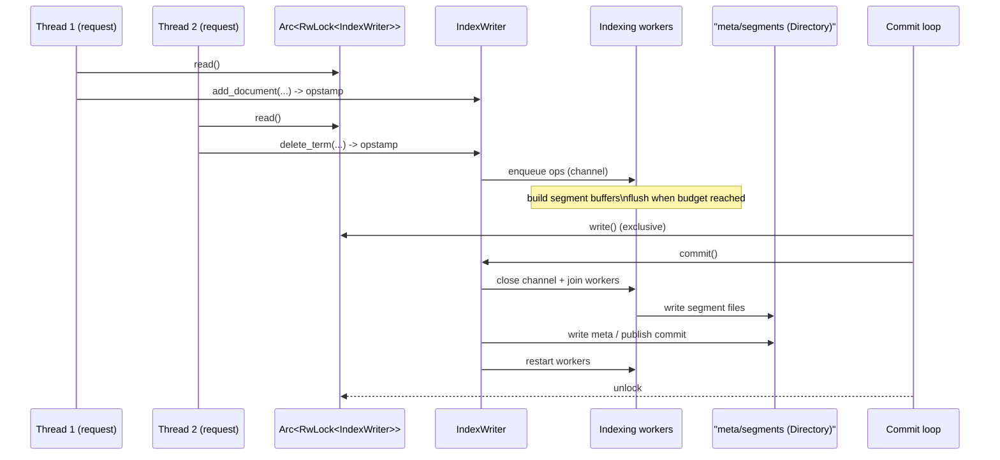

# P4-16 收官专题（四选一）：JSON / 索引排序 / Warmer / 多线程写入

> 本文主问题：选择一个你最关心的真实场景，把前 15 篇的知识串成一个可跑的小项目。

## 选题建议（四选一）

1. **JSON Field**：从 schema 到查询语法，再到性能注意事项（参考 `examples/index_with_json.rs`、`examples/json_field.rs`）
2. **Index Sorting**：解释为什么排序能带来查询收益，以及实现入口（若仓库相关文档/代码可对上）
3. **Warmer**：构建一个“预热缓存/特征”的例子（参考 `examples/warmer.rs`）
4. **多线程写入**：把 segment 生成、commit、merge 的关系串起来（参考 `examples/index_from_multiple_threads.rs`）

## 文章结构建议

- 场景描述（1 段）
- 设计目标（吞吐/延迟/一致性/资源）
- 关键源码入口（按调用链）
- 可运行实验（包含数据准备 + 指标观察）
- 复盘：哪些知识点来自前文（引用对应篇章）

## TODO

- [ ] 确定选题（四选一）
- [ ] 做一个可跑 demo（最小闭环）
- [ ] 补性能/可观测性指标（哪怕只是粗略 timing）
- [ ] 形成“可迁移到业务”的 checklist
# P4-16 收官专题：多线程写入的最小工程化闭环（并发 add/delete + 串行 commit/merge）

> 版本基线：tantivy 0.26.0（本仓库，见 `Cargo.toml`）
>
> 本文主问题：在 Web/流式写入这种“多线程到处来请求”的场景里，如何正确共享 `IndexWriter`，让并发写入与 `commit/merge` 协作，同时把“何时可见”这条边界控制清楚？
>
> 本文产出：并发写入时序图 1 张 + 可运行实验 1 个 + 关键源码入口清单 + 可迁移到业务的 checklist

## 场景描述（1 段）

假设你在做一个内部检索服务：上游不断产生事件（日志/埋点/商品变更），下游需要“写得动、查得快、结果一致”。写入端天然是多线程的（HTTP handler、消息消费线程、批处理线程），但 Tantivy 对同一份 index **只能打开一个 `IndexWriter`**。这篇收官专题就把“多线程写入”这件事讲成一套最小工程化方案：并发 add/delete 怎么做、`commit` 为什么必须串行、merge 什么时候发生、以及你在业务里应该监控哪些指标。

## 本文目标

- 用一句话记住官方推荐姿势：`Arc<RwLock<IndexWriter>>`，并理解“为什么读锁就够用”
- 搞清楚 `Opstamp` 是什么、为什么它能帮你把“写入队列”与“commit 可见性”对齐
- 明确 `commit()` 的职责边界：它是写入侧的“同步屏障”，会阻塞并发写入
- 给出一份可落地 checklist：线程数/内存预算/commit 策略/merge 压力/可观测性

## 读前准备

- Rust 并发基础：`Arc` / `RwLock` / 线程与同步
- 已经跑通过 `examples/basic_search.rs`（知道 `add_document → commit → reader.reload/searcher` 的主线）
- 可选：读过 `ARCHITECTURE.md` 里关于 indexing/merges 的章节

## 关键概念（先给结论）

### 1) “只能有一个 writer”不是建议，是锁

`Index::writer*` 在创建 writer 时会去 `Directory` 里拿一把全局锁（`.tantivy-writer.lock`），拿不到就会报错，避免你在同一个目录里同时有多个进程/实例写入导致索引损坏：

- 锁定义：`src/directory/directory_lock.rs` 的 `INDEX_WRITER_LOCK`（文件名 `.tantivy-writer.lock`）
- 上锁入口：`src/index/index.rs` 的 `Index::writer_with_options`（`directory.acquire_lock(&INDEX_WRITER_LOCK)`）

工程化含义：

- 你要做的是**共享**一个 writer，而不是“每个线程都建一个 writer”
- 如果进程崩溃留下了锁文件，在确认没有别的 writer 还在跑的前提下可以手动删除（注释里也写了）

### 2) 多线程写入的正确姿势：并发 add/delete，用串行 commit 当屏障

看 `examples/index_from_multiple_threads.rs` 就能得到结论：

- `add_document` / `delete_*` 只需要 `&self`（读锁足够），因此多个线程可以**同时**拿读锁并发写入
- `commit` / `rollback` 需要 `&mut self`（必须写锁），因此它们会**阻塞**所有并发写入

你可以把它理解成下面这张表（最常用的 4 类操作）：

| 操作 | 典型 API | 需要 `commit()` 才可被 searcher 看见？ | 需要 `RwLock` 哪种锁？ | 备注 |
|---|---|---:|---|---|
| 新增 | `IndexWriter::add_document` | 是 | 读锁 | 可能因 pipeline 满而阻塞（见下） |
| 删除 | `IndexWriter::delete_term/delete_query` | 是 | 读锁 | 删除也会生成 opstamp |
| 批量原子组 | `IndexWriter::run` | 是 | 读锁 | 给一批操作分配连续 opstamp |
| 发布可见性 | `IndexWriter::commit` | —— | 写锁 | 同步屏障：等待 worker flush + 写 meta |

### 3) `Opstamp`：写入侧的“逻辑时钟”，用来对齐 commit 与上游队列

`IndexWriter::add_document` 会返回一个递增的 `Opstamp`（本质是递增 `u64`），`commit()` 也会返回一个 `Opstamp`（“这次 commit 覆盖到哪个写入操作为止”）：

- `IndexWriter::add_document`：`src/indexer/index_writer.rs`（内部 `self.stamper.stamp()`）
- `IndexWriter::commit` 的文档注释也写了“Commit returns the opstamp of the last document that made it in the commit.”

工程化常用法：

- 你的业务线程把消息/文档推进 Tantivy 时，把 `opstamp` 也记下来
- commit 结束得到 `commit_opstamp` 后，你就能说清楚“到哪个 opstamp 为止的数据已经对查询可见”，从而推进 ack/checkpoint

### 4) 背压（Backpressure）：为什么 `add_document` 可能会卡住

`IndexWriter::add_document` 的注释明确写了：如果 indexing pipeline 满了，这个调用可能阻塞。

源码里有一个硬上限：

- `src/indexer/index_writer.rs`：`PIPELINE_MAX_SIZE_IN_DOCS`（达到上限会让 add 阻塞）

工程化含义：

- 这不是 bug，而是保护措施：避免写入速度远超 flush/merge 能力，导致内存爆炸
- 你需要监控“写入延迟/阻塞时间”，并通过调参（线程数、内存预算、commit 周期、merge policy）把系统推到健康区间

## 源码入口（建议阅读顺序）

1. `examples/index_from_multiple_threads.rs`：推荐并发模式（`Arc<RwLock<IndexWriter>>` + `read()` 写入 + `write()` commit）
2. `src/index/index.rs`：`Index::writer` / `Index::writer_with_num_threads` / `Index::writer_with_options`（writer 创建与锁失败语义）
3. `src/directory/directory_lock.rs`：`INDEX_WRITER_LOCK` 与 `.tantivy-writer.lock`（“只能有一个 writer”的根因）
4. `src/indexer/index_writer.rs`：`IndexWriter::{add_document, delete_term, run, prepare_commit, commit}`（opstamp、背压、commit 同步屏障）
5. `src/indexer/stamper.rs`：`Stamper`（opstamp 的生成器）
6. `src/indexer/merge_policy.rs` + `src/indexer/log_merge_policy.rs`：默认 merge policy（段数量与合并节奏）
7. `src/indexer/segment_updater.rs`：segment 生命周期管理（commit 发布、merge 调度、gc 等）

## 并发写入时序图（从请求到 commit 发布）

这张图刻意只画“工程上你需要理解的同步关系”：

- 多个线程可以并发 `add_document/delete_*`（读锁）
- `commit()` 是屏障：拿写锁 → 关闭当前批次的写入通道 → 等 worker flush → 发布 meta → 释放写锁



## 可运行实验

### 实验目标

- 跑通“并发 add + 周期 commit”的最小闭环，并观察 `opstamp` 的单调性与 commit 屏障效应
- 用最少的 `rg` 跳转，把工程上关心的 3 个点在源码里定位出来：上锁、opstamp、commit 屏障

### 操作步骤

```bash
# 1) 运行示例：它会启动两个写入线程，并在主线程里周期 commit
cargo run --example index_from_multiple_threads

# 2) 用输出反推行为（可选：只看关键行）
cargo run --example index_from_multiple_threads | rg "add doc|committed with opstamp"

# 3) 快速定位关键入口
rg -n "Arc<.*RwLock<IndexWriter|add_document\\(|commit\\(" examples/index_from_multiple_threads.rs
rg -n "INDEX_WRITER_LOCK|acquire_lock\\(&INDEX_WRITER_LOCK\\)" src/index/index.rs src/directory/directory_lock.rs
rg -n "pub fn add_document\\b|pub fn commit\\b|PIPELINE_MAX_SIZE_IN_DOCS" src/indexer/index_writer.rs
rg -n "pub struct Stamper\\b|fn stamp\\b|fn stamps\\b" src/indexer/stamper.rs
```

### 验证点

- 你能在输出里看到形如下面的行（线程交错顺序不固定）：
  - `add doc <n> from thread 1 - opstamp <x>`
  - `add doc <n> from thread 2 - opstamp <y>`
  - `committed with opstamp <z>`（共 10 次 commit）
- 你能确认两件事：
  1. `opstamp` 全局单调递增（不同线程交错，但不会回退）
  2. 每次 `commit` 都需要写锁，因此会在 commit 期间短暂停顿并发写入（屏障效应）

### 扩展实验（强烈推荐，10 分钟搞定）

把示例里的 `Index::create_in_ram(schema)` 换成 `Index::create_in_dir(path, schema)`，然后：

1. 跑一次写入，看看目录里生成了哪些文件（尤其是 `meta.json`、`.tantivy-writer.lock`）
2. 在另一个进程里再跑一次同样的程序，观察 writer 锁失败的报错（理解“只能有一个 writer”的强约束）

> 这一步能把 P1-02（segment/meta）和工程实践直接扣在一起。

## 复盘：前 15 篇知识点怎么在这个场景里落地

- **P1-01 最小闭环**：你现在是在“写入侧”把 `add_document → commit` 做成服务能力；“读侧”则是 `reader.reload → searcher.search`。
- **P1-02 Segment 与 meta.json**：commit 的本质是“发布新 meta”；多线程写入只是让更多操作更快进入同一个 commit 边界。
- **P1-03 Directory/mmap**：writer 锁、meta 锁都发生在 Directory 层；线上排错时你需要知道锁文件在哪。
- **P2-05~P2-08 写入管线细节**：吞吐瓶颈通常不在“加锁”，而在 tokenizer/倒排构建/store/fastfield 写入；内存预算决定 flush 节奏。
- **P3-09 Searcher 快照一致性**：写入再快，不 reload 也不可见；searcher 是快照，别拿它当“实时视图”。
- **P4-14 Deletes & AliveBitset**：删除同样受 commit 边界约束；merge 会把 tombstone 逐步清理掉（空间回收/性能恢复）。
- **P4-15 MergePolicy**：高写入并发最终都会变成“段数量与 merge 压力”的问题；merge policy 是你要调参的地方。

## 业务落地 checklist（可直接抄进项目文档）

- Writer 生命周期
  - [ ] 全局只创建一个 `IndexWriter`（按 index 目录维度），在进程启动时初始化并长期持有
  - [ ] 统一封装 `Arc<RwLock<IndexWriter>>`：业务线程只暴露 `add/delete`，commit 放到独立任务里
  - [ ] 明确 lock 文件策略：遇到 `TantivyError::LockFailure` 时先排查“是否已经有 writer 在跑”
- 吞吐与延迟
  - [ ] 优先并行化“文档准备”（解析/清洗/结构化），而不是并行化“创建多个 writer”
  - [ ] 设置合理的 `memory_budget` 与 `num_worker_threads`（见 `Index::writer_with_num_threads`）
  - [ ] 定义 commit 策略：按时间（每 N 秒）或按量（每 N 条）commit，并监控 commit 耗时
- 可见性与一致性
  - [ ] 把 `Opstamp` 当作“写入逻辑时钟”：记录 `add/delete` 的 opstamp，用 commit_opstamp 推进 checkpoint
  - [ ] reader 侧选好 reload 策略（自动/手动），并明确“旧 searcher 看不到新提交”
- 监控与告警（建议最少做这 5 个）
  - [ ] `commit` 耗时（p50/p95/p99）
  - [ ] 段数量（searchable segments count）与 merge 任务队列长度（如能拿到）
  - [ ] 写入阻塞比例（`add_document` 卡住的次数/时长，背压信号）
  - [ ] 进程内存（尤其是写入峰值）
  - [ ] 索引目录磁盘占用与增长速率（merge 期间会有“临时膨胀”）

## 常见坑 & FAQ（≤ 5）

1. **Q：我能不能每个线程都创建一个 `IndexWriter`？**  
   A：不行。同一个 index 目录会被 `.tantivy-writer.lock` 保护；多个 writer 同时写会导致数据损坏，Tantivy 直接禁止。

2. **Q：为什么示例里 `add_document` 只用读锁就行？**  
   A：因为 `IndexWriter::add_document` 的签名是 `&self`，它会把操作放进内部队列，并用 `Stamper` 生成全局递增的 `opstamp`。真正的 flush/segment 生成在内部 worker 线程完成。

3. **Q：commit 为什么一定会阻塞并发写入？**  
   A：commit 是“发布可见性”的同步屏障：它需要关闭当前批次的写入通道、等待 worker 把段刷完并写出 meta，然后才能开始下一批。它的 API 也要求 `&mut self`，自然需要写锁。

4. **Q：add 很快，但 search 还是看不到新数据？**  
   A：两道门槛：`commit()` 之后才“可搜索”，而 reader/searcher 需要 reload 才能拿到新快照（参见 P3-09）。

5. **Q：写入越来越慢、磁盘越来越大怎么办？**  
   A：通常是 merge 压力与 tombstone 清理跟不上。先看段数量是否暴涨，再看 merge policy（`src/indexer/log_merge_policy.rs`）与 commit 策略是否合理。

## 延伸阅读（可选）

- `ARCHITECTURE.md`：Indexing / Merges 章节（从宏观把 commit/merge 放回全局）
- `examples/index_from_multiple_threads.rs`：本文主实验
- `examples/warmer.rs`：如果你更关心“读侧工程化”（预热/外部特征缓存），可以选它作为另一个收官方向

## TODO

- [x] 选题：多线程写入
- [x] 画 1 张并发时序图（mermaid）
- [x] 给出 1 个可运行实验 + 验证点
- [x] 补“可迁移到业务”的 checklist
- [ ] 可选：把扩展实验的 on-disk 版本做成一个独立 example（真正的最小小项目）

